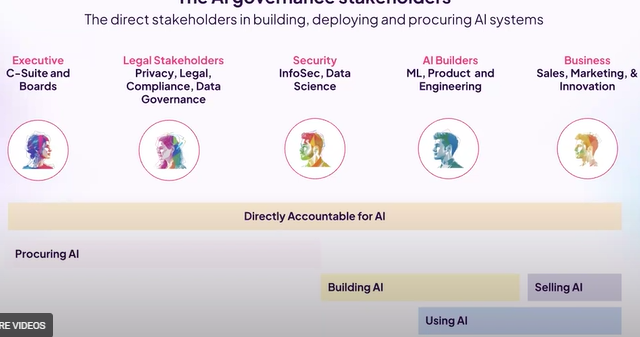

# AIGovNav - Market Research

*Document Type: DOCX*

## Table of Contents

- [Executive Brief: AI & Data Governance SaaS Strategy](#executive-brief-ai--data-governance-saas-strategy)
  - [What to Build: Unified Governance from Data to Decisions](#what-to-build-unified-governance-from-data-to-decisions)
  - [Why Now: Regulatory & Risk Imperatives](#why-now-regulatory--risk-imperatives)
  - [Market Landscape: Leaders, Overlap & Gaps](#market-landscape-leaders-overlap--gaps)
    - [Overlap](#overlap)
  - [Focus for Differentiation: EU-First Compliance & Extensible Oversight](#focus-for-differentiation-eu-first-compliance--extensible-oversight)
  - [EU AI Act (2025)](#eu-ai-act-2025)
  - [**Role / Risk Tier**](#role--risk-tier)
  - [**Required Controls / Obligations**](#required-controls--obligations)
  - [**Mapped Product Features**](#mapped-product-features)
  - [**Provider of High-Risk AI System**](#provider-of-high-risk-ai-system)
  - [**Deployer (User) of High-Risk AI**](#deployer-user-of-high-risk-ai)
  - [**Provider of General-Purpose AI (GPAI)**](#provider-of-general-purpose-ai-gpai)
    - [Sources](#sources)
  - [NIST AI Risk Management Framework 1.0 (2023)](#nist-ai-risk-management-framework-10-2023)
  - [**Function (NIST AI RMF)**](#function-nist-ai-rmf)
  - [**Required Controls / Practices**](#required-controls--practices)
  - [**Mapped Product Features**](#mapped-product-features)
    - [Sources](#sources)
  - [ISO/IEC 42001:2025 (AI Management System Standard)](#isoiec-420012025-ai-management-system-standard)
  - [**ISO 42001 Key Area**](#iso-42001-key-area)
  - [**Required Controls / Obligations**](#required-controls--obligations)
  - [**Mapped Product Features**](#mapped-product-features)
  - [**Leadership & Governance Program**](#leadership--governance-program)
  - [**AI Risk Assessment & Treatment**](#ai-risk-assessment--treatment)
  - [**Operational Controls (AI Lifecycle)**](#operational-controls-ai-lifecycle)
  - [**Monitoring & Continuous Improvement**](#monitoring--continuous-improvement)
  - [**Third-Party & Supply Chain**](#third-party--supply-chain)
    - [Sources](#sources)
  - [Colorado AI Act – SB 21-169 (2025)](#colorado-ai-act--sb-21-169-2025)
  - [**Requirement Area**](#requirement-area)
  - [**Required Controls / Obligations**](#required-controls--obligations)
  - [**Mapped Product Features**](#mapped-product-features)
  - [**Governance Structure & Oversight**](#governance-structure--oversight)
  - [**Model Inventory & Documentation**](#model-inventory--documentation)
  - [**Fairness Testing & Bias Mitigation**](#fairness-testing--bias-mitigation)
  - [**Vendor & Third-Party Model Oversight**](#vendor--third-party-model-oversight)
  - [**Regulatory Reporting & Transparency**](#regulatory-reporting--transparency)
    - [Sources](#sources)
  - [Comparative Matrix of Control Objectives and Product Features](#comparative-matrix-of-control-objectives-and-product-features)
  - [**Control Objective**](#control-objective)
  - [**EU AI Act (2025)**](#eu-ai-act-2025)
  - [**NIST AI RMF (2023)**](#nist-ai-rmf-2023)
  - [**ISO/IEC 42001:2025**](#isoiec-420012025)
  - [**Colorado SB 21-169 (2025)**](#colorado-sb-21-169-2025)
    - [Sources](#sources)
  - [Regulated Financial Services (Banking & Insurance)](#regulated-financial-services-banking--insurance)
    - [Regulatory Risk & Compliance](#regulatory-risk--compliance)
    - [Bias & Fairness Concerns](#bias--fairness-concerns)
    - [Model Drift & Performance Stability](#model-drift--performance-stability)
    - [Lack of Transparency & Auditability](#lack-of-transparency--auditability)
    - [“Shadow AI” & Third-Party Models](#shadow-ai--third-party-models)
    - [Budget & Buying Committee](#budget--buying-committee)
  - [Healthcare and Life Sciences](#healthcare-and-life-sciences)
    - [Data Privacy & Security](#data-privacy--security)
    - [Patient Safety & Efficacy (Regulatory Oversight)](#patient-safety--efficacy-regulatory-oversight)
    - [Bias & Equity in Outcomes](#bias--equity-in-outcomes)
    - [Lack of Explainability & Trust](#lack-of-explainability--trust)
    - [Shadow AI & Unvetted Tools](#shadow-ai--unvetted-tools)
    - [Budget & Buying Committee](#budget--buying-committee)
  - [Public Sector / Government](#public-sector--government)
    - [Mandates for Trustworthy AI](#mandates-for-trustworthy-ai)
    - [Ethical Use, Bias & Fairness](#ethical-use-bias--fairness)
    - [Transparency & Accountability](#transparency--accountability)
    - [Data Governance & Security](#data-governance--security)
    - [Talent & Culture Challenges](#talent--culture-challenges)
    - [Budget & Buying Committee](#budget--buying-committee)
  - [Industrial (Manufacturing & Energy)](#industrial-manufacturing--energy)
    - [Model Drift & Quality Degradation](#model-drift--quality-degradation)
    - [Operational Safety & Reliability Risks](#operational-safety--reliability-risks)
    - [Lack of Explainability & Troubleshooting Difficulty](#lack-of-explainability--troubleshooting-difficulty)
    - [Data Management & Quality Challenges](#data-management--quality-challenges)
    - [Security & Third-Party Risks](#security--third-party-risks)
    - [Compliance & Audit (Emerging Requirements)](#compliance--audit-emerging-requirements)
    - [Budget & Buying Committee](#budget--buying-committee)
    - [Sources](#sources)
  - [General AI Governance Workflow (Non‑LLM Models)](#general-ai-governance-workflow-nonllm-models)
    - [Policy Creation** – *Establish governance policies and AI usage guidelines upfront:* Organizations define AI principles (e.g. fairness, transparency) and set risk appetite, referencing frameworks like NIST AI RMF, ISO 42001, and the EU AI Act. **Typical activities](#policy-creation--establish-governance-policies-and-ai-usage-guidelines-upfront-organizations-define-ai-principles-eg-fairness-transparency-and-set-risk-appetite-referencing-frameworks-like-nist-ai-rmf-iso-42001-and-the-eu-ai-act-typical-activities)
    - [Use-Case Intake** – *Onboard and register new AI projects before development:* Each proposed AI use case or model is submitted for review. **Typical activities](#use-case-intake--onboard-and-register-new-ai-projects-before-development-each-proposed-ai-use-case-or-model-is-submitted-for-review-typical-activities)
    - [Risk Classification** – *Determine the risk level of the AI use case early on:* Based on the use-case details, the project is classified (e.g. *high risk*, *low risk*, etc.). **Typical activities](#risk-classification--determine-the-risk-level-of-the-ai-use-case-early-on-based-on-the-use-case-details-the-project-is-classified-eg-high-risk-low-risk-etc-typical-activities)
    - [Assessments (Legal, Compliance, Ethical)** – *Perform thorough risk and impact assessments on the AI system:* For high or moderate risk AI, multidisciplinary reviews are conducted. **Typical activities](#assessments-legal-compliance-ethical--perform-thorough-risk-and-impact-assessments-on-the-ai-system-for-high-or-moderate-risk-ai-multidisciplinary-reviews-are-conducted-typical-activities)
    - [Legal & Regulatory Assessment](#legal--regulatory-assessment)
    - [Ethical & Bias Assessment](#ethical--bias-assessment)
    - [Compliance Checks](#compliance-checks)
    - [Testing & Validation** – *Rigorously test the AI model for technical robustness and compliance before deployment:* **Typical activities](#testing--validation--rigorously-test-the-ai-model-for-technical-robustness-and-compliance-before-deployment-typical-activities)
    - [Performance testing](#performance-testing)
    - [Fairness and bias testing](#fairness-and-bias-testing)
    - [Robustness and security testing](#robustness-and-security-testing)
    - [Explainability testing](#explainability-testing)
    - [Approvals & Human-in-the-Loop (HITL)** – *Obtain required human approvals and ensure human oversight measures are in place:* **Typical activities](#approvals--human-in-the-loop-hitl--obtain-required-human-approvals-and-ensure-human-oversight-measures-are-in-place-typical-activities)
    - [Deployment** – *Release the AI model into production under controlled conditions:* **Typical activities](#deployment--release-the-ai-model-into-production-under-controlled-conditions-typical-activities)
    - [Monitoring & Incident Handling** – *Continuously monitor the AI system in production and manage incidents or deviations:* **Typical activities](#monitoring--incident-handling--continuously-monitor-the-ai-system-in-production-and-manage-incidents-or-deviations-typical-activities)
    - [Performance monitoring](#performance-monitoring)
    - [Outcome monitoring](#outcome-monitoring)
    - [Policy compliance monitoring](#policy-compliance-monitoring)
    - [Incident handling](#incident-handling)
    - [Reporting & Attestations** – *Document the AI system’s governance status and produce reports for accountability:* **Typical activities](#reporting--attestations--document-the-ai-systems-governance-status-and-produce-reports-for-accountability-typical-activities)
    - [Regulatory reporting](#regulatory-reporting)
    - [Internal reporting](#internal-reporting)
    - [Attestations](#attestations)
  - [LLM-Specific Governance Workflow (Generative AI Models)](#llm-specific-governance-workflow-generative-ai-models)
    - [Prompt/Dataset Changes** – *Manage changes to prompts or training data that could alter an LLM’s behavior:* Because Large Language Models (LLMs) are highly sensitive to their prompts and training data, any significant change here is treated as a governance event. **Controls/Metrics](#promptdataset-changes--manage-changes-to-prompts-or-training-data-that-could-alter-an-llms-behavior-because-large-language-models-llms-are-highly-sensitive-to-their-prompts-and-training-data-any-significant-change-here-is-treated-as-a-governance-event-controlsmetrics)
    - [Evaluation Gate Setup** – *Define automated evaluation tests that the LLM must pass before deployment:* **Controls/Metrics](#evaluation-gate-setup--define-automated-evaluation-tests-that-the-llm-must-pass-before-deployment-controlsmetrics)
    - [Red Team Review** – *Conduct human-led adversarial testing on the LLM:* **Controls/Metrics](#red-team-review--conduct-human-led-adversarial-testing-on-the-llm-controlsmetrics)
    - [Safety Guardrails (Toxicity & Jailbreak Filters)** – *Implement runtime safeguards to filter or mitigate problematic LLM outputs:* **Controls/Metrics](#safety-guardrails-toxicity--jailbreak-filters--implement-runtime-safeguards-to-filter-or-mitigate-problematic-llm-outputs-controlsmetrics)
    - [Policy enforcement engine](#policy-enforcement-engine)
    - [Multi-layered safeguards](#multi-layered-safeguards)
    - [Configuration management for guardrails](#configuration-management-for-guardrails)
    - [Transparency logs](#transparency-logs)
    - [Model Updates** – *Manage ongoing model iterations and drift for LLMs:* Unlike static software, LLMs may be updated frequently (fine-tuned with new data, or replaced with newer model versions). **Controls/Metrics](#model-updates--manage-ongoing-model-iterations-and-drift-for-llms-unlike-static-software-llms-may-be-updated-frequently-fine-tuned-with-new-data-or-replaced-with-newer-model-versions-controlsmetrics)
    - [Deployment Monitoring (Hallucination Metrics & Incident Triggers)** – *Continuously monitor the live LLM for errors like hallucinations and handle incidents:* **Controls/Metrics](#deployment-monitoring-hallucination-metrics--incident-triggers--continuously-monitor-the-live-llm-for-errors-like-hallucinations-and-handle-incidents-controlsmetrics)
  - [EU AI Act (Regulation (EU) 2024/1689) – High-Risk AI and GPAI Models](#eu-ai-act-regulation-eu-20241689--high-risk-ai-and-gpai-models)
  - [**Role / AI System**](#role--ai-system)
  - [**Regulatory Control Obligation**](#regulatory-control-obligation)
  - [**AI Governance Platform Feature Mapping**](#ai-governance-platform-feature-mapping)
  - [**Feature Availability**](#feature-availability)
  - [**Provider (High-Risk AI)**](#provider-high-risk-ai)
    - [Risk & Quality Management](#risk--quality-management)
    - [Exists](#exists)
  - [**Provider (High-Risk AI)**](#provider-high-risk-ai)
    - [Data Quality & Bias Tools](#data-quality--bias-tools)
    - [Exists](#exists)
  - [**Provider (High-Risk AI)**](#provider-high-risk-ai)
    - [Model Documentation & Logging](#model-documentation--logging)
    - [Exists](#exists)
  - [**Provider (High-Risk AI)**](#provider-high-risk-ai)
    - [Explainability & Oversight](#explainability--oversight)
    - [Partially Exists](#partially-exists)
  - [**Deployers (High-Risk AI)**](#deployers-high-risk-ai)
    - [Usage Governance](#usage-governance)
    - [Partially Exists](#partially-exists)
  - [**Deployers (High-Risk AI)**](#deployers-high-risk-ai)
    - [Monitoring & Incident Management](#monitoring--incident-management)
    - [Exists](#exists)
  - [**Deployers (High-Risk AI)**](#deployers-high-risk-ai)
    - [Outcome Disclosure](#outcome-disclosure)
    - [To Build (Later)](#to-build-later)
    - [Foundation Model Documentation](#foundation-model-documentation)
    - [Partially Exists](#partially-exists)
  - [**Provider of GPAI Model with Systemic Risk**](#provider-of-gpai-model-with-systemic-risk)
    - [Advanced Evaluation & Post-Market Monitoring](#advanced-evaluation--post-market-monitoring)
    - [To Build](#to-build)
    - [Sources](#sources)
  - [NIST AI RMF 1.0 (Jan 2023) – AI Risk Management Framework](#nist-ai-rmf-10-jan-2023--ai-risk-management-framework)
  - [**AI RMF Function**](#ai-rmf-function)
  - [**Key Control Practices**](#key-control-practices)
  - [**AI Platform Feature Mapping**](#ai-platform-feature-mapping)
  - [**Feature Availability**](#feature-availability)
    - [Policy & Governance Management](#policy--governance-management)
    - [Exists](#exists)
    - [Use Case Intake & Model Catalog](#use-case-intake--model-catalog)
    - [Exists](#exists)
    - [Analytics & Validation Tools](#analytics--validation-tools)
    - [Exists](#exists)
    - [Risk Mitigation Workflow & Monitoring](#risk-mitigation-workflow--monitoring)
    - [Exists](#exists)
    - [Sources](#sources)
  - [ISO/IEC 42001:2025 – AI Management System Standard](#isoiec-420012025--ai-management-system-standard)
  - [**ISO 42001 Role**](#iso-42001-role)
  - [**Responsibilities under ISO 42001**](#responsibilities-under-iso-42001)
  - [**AI Platform Feature Mapping**](#ai-platform-feature-mapping)
  - [**Feature Availability**](#feature-availability)
    - [Responsible design and data preparation](#responsible-design-and-data-preparation)
    - [Ethical Design & Documentation](#ethical-design--documentation)
    - [Partial – MVP](#partial--mvp)
    - [System integration, testing, and validation](#system-integration-testing-and-validation)
    - [Validation & Release Workflow](#validation--release-workflow)
    - [Exists](#exists)
    - [Responsible use and monitoring](#responsible-use-and-monitoring)
    - [Operational Monitoring & Feedback](#operational-monitoring--feedback)
    - [Partial – MVP](#partial--mvp)
    - [Sources](#sources)
  - [OCC SR 11-7 (2011) – Model Risk Management (Banking)](#occ-sr-11-7-2011--model-risk-management-banking)
  - [**MRM Role / Function**](#mrm-role--function)
  - [**SR 11-7 Control Expectation**](#sr-11-7-control-expectation)
  - [**AI Platform Feature Mapping**](#ai-platform-feature-mapping)
  - [**Feature Availability**](#feature-availability)
    - [Sound development & documentation](#sound-development--documentation)
    - [Model Development Documentation](#model-development-documentation)
    - [Exists (MVP)](#exists-mvp)
    - [Independent validation & ongoing monitoring](#independent-validation--ongoing-monitoring)
    - [Validation & Monitoring Tools](#validation--monitoring-tools)
    - [Exists](#exists)
    - [Governance framework & aggregate oversight](#governance-framework--aggregate-oversight)
    - [MRM Program Management](#mrm-program-management)
    - [Exists](#exists)
    - [Sources](#sources)
  - [Colorado AI Act (CAIA, 2024) – **Colorado SB 21-169** (Effective 2026)](#colorado-ai-act-caia-2024--colorado-sb-21-169-effective-2026)
  - [**CAIA Role**](#caia-role)
  - [**Key Obligations (High-Risk AI systems)**](#key-obligations-high-risk-ai-systems)
  - [**AI Platform Feature Mapping**](#ai-platform-feature-mapping)
  - [**Feature Availability**](#feature-availability)
    - [Documentation and disclosure](#documentation-and-disclosure)
    - [Model Cards & Risk Reports](#model-cards--risk-reports)
    - [Partial – MVP](#partial--mvp)
    - [Risk management program](#risk-management-program)
    - [Governance Program & Assessments](#governance-program--assessments)
    - [Exists/MVP](#existsmvp)
    - [Consumer notices and transparency](#consumer-notices-and-transparency)
    - [Transparency & Recourse Tools](#transparency--recourse-tools)
    - [To Build – Later](#to-build--later)
    - [Sources](#sources)
    - [**Feature matrix — Credo AI vs IBM ****watsonx.governance**** vs ****Monitaur**](#feature-matrix--credo-ai-vs-ibm-watsonxgovernance-vs-monitaur)
  - [**Capability**](#capability)
  - [**Credo AI**](#credo-ai)
  - [**IBM ****watsonx.governance**](#ibm-watsonxgovernance)
  - [**Monitaur**](#monitaur)
  - [**Policy/control library**](#policycontrol-library)
  - [**Risk taxonomy & registers**](#risk-taxonomy--registers)
  - [**EU AI Act mapping**](#eu-ai-act-mapping)
  - [**NIST RMF / ISO 42001 / Colorado**](#nist-rmf--iso-42001--colorado)
  - [**Data lineage & catalogs**](#data-lineage--catalogs)
  - [**Model registry**](#model-registry)
  - [**LLM governance (prompt/dataset governance)**](#llm-governance-promptdataset-governance)
  - [**LLM eval harness & metrics (toxicity, hallucination)**](#llm-eval-harness--metrics-toxicity-hallucination)
  - [**Red-teaming**** / jailbreak monitors**](#red-teaming--jailbreak-monitors)
  - [**Safety guardrails & content safety**](#safety-guardrails--content-safety)
  - [**Testing/validation**](#testingvalidation)
  - [**Approvals & human-in-the-loop**](#approvals--human-in-the-loop)
  - [**Audit trails**](#audit-trails)
  - [**Monitoring & incident ****mgmt**](#monitoring--incident-mgmt)
  - [**Reporting & attestations**](#reporting--attestations)
  - [**RBAC & ****SoD**](#rbac--sod)
  - [**Third-party/vendor model risk**](#third-partyvendor-model-risk)
  - [**SDLC/****MLOps**** integrations (Jira, Git, CI/CD)**](#sdlcmlops-integrations-jira-git-cicd)
  - [**GRC integrations (ServiceNow, Archer, ****OneTrust****)**](#grc-integrations-servicenow-archer-onetrust)
  - [**Security (residency, encryption, tenancy, KMS)**](#security-residency-encryption-tenancy-kms)
  - [**Deployment options**](#deployment-options)
  - [**Pricing/packaging (public)**](#pricingpackaging-public)
  - [**Fast take (EU-first lens)**](#fast-take-eu-first-lens)
    - [EU AI Act coverage](#eu-ai-act-coverage)
    - [LLM ops depth](#llm-ops-depth)
    - [GRC stack](#grc-stack)
  - [**Short supporting quotes (≤25 words)**](#short-supporting-quotes-25-words)
- [Gap-to-MVP Plan: GenAI-First AI Governance SaaS (EU AI Act Readiness)](#gap-to-mvp-plan-genai-first-ai-governance-saas-eu-ai-act-readiness)
  - [Current Landscape – Feature Matrix Overview (Credo AI vs IBM watsonx.governance vs Monitaur)](#current-landscape--feature-matrix-overview-credo-ai-vs-ibm-watsonxgovernance-vs-monitaur)
    - [Credo AI](#credo-ai)
    - [IBM ****watsonx.governance****](#ibm-watsonxgovernance)
    - [Monitaur****](#monitaur)
    - [Summary](#summary)
  - [Missing Capabilities for Full EU AI Act Coverage (Gaps for High-Risk AI & GPAI)](#missing-capabilities-for-full-eu-ai-act-coverage-gaps-for-high-risk-ai--gpai)
    - [Use Case Risk Classification & Intake](#use-case-risk-classification--intake)
    - [Comprehensive Risk Management System](#comprehensive-risk-management-system)
    - [Data Governance & Bias Testing](#data-governance--bias-testing)
    - [Technical Documentation & Transparency Artifacts](#technical-documentation--transparency-artifacts)
    - [Audit Logging & Record-Keeping](#audit-logging--record-keeping)
    - [Human Oversight & Approval Workflows](#human-oversight--approval-workflows)
    - [Generative AI Prompt & Content Controls](#generative-ai-prompt--content-controls)
    - [Incident Tracking & Post-Market Monitoring](#incident-tracking--post-market-monitoring)
    - [Cybersecurity and Model Integrity Checks](#cybersecurity-and-model-integrity-checks)
  - [90-Day MVP Scope – Focusing on Critical Workflows, Modules, and Integrations](#90-day-mvp-scope--focusing-on-critical-workflows-modules-and-integrations)
    - [Critical Workflows (MVP)](#critical-workflows-mvp)
    - [AI Use Case Intake & Risk Classification](#ai-use-case-intake--risk-classification)
    - [Policy and Control Mapping at Design](#policy-and-control-mapping-at-design)
    - [Prompt & Dataset Review (Generative AI Use Cases)](#prompt--dataset-review-generative-ai-use-cases)
    - [Evaluation Gates & Testing](#evaluation-gates--testing)
    - [Red Team Testing & Sign-off](#red-team-testing--sign-off)
    - [Pre-Deployment Approval & Human Oversight Plan](#pre-deployment-approval--human-oversight-plan)
    - [Post-Deployment Monitoring & Incident Workflow (Minimal for MVP)](#post-deployment-monitoring--incident-workflow-minimal-for-mvp)
    - [Essential Modules & Features (MVP)](#essential-modules--features-mvp)
    - [Policy/Control Library & Compliance Packs](#policycontrol-library--compliance-packs)
    - [AI Risk Register & Issue Management](#ai-risk-register--issue-management)
    - [Evaluations & Test Harness for LLMs](#evaluations--test-harness-for-llms)
    - [AI Policy Compliance Checker](#ai-policy-compliance-checker)
    - [Audit Logging & Change Tracking](#audit-logging--change-tracking)
    - [Approval & Workflow Engine](#approval--workflow-engine)
    - [Integrated Control of AI Endpoints (Minimal)](#integrated-control-of-ai-endpoints-minimal)
    - [Must-Have UI Components & Integrations (MVP)](#must-have-ui-components--integrations-mvp)
    - [Intuitive Dashboard & Project Workspace](#intuitive-dashboard--project-workspace)
    - [Risk & Compliance Scorecard](#risk--compliance-scorecard)
    - [Policy & Control Manager UI](#policy--control-manager-ui)
    - [Workflow Inbox & Notifications](#workflow-inbox--notifications)
    - [Integration: ServiceNow (or GRC system) Touchpoint](#integration-servicenow-or-grc-system-touchpoint)
    - [Integration: CI/CD & Dev Pipeline Hooks](#integration-cicd--dev-pipeline-hooks)
    - [Integration: LLM Evaluation APIs](#integration-llm-evaluation-apis)
    - [Single Sign-On (SSO) and User Management](#single-sign-on-sso-and-user-management)
  - [Post-MVP (v2+) Roadmap – Expanded Scope for Broad AI Governance](#post-mvp-v2-roadmap--expanded-scope-for-broad-ai-governance)
    - [Support for Classical ML Models & Broader AI Pipelines](#support-for-classical-ml-models--broader-ai-pipelines)
    - [More Regulatory Frameworks & Standards](#more-regulatory-frameworks--standards)
    - [NIST AI Risk Management Framework (RMF)](#nist-ai-risk-management-framework-rmf)
    - [ISO/IEC 42001 (AI Management System Standard)](#isoiec-42001-ai-management-system-standard)
    - [Other Standards & Frameworks](#other-standards--frameworks)
    - [Advanced GRC & IT Integrations](#advanced-grc--it-integrations)
    - [GRC Platforms](#grc-platforms)
    - [SIEM/Security Tools](#siemsecurity-tools)
    - [DevOps/****MLops****](#devopsmlops)
    - [Collaboration Tools](#collaboration-tools)
    - [Enhanced Red-Teaming & Adversarial Testing Module](#enhanced-red-teaming--adversarial-testing-module)
    - [Continuous Monitoring & AI “Control Tower”](#continuous-monitoring--ai-control-tower)
    - [Automated Documentation & Reporting](#automated-documentation--reporting)
    - [Internal Governance Reports](#internal-governance-reports)
    - [Scalability and Enterprise Readiness](#scalability-and-enterprise-readiness)
  - [Why Now, Wedge Strategy, and Extensibility](#why-now-wedge-strategy-and-extensibility)
    - [Timing (Why Now?)](#timing-why-now)
    - [Wedge Strategy (EU AI Act as the Beachhead)](#wedge-strategy-eu-ai-act-as-the-beachhead)
    - [Extensibility for Broader Governance Stack](#extensibility-for-broader-governance-stack)
  - [**Sources:**](#sources)
  - [**Stage**](#stage)
  - [**Phase (target)**](#phase-target)
  - [**Feature / Capability**](#feature--capability)
  - [**Opportunity Identified**](#opportunity-identified)
  - [**Why build (crisp)**](#why-build-crisp)
  - [**For whom**](#for-whom)
  - [**AI use-case intake + registry**](#ai-use-case-intake--registry)
  - [**EU AI Act policy pack (v1)**](#eu-ai-act-policy-pack-v1)
  - [**RBAC & SSO (Okta/SAML)**](#rbac--sso-oktasaml)
  - [**Risk classification engine (Annex III rules)**](#risk-classification-engine-annex-iii-rules)
  - [**Prompt governance (versioning + review)**](#prompt-governance-versioning--review)
  - [**Dataset governance checklist**](#dataset-governance-checklist)
  - [**LLM eval harness (toxicity, hallucination, bias)**](#llm-eval-harness-toxicity-hallucination-bias)
  - [**Approval gate workflow (legal/risk sign-off)**](#approval-gate-workflow-legalrisk-sign-off)
  - [**Audit log (****immut****., v1)**](#audit-log-immut-v1)
  - [**Guardrails ****middleware**** (pre/post filters)**](#guardrails-middleware-prepost-filters)
  - [**Red-team workflow + findings register**](#red-team-workflow--findings-register)
  - [**Tech documentation generator (“EU Tech File”)**](#tech-documentation-generator-eu-tech-file)
  - [**CI/CD & API hooks (governance-as-code)**](#cicd--api-hooks-governance-as-code)
  - [**ServiceNow connector (tickets/tasks)**](#servicenow-connector-ticketstasks)
  - [**Incident register (post-market v1)**](#incident-register-post-market-v1)
  - [**Production monitoring (light) + drift alerts**](#production-monitoring-light--drift-alerts)
  - [**Disclosure templates (user notice/explainability)**](#disclosure-templates-user-noticeexplainability)
  - [**Executive dashboard (model risk/compliance)**](#executive-dashboard-model-riskcompliance)
  - [**Report/attestation exports (EU-Act pack)**](#reportattestation-exports-eu-act-pack)

Deep Market Research Brief — Build “AI Governance Navigator” (SaaS) for Fortune-1000

Context & goal

My goal is to build an AI and Data Governance solution to serve Fortune-1000 s across the entire analytic lifecycle. They use these tools for compliance, security, and data governance. I need detailed market research to determine the solution to build here. We need to think about holistic AI governance SaaS spanning data → models (incl. LLMs) → decisions → deployment/ ops with compliance esp. EU AI Act, ISO 42001, NIST AI RMF and Colorado AI Act) and cross-functional oversight. Benchmark leaders and produce a gap-to-MVP plan.

The tools being used for this exercise and will take the persona of PED and consumer of this research:

1) Claude Opus or ChatGPT 5 = Product Manager

2) Claude Code = Engineer (full stack, quality and Infra/ ops, swarm using subagents for each of the engineering task)

3) Claude Code = Designer (design, front end, architecture and test/ acceptance)

I will be orchestrating all the 3 personas and can do the required interpretations, answering questions and copy/ pasting of screen shots, anything else required

Vendors to analyze (core)

Credo AI Governance Platform.

IBM watsonx.governance.

Monitaur

Add 3 comparable if material (e.g., Microsoft Responsible AI/AI Studio governance, Google Vertex AI governance, AWS model governance) but keep focus on the above three.

Deliverables

Executive brief (≤500 words): what to build (overlap is OK along with unique gaps to fill), why now, where to build based on core 3.

Feature matrix (table): rows = capabilities; columns = Credo / watsonx / Monitaur.  Use ✓/△/✗ and short notes.

Capabilities to score (at minimum based on Forrester’s attached pictures and additional important dimensions): policy/control library; risk taxonomy & registers; EU AI Act mapping; NIST AI RMF/ ISO 42001/ Colorado AI Act alignment; data lineage & catalogs; model registry; LLM governance (prompt/dataset governance, eval harness, red-teaming, safety guardrails, jailbreak/TOX monitors, hallucination metrics, privacy/PII filters, content safety); testing/validation; approvals & human-in-the-loop; audit trails; monitoring & incident mgmt; reporting & attestations; role-based access & SoD; vendor/third-party model risk; SDLC/MLOps/DevSecOps integrations (Jira, Git, CI/CD); GRC integrations (ServiceNow, Archer, OneTrust); security (data residency, encryption, tenancy, key mgmt); deployment options; pricing/packaging.

Regulatory mapping (tables):

EU AI Act obligations by role/risk class (incl. GPAI/foundation model duties): required controls ↔ product features.

NIST AI RMF 1.0,ISO/IEC 42001:2025, OCC SR 11-7/MRM, Colorado AI Act 2025 (if material): control objectives ↔ features.

Buyer problems & JTBD: for Regulated FS, Healthcare, Public Sector, Industrial; include top pains, success metrics, budgets, buying committee.

Key workflows (bulleted): policy→use-case intake→risk classification→assessments→tests→approvals→deploy→monitor→incident→reporting/attestations. Include LLM-specific flows (prompt/dataset changes, eval gates, red team sign-off).

Also attached are few images from Credo in terms of personalities using the platform, Credo’s platform integration with others in the ecosystem (with sample vendors/ capabilities throughout the AI lifecycle)

MVP scope (90 days): must-have features, what’s v2+, and a minimal “happy path”. Core features to build. These core features will be used by the Product Manager persona, who in turn will provide details to engineers and designers.

Sources: link every non-obvious claim; include short, quoted snippets (≤25 words) with URLs.

Quality bar

Prioritize official docs, product pages, whitepapers, audits, and recent analyst notes.

Compare publish dates vs event dates; prefer 2024–2025 content.

Be precise; no speculation without labeling it.

Keep it concise and decision-ready.

# Executive Brief: AI & Data Governance SaaS Strategy

## What to Build: Unified Governance from Data to Decisions

Design a **unified AI and data governance platform** that covers the entire lifecycle – from data inputs and model development (including LLMs) to AI-driven decisions and deployment/operations. The solution should provide a **central “system of record” for AI** across the enterprise, inventorying data assets, models, and AI use cases with risk classification and full traceability. It must embed **compliance-by-design** features mapped to emerging regulations and standards (e.g. EU AI Act, ISO/IEC 42001, NIST AI RMF, Colorado SB21-169) to automate documentation, testing, and controls. For example, leading platforms already help implement policies across the AI lifecycle and align with global standards like the EU AI Act, NIST RMF, and ISO 42001[[1]](https://www.credo.ai/blog/credo-ai-named-a-leader-in-the-forrester-wave-tm-ai-governance-solutions-q3-2025)[[2]](https://www.credo.ai/blog/credo-ai-named-a-leader-in-the-forrester-wave-tm-ai-governance-solutions-q3-2025). Our SaaS should similarly include **pre-built policy templates, assessment workflows, and reporting** to meet these frameworks, enabling audit-ready evidence gathering and third-party certification support. Crucially, **cross-functional oversight** is a core design principle: the interface must accommodate stakeholders in compliance, risk, data science, IT, and business roles. (AI governance isn’t one department’s job – effective solutions foster collaboration across engineering, legal, risk, security, data and business teams[[3]](https://www.ibm.com/new/announcements/governing-ai-with-confidence-our-journey-with-watsonx-governance).) This means a **user-friendly UX** with role-based views and dashboards, so that both technical and non-technical users can engage. The platform should not reinvent tools for data quality, ModelOps, or monitoring, but **integrate ****extensibly** with existing enterprise data catalogs, MLOps pipelines, and ML monitoring systems. Extensibility is paramount in this fast-evolving space[[4]](https://www.credo.ai/blog/credo-ai-named-a-leader-in-the-forrester-wave-tm-ai-governance-solutions-q3-2025) – the SaaS acts as a governance “control plane” orchestrating policies and checks across diverse tools and AI assets. In summary, we will build a **EU-first, global-ready AI governance SaaS** that operationalizes AI risk management (policies, controls, continuous monitoring) as part of business workflows, turning abstract principles into tangible actions[[4]](https://www.credo.ai/blog/credo-ai-named-a-leader-in-the-forrester-wave-tm-ai-governance-solutions-q3-2025).

## Why Now: Regulatory & Risk Imperatives

Organizations (especially Fortune 1000) face **urgent drivers** making AI governance a board-level priority[[5]](https://www.credo.ai/blog/credo-ai-named-a-leader-in-the-forrester-wave-tm-ai-governance-solutions-q3-2025). The EU’s AI Act timeline is a primary catalyst: initial provisions took effect in early 2025, and by August 2025 comprehensive transparency, risk management, and documentation requirements become mandatory[[6]](https://www.gtlaw.com/en/insights/2025/7/eu-ai-act-key-compliance-considerations-ahead-of-august-2025)[[7]](https://www.gtlaw.com/en/insights/2025/7/eu-ai-act-key-compliance-considerations-ahead-of-august-2025). No transition delays are expected, and violations can incur fines up to **€35 million or 7% of global turnover**[[6]](https://www.gtlaw.com/en/insights/2025/7/eu-ai-act-key-compliance-considerations-ahead-of-august-2025) – far exceeding GDPR’s penalties. U.S. regulators are also moving (e.g. Colorado’s law effective 2024 requires bias testing in insurance AI), and standards like NIST’s AI Risk Management Framework (2023) and ISO 42001 (AI management systems) are shaping best practices. Meanwhile, the rapid adoption of **foundation models and “agentic AI”** brings new risks (hallucinations, opaque reasoning, autonomous actions) that demand governance in design and deployment[[8]](https://www.ibm.com/new/announcements/governing-ai-with-confidence-our-journey-with-watsonx-governance)[[9]](https://www.ibm.com/new/announcements/governing-ai-with-confidence-our-journey-with-watsonx-governance). Executive awareness is high: 27% of Fortune 500 firms already cite AI regulation as a risk factor, and 68% of CEOs say generative AI governance must be built in from the start[[10]](https://www.ibm.com/new/announcements/governing-ai-with-confidence-our-journey-with-watsonx-governance). High-profile AI failures have shown reputational damage (one in four enterprises report harm from poor AI governance[[5]](https://www.credo.ai/blog/credo-ai-named-a-leader-in-the-forrester-wave-tm-ai-governance-solutions-q3-2025)). In short, converging **regulatory deadlines, emerging AI risks, and stakeholder pressures** create a narrow window for enterprises to put robust AI governance in place. A SaaS solution that can be rapidly deployed to address these needs – providing confidence to scale AI innovations without violating laws or trust – is **timely and essential**.

## Market Landscape: Leaders, Overlap & Gaps

The nascent AI governance market has been defined by a few key players, each with strengths that inform our strategy. **Forrester’s Q3 2025 Wave** on AI Governance Solutions highlights two Leaders – Credo AI and IBM – and a strong performer Monitaur[11] (among others). Credo AI pioneered this category, emphasizing policy management and regulatory compliance depth. It earned 5/5 scores in 12 criteria including *AI policy management, regulatory compliance audit, quality & testing workflows,* and even *User Interface/Experience*[[12]](https://www.credo.ai/blog/credo-ai-named-a-leader-in-the-forrester-wave-tm-ai-governance-solutions-q3-2025)[[13]](https://www.credo.ai/blog/credo-ai-named-a-leader-in-the-forrester-wave-tm-ai-governance-solutions-q3-2025). Credo’s platform excels at operationalizing governance (policy libraries, risk assessments, control tracking) and aligning to global standards, making it ideal for enterprises with heavy regulatory needs[[14]](https://www.credo.ai/blog/credo-ai-named-a-leader-in-the-forrester-wave-tm-ai-governance-solutions-q3-2025). IBM’s **watsonx.governance** leverages IBM’s enterprise AI legacy to offer broad lifecycle coverage – from data and model observability to audit trails and dynamic *“agentic AI”* governance. Forrester cited IBM’s strong vision and roadmap; Watsonx.governance supports policy management, auditability and advanced capabilities for governing AI agents (inventories of AI tools, behavior monitoring, and metric-based evaluations for issues like hallucination)[[9]](https://www.ibm.com/new/announcements/governing-ai-with-confidence-our-journey-with-watsonx-governance). IBM’s strength lies in integration with existing data/AI infrastructure and an ability to align technology, business, and risk teams on common governance workflows[[15]](https://www.ibm.com/new/announcements/governing-ai-with-confidence-our-journey-with-watsonx-governance). **Monitaur**, a smaller player, was rated a *Strong Performer* and even a **“Customer Favorite”** due to above-average client satisfaction[[16]](https://www.businesswire.com/news/home/20250827550651/en/Monitaur-Recognized-as-a-Customer-Favorite-in-Groundbreaking-AI-Governance-Market-Assessment)[[17]](https://www.businesswire.com/news/home/20250827550651/en/Monitaur-Recognized-as-a-Customer-Favorite-in-Groundbreaking-AI-Governance-Market-Assessment). Monitaur focuses on highly regulated sectors (notably insurance), providing a unified system to define, manage, and automate AI governance best practices (ensuring model transparency, performance, fairness, safety, compliance)[[18]](https://www.businesswire.com/news/home/20250827550651/en/Monitaur-Recognized-as-a-Customer-Favorite-in-Groundbreaking-AI-Governance-Market-Assessment). It earned top marks for vision and pricing transparency[[19]](https://www.businesswire.com/news/home/20250827550651/en/Monitaur-Recognized-as-a-Customer-Favorite-in-Groundbreaking-AI-Governance-Market-Assessment), reflecting a nimble, customer-centric approach.

### Overlap

All three emphasize **model registries/catalogs, policy workflow engines, and monitoring/audit reporting**. Each provides some form of AI asset inventory and documentation, as well as testing or validation pipelines (e.g. bias checks, performance metrics) to support responsible AI. Compliance alignment is a common theme: Credo and Monitaur offer rich “AI accelerators” (pre-built frameworks for regulations)[[19]](https://www.businesswire.com/news/home/20250827550651/en/Monitaur-Recognized-as-a-Customer-Favorite-in-Groundbreaking-AI-Governance-Market-Assessment)[[20]](https://www.credo.ai/blog/credo-ai-named-a-leader-in-the-forrester-wave-tm-ai-governance-solutions-q3-2025), while IBM has flexible packaging and a partner ecosystem to cover varied use cases[[21]](https://www.ibm.com/new/announcements/governing-ai-with-confidence-our-journey-with-watsonx-governance)[[22]](https://www.ibm.com/new/announcements/governing-ai-with-confidence-our-journey-with-watsonx-governance). **Unmet needs/gaps:** Despite this overlap, parts of the governance stack remain under-addressed. Notably, **data governance integration** is still nascent – traditional data governance leaders like Collibra have entered AI governance but are not leaders in this space, indicating that linking data lineage/quality controls with AI model governance is an opportunity. Likewise, **decision-level governance** (ensuring that AI-driven decisions and downstream business processes adhere to policies) is an area for innovation; current solutions focus more on models themselves than on how AI outcomes are used by humans or automated systems. There is also room to improve **cross-lifecycle continuity**: many tools cover either pre-deployment (model development) or post-deployment (monitoring) well, but few provide seamless governance *from initial AI use-case intake through ongoing audits*. For example, an ideal solution would track an AI application from risk assessment at design time through validation, deployment, and performance monitoring with automated alerts – today this often requires stitching together multiple products. In addition, **user experience and cross-functional usability** vary: Credo leads in UI/UX[[20]](https://www.credo.ai/blog/credo-ai-named-a-leader-in-the-forrester-wave-tm-ai-governance-solutions-q3-2025), but some enterprise suites can be complex. This implies an opening for a solution that is both comprehensive and *easy to use* across departments. Lastly, as generative AI emerges, governance around prompts, model updates, and AI agent behaviors is only just developing (IBM’s “agentic” features are a start); our platform can differentiate by natively handling these **new AI paradigms** rather than bolting them on later.

## Focus for Differentiation: EU-First Compliance & Extensible Oversight

To win against incumbents, we will focus on **unmet needs and a strategic scope** that others struggle with. First, anchor the product in an **“EU-first” compliance design**. The EU AI Act is the world’s most comprehensive AI law and sets a high bar for risk management and transparency[[23]](https://www.gtlaw.com/en/insights/2025/7/eu-ai-act-key-compliance-considerations-ahead-of-august-2025). By building our governance workflows around EU Act requirements (e.g. maintaining an AI system registry with risk classifications, technical documentation, bias and transparency evaluations, etc.), we create a robust baseline that global enterprises can trust. This EU-first approach ensures readiness for strict obligations taking effect in 2025[[6]](https://www.gtlaw.com/en/insights/2025/7/eu-ai-act-key-compliance-considerations-ahead-of-august-2025)[[7]](https://www.gtlaw.com/en/insights/2025/7/eu-ai-act-key-compliance-considerations-ahead-of-august-2025), and it’s easier to dial down or customize for less stringent regimes (like U.S. frameworks) than to retrofit later. In practice, this means our SaaS ships with **policy packs and controls mapped to the EU Act’s risk tiers and documentation mandates**, and supports forthcoming standards (e.g. harmonized technical standards, ISO 42001 certification) out-of-the-box.

Second, we will differentiate through **truly end-to-end governance coverage**: a platform that bridges data governance, model governance, and decision governance in one extensible system. This entails deep **integration capabilities** – e.g. connectors to data catalog tools (for data lineage/provenance linking into model documentation), APIs/SDK for MLOps and CI/CD integration so that governance checks (like bias tests or robustness evaluations) trigger during model development pipelines, and hooks for real-time decision monitoring (capturing when AI outputs are used in decisions and flagging policy violations or anomalies). By acting as the connective tissue, our product can fill the gap between siloed solutions. A concrete focus is the **governance of AI outputs and decisions**: providing features to log AI decisions, explanations, and human override actions, ensuring accountability at the point of impact – an aspect often overlooked in current offerings.

Third, emphasize a **cross-functional user experience with strong workflow automation**. Governance processes often stall when tools are too technical for risk managers or too bureaucratic for developers. Our platform will offer an intuitive, collaborative interface where, for example, a data scientist can view model performance and bias metrics, a compliance officer can view compliance status and evidence, and executives can see a high-level risk dashboard. Role-based access and notifications (e.g. alert the compliance team if a high-risk model is deployed without approval) will enforce oversight without adding friction. Notably, Forrester highlighted the importance of aligning tech, business, and risk teams on policy and approvals[[24]](https://www.ibm.com/new/announcements/governing-ai-with-confidence-our-journey-with-watsonx-governance) – our UX must make this alignment seamless. By learning from Credo’s strength in UI and IBM’s multi-role approach, we’ll prioritize **decision-ready reporting** (clear metrics, compliance scores, audit trails) and **ease of use** as key features, turning governance from a check-the-box task into an enabler of AI innovation.

Finally, **extensibility and scalability** will underpin the product’s long-term value. The platform should be architected to plug in new compliance modules and AI capabilities as the landscape evolves. This could mean a marketplace or SDK for adding checks (e.g. a new fairness metric or privacy technique), and flexible integrations with both cloud-specific and on-prem tools that Fortune-1000 firms use. Both Credo and Monitaur earned praise for innovation and accelerators[[19]](https://www.businesswire.com/news/home/20250827550651/en/Monitaur-Recognized-as-a-Customer-Favorite-in-Groundbreaking-AI-Governance-Market-Assessment)[[25]](https://www.credo.ai/blog/credo-ai-named-a-leader-in-the-forrester-wave-tm-ai-governance-solutions-q3-2025); we will continue that by rapidly incorporating emerging best practices (for example, governance for *autonomous agents*, or integration with emerging AI audit standards). Additionally, our **pricing and packaging** will be designed for enterprise flexibility (a noted strength of Monitaur[19]), allowing clients to start with critical modules and expand coverage as their AI footprint grows.

**In conclusion,** this AI & data governance SaaS will fill market gaps by providing a *comprehensive yet user-friendly platform* that ensures AI accountability from data through decisions. It leverages the urgency of EU regulations and foundation model risks to deliver timely value. By overlapping with leaders on core capabilities (policy management, model monitoring, compliance reporting) while surpassing them in seamless lifecycle integration, EU-centric compliance depth, and extensible design, we position our solution as the go-to governance **control plane** for Fortune-1000 enterprises aiming to scale AI **responsibly and globally**[[26]](https://www.credo.ai/blog/credo-ai-named-a-leader-in-the-forrester-wave-tm-ai-governance-solutions-q3-2025)[[27]](https://www.ibm.com/new/announcements/governing-ai-with-confidence-our-journey-with-watsonx-governance).

[1] [[2]](https://www.credo.ai/blog/credo-ai-named-a-leader-in-the-forrester-wave-tm-ai-governance-solutions-q3-2025) [[4]](https://www.credo.ai/blog/credo-ai-named-a-leader-in-the-forrester-wave-tm-ai-governance-solutions-q3-2025) [[5]](https://www.credo.ai/blog/credo-ai-named-a-leader-in-the-forrester-wave-tm-ai-governance-solutions-q3-2025) [[12]](https://www.credo.ai/blog/credo-ai-named-a-leader-in-the-forrester-wave-tm-ai-governance-solutions-q3-2025) [[13]](https://www.credo.ai/blog/credo-ai-named-a-leader-in-the-forrester-wave-tm-ai-governance-solutions-q3-2025) [[14]](https://www.credo.ai/blog/credo-ai-named-a-leader-in-the-forrester-wave-tm-ai-governance-solutions-q3-2025) [[20]](https://www.credo.ai/blog/credo-ai-named-a-leader-in-the-forrester-wave-tm-ai-governance-solutions-q3-2025) [[25]](https://www.credo.ai/blog/credo-ai-named-a-leader-in-the-forrester-wave-tm-ai-governance-solutions-q3-2025) [[26]](https://www.credo.ai/blog/credo-ai-named-a-leader-in-the-forrester-wave-tm-ai-governance-solutions-q3-2025) Credo AI Named a Leader in The Forrester Wave™: AI Governance Solutions, Q3 2025 - Credo AI Company Blog

[https://www.credo.ai/blog/credo-ai-named-a-leader-in-the-forrester-wave-tm-ai-governance-solutions-q3-2025](https://www.credo.ai/blog/credo-ai-named-a-leader-in-the-forrester-wave-tm-ai-governance-solutions-q3-2025)

[[3]](https://www.ibm.com/new/announcements/governing-ai-with-confidence-our-journey-with-watsonx-governance) [[8]](https://www.ibm.com/new/announcements/governing-ai-with-confidence-our-journey-with-watsonx-governance) [[9]](https://www.ibm.com/new/announcements/governing-ai-with-confidence-our-journey-with-watsonx-governance) [[10]](https://www.ibm.com/new/announcements/governing-ai-with-confidence-our-journey-with-watsonx-governance) [[15]](https://www.ibm.com/new/announcements/governing-ai-with-confidence-our-journey-with-watsonx-governance) [[21]](https://www.ibm.com/new/announcements/governing-ai-with-confidence-our-journey-with-watsonx-governance) [[22]](https://www.ibm.com/new/announcements/governing-ai-with-confidence-our-journey-with-watsonx-governance) [[24]](https://www.ibm.com/new/announcements/governing-ai-with-confidence-our-journey-with-watsonx-governance) [[27]](https://www.ibm.com/new/announcements/governing-ai-with-confidence-our-journey-with-watsonx-governance) Governing AI with Confidence: Our Journey with watsonx.governance

[https://www.ibm.com/new/announcements/governing-ai-with-confidence-our-journey-with-watsonx-governance](https://www.ibm.com/new/announcements/governing-ai-with-confidence-our-journey-with-watsonx-governance)

[[6]](https://www.gtlaw.com/en/insights/2025/7/eu-ai-act-key-compliance-considerations-ahead-of-august-2025) [[7]](https://www.gtlaw.com/en/insights/2025/7/eu-ai-act-key-compliance-considerations-ahead-of-august-2025) [[23]](https://www.gtlaw.com/en/insights/2025/7/eu-ai-act-key-compliance-considerations-ahead-of-august-2025) EU AI Act: Key Compliance Considerations Ahead of August 2025 | Insights | Greenberg Traurig LLP

[https://www.gtlaw.com/en/insights/2025/7/eu-ai-act-key-compliance-considerations-ahead-of-august-2025](https://www.gtlaw.com/en/insights/2025/7/eu-ai-act-key-compliance-considerations-ahead-of-august-2025)

[[11]](https://www.businesswire.com/news/home/20250827550651/en/Monitaur-Recognized-as-a-Customer-Favorite-in-Groundbreaking-AI-Governance-Market-Assessment) [[16]](https://www.businesswire.com/news/home/20250827550651/en/Monitaur-Recognized-as-a-Customer-Favorite-in-Groundbreaking-AI-Governance-Market-Assessment) [[17]](https://www.businesswire.com/news/home/20250827550651/en/Monitaur-Recognized-as-a-Customer-Favorite-in-Groundbreaking-AI-Governance-Market-Assessment) [[18]](https://www.businesswire.com/news/home/20250827550651/en/Monitaur-Recognized-as-a-Customer-Favorite-in-Groundbreaking-AI-Governance-Market-Assessment) [[19]](https://www.businesswire.com/news/home/20250827550651/en/Monitaur-Recognized-as-a-Customer-Favorite-in-Groundbreaking-AI-Governance-Market-Assessment) Monitaur Recognized as a Customer Favorite in Groundbreaking AI Governance Market Assessment

[https://www.businesswire.com/news/home/20250827550651/en/Monitaur-Recognized-as-a-Customer-Favorite-in-Groundbreaking-AI-Governance-Market-Assessment](https://www.businesswire.com/news/home/20250827550651/en/Monitaur-Recognized-as-a-Customer-Favorite-in-Groundbreaking-AI-Governance-Market-Assessment)

Regulatory Mapping of AI Governance Requirements Across Frameworks

## EU AI Act (2025)

The EU AI Act defines obligations based on an AI system’s risk level and the actor’s role in the AI lifecycle[[1]](https://www.lowenstein.com/news-insights/publications/client-alerts/the-eu-artificial-intelligence-act-of-2024-what-you-need-to-know-privacy)[[2]](https://www.lowenstein.com/news-insights/publications/client-alerts/the-eu-artificial-intelligence-act-of-2024-what-you-need-to-know-privacy). High-risk AI systems face strict mandatory requirements, and *general-purpose AI* (GPAI) model providers have tailored duties starting August 2025[[3]](https://www.lowenstein.com/news-insights/publications/client-alerts/the-eu-artificial-intelligence-act-of-2024-what-you-need-to-know-privacy). The table below outlines key roles/risk tiers under the Act, their obligations, and how AI governance product features can fulfill them:

### ## **Role / Risk Tier**

**## **Required Controls / Obligations****: ## **Mapped Product Features**

### ## **Provider of High-Risk AI System**

**Must implement a comprehensive risk management system covering the AI lifecycle (design through post-market)[[4]](https://www.lowenstein.com/news-insights/publications/client-alerts/the-eu-artificial-intelligence-act-of-2024-what-you-need-to-know-privacy). Ensure the system is designed for **accuracy, robustness, and cybersecurity**[[5]](https://www.lowenstein.com/news-insights/publications/client-alerts/the-eu-artificial-intelligence-act-of-2024-what-you-need-to-know-privacy). Maintain **data governance** measures to ensure training data quality (relevant, representative, free of bias)[[6]](https://www.lowenstein.com/news-insights/publications/client-alerts/the-eu-artificial-intelligence-act-of-2024-what-you-need-to-know-privacy). Prepare thorough **technical documentation** and conduct a conformity assessment before CE-marking/deployment[[7]](https://www.lowenstein.com/news-insights/publications/client-alerts/the-eu-artificial-intelligence-act-of-2024-what-you-need-to-know-privacy). Provide clear **instructions for use** to enable compliant deployment[[8]](https://www.lowenstein.com/news-insights/publications/client-alerts/the-eu-artificial-intelligence-act-of-2024-what-you-need-to-know-privacy). Register the model in the EU AI database[[9]](https://www.lowenstein.com/news-insights/publications/client-alerts/the-eu-artificial-intelligence-act-of-2024-what-you-need-to-know-privacy). **Human oversight** mechanisms must be enabled by design[[6]](https://www.lowenstein.com/news-insights/publications/client-alerts/the-eu-artificial-intelligence-act-of-2024-what-you-need-to-know-privacy). Monitor performance and **report serious incidents** or malfunctions to regulators without undue delay[[10]](https://www.lowenstein.com/news-insights/publications/client-alerts/the-eu-artificial-intelligence-act-of-2024-what-you-need-to-know-privacy).**: 
*Policy & risk management modules* – e.g. pre-built **policy packs** for EU AI Act compliance and workflows for risk assessments. **Model documentation** tools to generate and manage required technical files (model cards, design specs). **Model testing pipelines** for robustness/security (adversarial attacks, stress tests) to ensure accuracy and cybersecurity by design. **Data governance toolkit** for dataset versioning, bias checks, and quality validation. **Human-in-the-loop controls** to configure human oversight or approval steps for high-risk decisions. **Compliance registry integration** to log models into the EU database. **Incident response system** with alerting and templates for EU incident reports, linked to an **audit log** of model operations.

### ## **Deployer (User) of High-Risk AI**

**Must use the AI system according to the provider’s instructions and maintain **human oversight by qualified staff**[[11]](https://www.lowenstein.com/news-insights/publications/client-alerts/the-eu-artificial-intelligence-act-of-2024-what-you-need-to-know-privacy). Ensure any data they input is relevant and sufficiently representative (no garbage in)[[12]](https://www.lowenstein.com/news-insights/publications/client-alerts/the-eu-artificial-intelligence-act-of-2024-what-you-need-to-know-privacy). For certain uses (credit, insurance, public services), perform an **AI impact assessment** before deployment[[13]](https://www.lowenstein.com/news-insights/publications/client-alerts/the-eu-artificial-intelligence-act-of-2024-what-you-need-to-know-privacy). Upon an individual’s request, provide a **reasoned explanation** of any significant decision made by the AI[[14]](https://www.lowenstein.com/news-insights/publications/client-alerts/the-eu-artificial-intelligence-act-of-2024-what-you-need-to-know-privacy). Continuously **monitor** the AI’s operation and promptly report any unacceptable risks or serious incidents to the provider and regulators[[15]](https://www.lowenstein.com/news-insights/publications/client-alerts/the-eu-artificial-intelligence-act-of-2024-what-you-need-to-know-privacy). **Log data** automatically to enable traceability[[16]](https://www.lowenstein.com/news-insights/publications/client-alerts/the-eu-artificial-intelligence-act-of-2024-what-you-need-to-know-privacy). Be **transparent** about AI use, e.g. inform employees when monitoring them with AI or disclose AI-driven decisions to those affected[[16]](https://www.lowenstein.com/news-insights/publications/client-alerts/the-eu-artificial-intelligence-act-of-2024-what-you-need-to-know-privacy).**: 
**AI use policy enforcement** – features to ensure deployers configure systems per provider guidelines (e.g. pre-set **LLM guardrails** on a generative model). **Input data validation** tools to check that user-supplied data fits the model’s intended scope and is bias-tested (preventing garbage or biased inputs). **Automated impact assessment templates** and **risk registries** to document assessments for regulated uses (e.g. a credit risk model’s fairness impact). **Explainability and XAI tools** to generate human-readable explanations for model decisions on-demand, fulfilling explanation obligations[[14]](https://www.lowenstein.com/news-insights/publications/client-alerts/the-eu-artificial-intelligence-act-of-2024-what-you-need-to-know-privacy). **Monitoring dashboards** with live model performance metrics and drift detection to flag anomalies. **Alerting & incident workflow** to notify both provider and regulators of issues, with built-in report generation. **Audit logging** of all inputs, outputs, and user interventions for compliance review. **Disclosure support** (e.g. configurable notifications to inform employees or customers when an AI is in use, and record that disclosure for compliance).

### ## **Provider of General-Purpose AI (GPAI)**

****All GPAI model providers**
: Must meet *baseline transparency* obligations[[3]](https://www.lowenstein.com/news-insights/publications/client-alerts/the-eu-artificial-intelligence-act-of-2024-what-you-need-to-know-privacy). This includes publishing a **summary of the training data** used by the model (via a standardized template)[[17]](https://insightplus.bakermckenzie.com/bm/attachment_dw.action?attkey=w%2FRQkApBIqUrfOtthNfYhc0HrUSWw99BOq4AmCiVC08MclFGvd%2B0kFDP9mpFF1Ujb2L0zOUoPYuTevp3e%2F%2Bahj2BGVmk3Qo%3D&nav=C4InNNq5OO9Gvvpx6CT%2F1cT4UoyK8mMKDUaM5%2FpfdvavkVMQZzZXWELuyaLcy1T6bgEBgKfvoNA%3D&attdocparam=Ka1XcuEs1UChzdUJawXOujEHbq%2BrIN0bJCal%2FA1SvNA2WItsHCl9ie1aiG34aX7r%2BuFQ5FN0%2ByIM17A%3D&fromContentView=1) to inform users of its contents, and implementing a **copyright compliance policy** to respect any opt-outs or IP rights in training data[[17]](https://insightplus.bakermckenzie.com/bm/attachment_dw.action?attkey=w%2FRQkApBIqUrfOtthNfYhc0HrUSWw99BOq4AmCiVC08MclFGvd%2B0kFDP9mpFF1Ujb2L0zOUoPYuTevp3e%2F%2Bahj2BGVmk3Qo%3D&nav=C4InNNq5OO9Gvvpx6CT%2F1cT4UoyK8mMKDUaM5%2FpfdvavkVMQZzZXWELuyaLcy1T6bgEBgKfvoNA%3D&attdocparam=Ka1XcuEs1UChzdUJawXOujEHbq%2BrIN0bJCal%2FA1SvNA2WItsHCl9ie1aiG34aX7r%2BuFQ5FN0%2ByIM17A%3D&fromContentView=1). They must also provide appropriate **instructions or information** to downstream developers integrating the GPAI model, disclosing the model’s intended uses and limitations (per forthcoming guidelines).   **High-Impact GPAI models** (those with “systemic risk” due to scale/impact): Subject to additional controls[[3]](https://www.lowenstein.com/news-insights/publications/client-alerts/the-eu-artificial-intelligence-act-of-2024-what-you-need-to-know-privacy). Providers must conduct and document **risk assessments** to identify potential harmful uses or impacts, and implement **risk mitigation measures** (e.g. safety filters, usage policies)[[18]](https://www.lowenstein.com/news-insights/publications/client-alerts/the-eu-artificial-intelligence-act-of-2024-what-you-need-to-know-privacy). They must ensure **robustness and cybersecurity** proportionate to the model’s advanced capabilities[[18]](https://www.lowenstein.com/news-insights/publications/client-alerts/the-eu-artificial-intelligence-act-of-2024-what-you-need-to-know-privacy). Enhanced **technical documentation** (a “Model Report”) is required, detailing model capabilities, limitations, and risk controls. Providers must **report serious incidents** or new emerging risks associated with the model without undue delay[[19]](https://insightplus.bakermckenzie.com/bm/attachment_dw.action?attkey=w%2FRQkApBIqUrfOtthNfYhc0HrUSWw99BOq4AmCiVC08MclFGvd%2B0kFDP9mpFF1Ujb2L0zOUoPYuTevp3e%2F%2Bahj2BGVmk3Qo%3D&nav=C4InNNq5OO9Gvvpx6CT%2F1cT4UoyK8mMKDUaM5%2FpfdvavkVMQZzZXWELuyaLcy1T6bgEBgKfvoNA%3D&attdocparam=Ka1XcuEs1UChzdUJawXOujEHbq%2BrIN0bJCal%2FA1SvNA2WItsHCl9ie1aiG34aX7r%2BuFQ5FN0%2ByIM17A%3D&fromContentView=1).**: 
**Model provenance and transparency tools** – e.g. **training data catalogues** and model cards automatically generated to summarize datasets, which helps fulfill the Act’s training data transparency template[[17]](https://insightplus.bakermckenzie.com/bm/attachment_dw.action?attkey=w%2FRQkApBIqUrfOtthNfYhc0HrUSWw99BOq4AmCiVC08MclFGvd%2B0kFDP9mpFF1Ujb2L0zOUoPYuTevp3e%2F%2Bahj2BGVmk3Qo%3D&nav=C4InNNq5OO9Gvvpx6CT%2F1cT4UoyK8mMKDUaM5%2FpfdvavkVMQZzZXWELuyaLcy1T6bgEBgKfvoNA%3D&attdocparam=Ka1XcuEs1UChzdUJawXOujEHbq%2BrIN0bJCal%2FA1SvNA2WItsHCl9ie1aiG34aX7r%2BuFQ5FN0%2ByIM17A%3D&fromContentView=1). **Content filtering and IP-check modules** to enforce copyright policies on training data and model outputs (flagging or stripping content that violates opt-outs). **Foundation model risk profiling** features that evaluate the model on a broad range of tasks for ethical and safety risks (bias, toxicity, privacy leakage), creating a risk report. **Adversarial robustness testing** and red-teaming frameworks to probe GPAI models for vulnerabilities or misuse scenarios (e.g. prompt leakage, harmful content generation), with results fed into mitigation plans. **Secure model release management** – tools to inject guardrails (like API usage policies, toxicity filters) before deployment. **Documentation generators** to produce the required Model Report and usage guidelines for downstream users. **Incident tracking** systems spanning the model’s lifecycle, so providers can log and analyze incidents (e.g. model failures, near-misses) and rapidly produce regulatory incident reports when needed.

### Sources

Key provisions of the EU AI Act on risk tiers and obligations[[1]](https://www.lowenstein.com/news-insights/publications/client-alerts/the-eu-artificial-intelligence-act-of-2024-what-you-need-to-know-privacy)[[20]](https://www.lowenstein.com/news-insights/publications/client-alerts/the-eu-artificial-intelligence-act-of-2024-what-you-need-to-know-privacy)[[6]](https://www.lowenstein.com/news-insights/publications/client-alerts/the-eu-artificial-intelligence-act-of-2024-what-you-need-to-know-privacy)[[11]](https://www.lowenstein.com/news-insights/publications/client-alerts/the-eu-artificial-intelligence-act-of-2024-what-you-need-to-know-privacy); special rules for general-purpose AI models[[3]](https://www.lowenstein.com/news-insights/publications/client-alerts/the-eu-artificial-intelligence-act-of-2024-what-you-need-to-know-privacy)[[17]](https://insightplus.bakermckenzie.com/bm/attachment_dw.action?attkey=w%2FRQkApBIqUrfOtthNfYhc0HrUSWw99BOq4AmCiVC08MclFGvd%2B0kFDP9mpFF1Ujb2L0zOUoPYuTevp3e%2F%2Bahj2BGVmk3Qo%3D&nav=C4InNNq5OO9Gvvpx6CT%2F1cT4UoyK8mMKDUaM5%2FpfdvavkVMQZzZXWELuyaLcy1T6bgEBgKfvoNA%3D&attdocparam=Ka1XcuEs1UChzdUJawXOujEHbq%2BrIN0bJCal%2FA1SvNA2WItsHCl9ie1aiG34aX7r%2BuFQ5FN0%2ByIM17A%3D&fromContentView=1); and credible interpretations of compliance measures.

## NIST AI Risk Management Framework 1.0 (2023)

NIST’s AI RMF is a voluntary framework that structures AI risk management into four core functions: **Govern, Map, Measure,** and **Manage**[[21]](https://www.wiz.io/academy/nist-ai-risk-management-framework). It provides a comprehensive set of outcomes and controls to help organizations identify, assess, mitigate, and monitor AI-related risks across the AI lifecycle[[22]](https://www.wiz.io/academy/nist-ai-risk-management-framework). The table below maps each function’s focus to recommended controls, with examples of supporting SaaS product features:

### ## **Function (NIST AI RMF)**

**## **Required Controls / Practices****: ## **Mapped Product Features**

### **Govern** (Governance)

**Establish organizational **AI governance structures, policies, and processes**[[23]](https://securiti.ai/nist-ai-risk-management-framework/)[[24]](https://securiti.ai/nist-ai-risk-management-framework/). NIST emphasizes clear **roles and responsibilities** for AI risk management – e.g. define who in the organization oversees AI risks and ensure executive accountability[[25]](https://securiti.ai/nist-ai-risk-management-framework/)[[26]](https://securiti.ai/nist-ai-risk-management-framework/). Integrate **trustworthy AI principles** (like fairness, transparency, privacy) into corporate policies and culture[[27]](https://securiti.ai/nist-ai-risk-management-framework/)[[28]](https://securiti.ai/nist-ai-risk-management-framework/). Document the organization’s **risk tolerance** and criteria for when heightened risk controls are needed[[29]](https://securiti.ai/nist-ai-risk-management-framework/). Maintain an **inventory of AI systems** (AI Bill of Materials) and processes for **decommissioning** AI safely when needed[[30]](https://securiti.ai/nist-ai-risk-management-framework/)[[31]](https://securiti.ai/nist-ai-risk-management-framework/). Foster a culture of **risk awareness** – involve diverse teams in AI design, address bias in the workforce, and encourage critical oversight of AI operations[[32]](https://securiti.ai/nist-ai-risk-management-framework/)[[33]](https://securiti.ai/nist-ai-risk-management-framework/). Engage external stakeholders and **third-party** partners – collect feedback on AI impacts and manage supply chain risks via policies and vetting[[34]](https://securiti.ai/nist-ai-risk-management-framework/)[[35]](https://securiti.ai/nist-ai-risk-management-framework/).**: 
**AI policy management** – centralized **policy packs** aligned to NIST’s principles (e.g. templates for AI ethics policy, data privacy, and usage guidelines) that can be customized and enforced across the organization. **Governance workflow tools** for assigning **roles** (e.g. designate an AI Risk Officer, responsible teams) and tracking accountability (with sign-offs for model risk reviews). **Training & awareness modules** to ensure staff and management are educated on AI risk policies and their responsibilities[[25]](https://securiti.ai/nist-ai-risk-management-framework/). **AI system inventory** (AI asset register) to log all models, including their status, purpose, and risk criticality[[36]](https://securiti.ai/nist-ai-risk-management-framework/) – often implemented as an **AI Registry** with tagging for high-risk systems and links to documentation. **Risk tolerance configuration** – ability to record risk appetite and automatically flag AI projects that exceed defined thresholds (prompting additional review). **Stakeholder feedback portals** to solicit input from users or impacted groups, and **vendor assessment** integrations to evaluate third-party AI services for compliance (mirroring supply chain risk controls).

### **Map** (Context & Risks)

****Map out the context** and scope of each AI system to frame its risks[[37]](https://securiti.ai/nist-ai-risk-management-framework/)[[38]](https://securiti.ai/nist-ai-risk-management-framework/). NIST calls for documenting the AI system’s **intended purpose, domain, and setting**, the **stakeholders** and affected parties, and the relevant **legal or societal norms**[[38]](https://securiti.ai/nist-ai-risk-management-framework/). Identify **potential positive uses and negative impacts** of the AI in its context (e.g. impacts on individuals, communities, the environment)[[39]](https://securiti.ai/nist-ai-risk-management-framework/)[[40]](https://securiti.ai/nist-ai-risk-management-framework/). Enumerate **assumptions and limitations** of the AI model – what conditions or data distributions is it designed for, and where it might fail[[41]](https://securiti.ai/nist-ai-risk-management-framework/)[[42]](https://securiti.ai/nist-ai-risk-management-framework/). Determine the organization’s **risk tolerances** for this use case and document them[[43]](https://securiti.ai/nist-ai-risk-management-framework/). Engage a **broad, interdisciplinary team** (including domain experts, end-users, and diverse voices) to inform this context mapping and review whether the AI’s use aligns with organizational mission and values[[44]](https://securiti.ai/nist-ai-risk-management-framework/)[[45]](https://securiti.ai/nist-ai-risk-management-framework/). If risks or context change over time, the Map function should be revisited continuously[[46]](https://securiti.ai/nist-ai-risk-management-framework/). The output of “Map” is a clear understanding of where and how the AI will operate and what risks need measuring and managing.**: 
**AI risk assessment templates** – guided questionnaires or forms to capture an AI project’s context (objective, intended users, environment) and surface relevant risk factors (e.g. checklists for legal requirements or ethical considerations in that domain). **Stakeholder mapping tools** to record stakeholders and their expectations or concerns, ensuring diverse inputs (the platform might prompt inclusion of representatives from different departments or communities for review). **Use-case risk profiler** – features that map the stated AI use against known risk taxonomies or regulations (for example, flag if the use-case falls under high-risk categories defined by the EU or other frameworks). **Assumption logging & validation** – ability to document model assumptions and attach evidence or test results validating them (e.g. “Model is only valid for population X; verified on dataset Y”). **Risk tolerance settings** – capture the acceptable risk levels (impact and likelihood) for the project, which can later trigger alerts if risk metrics (from Measure/Manage) exceed them. **Collaboration dashboard** for interdisciplinary input: the tool can allow domain experts and compliance officers to comment on the assessment, recording their feedback in the risk register.

### **Measure** (Analyze & Test)

**Use appropriate **metrics, tests, and validation techniques** to *measure* the AI system’s performance and risks identified in the Map stage[[47]](https://securiti.ai/nist-ai-risk-management-framework/)[[48]](https://securiti.ai/nist-ai-risk-management-framework/). Develop or select **quantitative metrics** for each trustworthiness concern (e.g. fairness, accuracy, robustness, explainability) and apply them regularly[[49]](https://securiti.ai/nist-ai-risk-management-framework/)[[50]](https://securiti.ai/nist-ai-risk-management-framework/). If certain risks cannot easily be quantified (e.g. some ethical impacts), document that and use qualitative assessment[[51]](https://securiti.ai/nist-ai-risk-management-framework/). Conduct thorough **Testing, Evaluation, Verification, and Validation (TEVV)** of the AI system before and during deployment[[52]](https://securiti.ai/nist-ai-risk-management-framework/)[[53]](https://securiti.ai/nist-ai-risk-management-framework/). NIST suggests involving **independent experts or auditors** for unbiased assessment of the AI where possible[[54]](https://securiti.ai/nist-ai-risk-management-framework/)[[55]](https://securiti.ai/nist-ai-risk-management-framework/). Key areas to measure include: **bias/fairness** (evaluate outputs across different groups and document results)[[48]](https://securiti.ai/nist-ai-risk-management-framework/)[[56]](https://securiti.ai/nist-ai-risk-management-framework/), **privacy** (assess privacy risks like data leakage)[[57]](https://securiti.ai/nist-ai-risk-management-framework/), **safety** (ensure system operates within safe bounds and fails safely)[[58]](https://securiti.ai/nist-ai-risk-management-framework/), **security** (test for vulnerability to attacks or misuse)[[59]](https://securiti.ai/nist-ai-risk-management-framework/), **performance** (validate the model’s accuracy/reliability on data representative of the deployment context)[[60]](https://securiti.ai/nist-ai-risk-management-framework/)[[61]](https://securiti.ai/nist-ai-risk-management-framework/), and **explainability** (verify that model decisions can be interpreted and explained appropriately)[[62]](https://securiti.ai/nist-ai-risk-management-framework/)[[63]](https://securiti.ai/nist-ai-risk-management-framework/). All measurement outcomes, error rates, and limitations should be **documented** for transparency[[52]](https://securiti.ai/nist-ai-risk-management-framework/)[[64]](https://securiti.ai/nist-ai-risk-management-framework/). Establish procedures to **track risks over time** – monitor for new or emergent risks and set up feedback loops (e.g. user feedback, incident reports) to feed into ongoing measurement[[65]](https://securiti.ai/nist-ai-risk-management-framework/)[[66]](https://securiti.ai/nist-ai-risk-management-framework/).**: 
**Automated model testing pipelines** – the product provides **testing suites for AI models** to evaluate them on a range of metrics. For example, a **bias audit module** to measure disparate impact or accuracy across demographic groups, a **privacy scanner** to detect personal data leakage or perform membership inference tests, and **robustness tests** (adversarial attacks or stress tests to see if the model can be manipulated)[[59]](https://securiti.ai/nist-ai-risk-management-framework/). **Metric library and dashboard** – out-of-the-box metrics for fairness, explainability, performance, etc., with visualization dashboards to compare against risk thresholds. **Model validation reports** – automatically generated documentation that compiles all test results, model performance statistics in the deployment context, and known limitations (fulfilling NIST’s call to document TEVV outcomes). **Integration for third-party audits** – the platform can incorporate results from independent assessors or allow external experts read-access to run their own tests, ensuring an **independent review** is recorded[[54]](https://securiti.ai/nist-ai-risk-management-framework/). **Continuous monitoring hooks** – tools to capture production data and outcomes to measure drift or new biases, feeding those back into the risk metrics over time. **User feedback channels** – allowing end-users to flag errors or unjust outcomes; these are logged and can trigger re-testing or adjustment of metrics (closing the feedback loop as per NIST guidance[[67]](https://securiti.ai/nist-ai-risk-management-framework/)).

### **Manage** (Mitigate & Improve)

**Implement risk **treatment and mitigation strategies** for the risks identified and measured[[68]](https://securiti.ai/nist-ai-risk-management-framework/)[[69]](https://securiti.ai/nist-ai-risk-management-framework/). This involves prioritizing risks based on severity and likelihood, then deciding on response actions: e.g. mitigate (apply controls to reduce risk), avoid (stop the AI use), transfer, or accept residual risk with approval[[70]](https://securiti.ai/nist-ai-risk-management-framework/)[[69]](https://securiti.ai/nist-ai-risk-management-framework/). Develop **risk response plans** for high-priority risks – including how to **respond to incidents** if they occur (incident response plans)[[71]](https://securiti.ai/nist-ai-risk-management-framework/)[[72]](https://securiti.ai/nist-ai-risk-management-framework/). Ensure **resources and budget** are allocated for ongoing risk management and possible contingencies (like human fallback in case AI fails)[[73]](https://securiti.ai/nist-ai-risk-management-framework/)[[74]](https://securiti.ai/nist-ai-risk-management-framework/). **Continuous monitoring**: put in place mechanisms to continuously monitor the AI system in operation and its risk environment, so that emerging risks or declines in performance can be caught early[[75]](https://securiti.ai/nist-ai-risk-management-framework/)[[76]](https://securiti.ai/nist-ai-risk-management-framework/). Regularly **update and improve** the AI system and risk controls – the Manage function is iterative, requiring periodic re-evaluation of whether the AI still meets its intended purpose and risk criteria, especially as contexts and **relevant AI actors’ expectations evolve**[[75]](https://securiti.ai/nist-ai-risk-management-framework/)[[77]](https://securiti.ai/nist-ai-risk-management-framework/). Also, maintain **incident management processes**: document incidents, root causes, and lessons learned, and feed this information back into updates of the risk management process (closing the loop with the Govern function’s policies)[[71]](https://securiti.ai/nist-ai-risk-management-framework/)[[78]](https://securiti.ai/nist-ai-risk-management-framework/).**: 
**AI risk register and workflow** – a centralized **risk tracking system** where each identified risk is logged, given a severity, and mapped to a mitigation action plan. The platform can automate risk prioritization (e.g. highlighting “High” risks that require immediate attention)[[70]](https://securiti.ai/nist-ai-risk-management-framework/). **Control library and implementation tracking** – the product offers a library of common mitigation controls (for example, “debias training data”, “implement differential privacy”, “add human review checkpoint”) and allows teams to link chosen controls to each risk in the register. **Incident response management** – integrated tools for incident handling: e.g. the ability to flag an event as an AI incident, execute a predefined response playbook, and record the outcome. This might include **automated alerts** to stakeholders, sandboxing or shutting down a model if a trigger condition is met, and capturing forensic data for analysis. **Continuous monitoring services** – once the model is deployed, the platform continuously collects performance and risk metrics (set up in Measure) and can trigger alerts if, say, error rates exceed a threshold or new data drifts beyond the model’s valid range, enabling proactive management. **Periodic review scheduler** – features that prompt regular audits (say, quarterly model risk reviews or annual model re-validation) and track completion. These ensure the risk management process is revisited and updated, aligning with NIST’s iterative approach. **Dashboards for management** – high-level views for executives to see overall AI risk posture, outstanding high risks, and mitigation progress, supporting accountability and resource allocation for risk management.

### Sources

NIST AI RMF core functions and categories[[21]](https://www.wiz.io/academy/nist-ai-risk-management-framework)[[23]](https://securiti.ai/nist-ai-risk-management-framework/)[[79]](https://securiti.ai/nist-ai-risk-management-framework/); detailed outcomes in NIST’s AI RMF Playbook (e.g. bias, safety, transparency measurement)[[48]](https://securiti.ai/nist-ai-risk-management-framework/)[[59]](https://securiti.ai/nist-ai-risk-management-framework/)[[80]](https://securiti.ai/nist-ai-risk-management-framework/); and expert interpretations of implementing NIST guidelines in practice.

## ISO/IEC 42001:2025 (AI Management System Standard)

ISO/IEC 42001:2023 is the first international standard for AI management systems (AIMS), published in late 2023 and seeing adoption in 2024–2025. It specifies requirements for organizations to **establish, implement, maintain, and continually improve** a systematic AI governance program[[81]](https://www.iso.org/standard/42001)[[82]](https://www.iso.org/standard/42001). The standard addresses key areas such as AI risk management, data quality, transparency, and human oversight[[83]](https://www.trendmicro.com/en_us/what-is/ai/iso-42001.html), in a Plan-Do-Check-Act cycle. Below is a mapping of ISO 42001’s requirements to example controls and supporting product features:

### ## **ISO 42001 Key Area**

**## **Required Controls / Obligations****: ## **Mapped Product Features**

### ## **Leadership & Governance Program**

****Define the scope and context** of the AI Management System and get top management commitment[[84]](https://www.trendmicro.com/en_us/what-is/ai/iso-42001.html). The organization must establish an AI governance **policy** endorsed by leadership, aligning AI development with ethical principles and applicable regulations[[85]](https://kpmg.com/ch/en/insights/artificial-intelligence/iso-iec-42001.html)[[83]](https://www.trendmicro.com/en_us/what-is/ai/iso-42001.html). Clear **organizational roles and responsibilities** for AI governance should be assigned (e.g. designate accountable owners for AI risks). Leadership should ensure necessary resources and foster an organizational culture supporting **trustworthy AI** (fairness, accountability, etc.)[[86]](https://kpmg.com/ch/en/insights/artificial-intelligence/iso-iec-42001.html)[[83]](https://www.trendmicro.com/en_us/what-is/ai/iso-42001.html). Governance structures (committees or AI boards) oversee the AI portfolio and integrate AI risk management into corporate decision-making. The AI policy should cover commitment to **transparency, human oversight, and continual improvement**.**: 
**Governance portal** – a centralized dashboard for managing AI policies, roles, and approvals. The product provides **template AI policies** aligned with ISO’s ethical principles (transparency, fairness, accountability) for quick adoption. **Role-based access control** and responsibility mapping, linking specific AI systems to their “owners” and approvers (mirroring ISO’s emphasis on assigned responsibilities). **Management review** tools – e.g. quarterly reports or KPI dashboards on AI compliance that leadership can review and sign off, demonstrating top management oversight. **Policy attestation** workflows where leaders periodically confirm the AI policy is implemented and understood across the organization.

### ## **AI Risk Assessment & Treatment**

**Implement a robust **risk management process** for AI. ISO 42001 requires organizations to **identify AI-related risks** (including ethical, legal, social, and safety risks) and perform **AI impact assessments** before deployment[[85]](https://kpmg.com/ch/en/insights/artificial-intelligence/iso-iec-42001.html). This includes assessing risks of bias, privacy breaches, security threats like data poisoning, etc., and evaluating potential harm to stakeholders. For each identified risk, develop a **risk treatment plan** – either mitigating it with controls or accepting it with justification[[87]](https://www.trendmicro.com/en_us/what-is/ai/iso-42001.html)[[88]](https://www.trendmicro.com/en_us/what-is/ai/iso-42001.html). The risk management must be continuous: regularly update risk assessments as the AI or its context changes. The standard highlights **technology-specific risks** (e.g. adversarial attacks, model drift, unexpected behavior of learning systems) and expects organizations to address these with suitable controls[[89]](https://www.trendmicro.com/en_us/what-is/ai/iso-42001.html)[[90]](https://www.trendmicro.com/en_us/what-is/ai/iso-42001.html). All decisions on risk acceptance or mitigation should be documented and integrated into the organization’s overall risk framework.**: 
**AI risk management module** – integrated **risk register** for AI projects where identified risks (bias, security, compliance) are logged along with severity and mitigation actions. Tools for conducting **AI-specific risk assessments**, including questionnaires for ethical and societal impact and libraries of common risks (the product might incorporate ISO 42001’s guidance to ensure all categories – privacy, bias, safety, etc. – are considered). **Threat modeling support** – features that help model-specific threats like adversarial attacks or data poisoning scenarios, with recommended controls (e.g. robust training, validation steps). **Risk treatment workflow** that allows assignment of mitigation tasks (e.g. “apply bias mitigation technique X by date Y”) and tracking their completion. **Document generation** to produce an “AI Risk Assessment Report” compliant with ISO requirements, recording all identified risks and how they’re handled. Periodic **risk review reminders** prompting teams to re-evaluate and update risk entries, ensuring continuous assessment.

### ## **Operational Controls (AI Lifecycle)**

**Establish controls for each phase of the AI system **lifecycle** – from data collection and model design to deployment and decommissioning[[84]](https://www.trendmicro.com/en_us/what-is/ai/iso-42001.html)[[85]](https://kpmg.com/ch/en/insights/artificial-intelligence/iso-iec-42001.html). Key requirements include: **Data management controls** – ensure data quality, integrity, and relevance for model training; implement processes to mitigate bias in datasets and comply with data protection regulations[[83]](https://www.trendmicro.com/en_us/what-is/ai/iso-42001.html). **Development controls** – document model design requirements, track experiments, and validate the model against design objectives and ethical criteria. **Verification and validation** – before deployment, test the AI system to verify it meets performance, safety, and fairness targets (similar to model validation in NIST). **Deployment controls** – define procedures for safe deployment, access control, and user training on the AI system. **Change management** for AI models – if the model is updated or retrained, re-assess risks and update documentation. **Decommissioning** – have a plan to safely retire or replace AI systems, including data retention or deletion as appropriate[[36]](https://securiti.ai/nist-ai-risk-management-framework/). Throughout, maintain **documentation** and records (datasets used, parameter tuning, test results, etc.) to ensure traceability and auditability[[91]](https://www.iso.org/standard/42001)[[83]](https://www.trendmicro.com/en_us/what-is/ai/iso-42001.html). Also, incorporate **human oversight** where needed: for high-stakes AI, define points at which human review or intervention occurs to override or monitor AI decisions (this ties to the human-in-the-loop principle).**: 
**AI lifecycle management platform** – a suite that covers data to deployment. **Data governance tools** for dataset versioning, quality checks, and bias scanning (with reports to demonstrate dataset suitability) align with ISO’s data quality mandate[[83]](https://www.trendmicro.com/en_us/what-is/ai/iso-42001.html). **Model experiment tracking** – the product can automatically log model configurations, training runs, and validation metrics, preserving a traceable record. **Continuous integration/continuous delivery (CI/CD) for AI** with built-in approval gates: e.g. a model cannot be promoted to production until it passes all validation tests (accuracy, bias, robustness) and a manager approves, implementing ISO’s verification control. **Access and change management** – role-based controls so only authorized personnel can deploy or modify models, and any change triggers an update to the risk assessment. **Documentation generator** – compile a living document (or **model card**) capturing the model’s purpose, development history, performance benchmarks, and ethical considerations, ensuring each AI system has an audit trail. **Human oversight features** – for example, the platform can require human sign-off on certain AI decisions or alert a human when the AI flags uncertainty or high-risk conditions, embedding oversight into operations. **Retirement workflow** – the tool helps plan decommissioning by archiving model artifacts, exporting decision logs, and confirming data deletion, satisfying the safe retirement requirement.

### ## **Monitoring & Continuous Improvement**

**The standard requires ongoing **monitoring of AI system performance and risks** in operation[[92]](https://kpmg.com/ch/en/insights/artificial-intelligence/iso-iec-42001.html)[[93]](https://www.trendmicro.com/en_us/what-is/ai/iso-42001.html). Organizations should define metrics and processes to continuously evaluate whether the AI is functioning as intended (e.g. accuracy, fairness over time, uptime) and detect any performance degradation or emerging risks (like drift in data or model). Implement **incident identification and response** procedures: when AI errors, failures, or near-misses occur, they should be recorded, analyzed, and corrective actions taken. ISO 42001 emphasizes **continuous improvement**: there must be a feedback loop where monitoring results, audit findings, and incident learnings lead to updates in processes or controls[[94]](https://kpmg.com/ch/en/insights/artificial-intelligence/iso-iec-42001.html)[[95]](https://kpmg.com/ch/en/insights/artificial-intelligence/iso-iec-42001.html). Regular **internal audits** or management reviews of the AI management system are expected to ensure it remains effective and to identify opportunities for improvement. Essentially, organizations should periodically **review** their AI governance framework (at least annually) and adapt it based on new regulations, technological changes, or incidents.**: 
**AI performance monitoring services** – once a model is deployed, the platform provides **real-time monitoring** of key metrics (accuracy on recent data, prediction drift, fairness metrics per batch, etc.). It can trigger alerts if metrics stray outside acceptable bounds, aligning with ISO’s monitoring requirement. **Automated drift detection** and outlier detection to catch when the production data shifts or the model’s predictions become unstable. **Incident management** – a built-in incident log where AI issues are recorded (with fields for incident type, impact, root cause, resolution). The system can integrate with ticketing systems to ensure incidents are assigned and tracked to closure. **Adaptive feedback** – the platform might support automated retraining or model tuning when minor drift is detected, or at least provide an interface to update the model and document that action. **Audit and review support** – tools to run **periodic compliance audits** of the AI management system (checking that all required documents are up to date, all models have been evaluated recently, etc.). Dashboard for **continuous improvement** that aggregates insights from incidents and monitoring: e.g. “5 bias issues were reported last quarter – retraining scheduled” to ensure lessons are turned into actions. **Management review reports** – auto-generated summaries of the AI program’s performance (number of incidents, risk level changes, compliance status) to facilitate the ISO-mandated management review and improvement cycle.

### ## **Third-Party & Supply Chain**

**ISO 42001 mandates control over **external providers** of AI components or data[[85]](https://kpmg.com/ch/en/insights/artificial-intelligence/iso-iec-42001.html). If an organization uses third-party data sources, pre-trained models, or AI services, it must assess and manage the risks arising from those. This includes ensuring third-party AI systems meet equivalent trustworthiness criteria and do not introduce unmanaged risks. There should be **supplier assessment procedures** – e.g. vetting vendors for their AI ethics and security practices, and contractual controls to enforce compliance. **Third-party data** must be evaluated for quality and bias just as internal data is. The organization should maintain an **inventory of external AI inputs** (data or models) and have contingency plans if a third-party component fails or is found non-compliant[[35]](https://securiti.ai/nist-ai-risk-management-framework/). Essentially, the AI management system extends to the supply chain, requiring oversight of any outsourced aspect of AI development or operation.**: 
**Vendor and model catalog** – a feature to inventory all third-party AI assets (datasets, external models/APIs). For each, the platform can store due diligence information (e.g. the vendor’s bias testing results, security certifications, or a completed **questionnaire** on their AI governance). **Third-party risk scoring** – the product might automatically rate the risk of a vendor’s AI based on factors like data origin or model transparency. **Compliance workflow for onboarding** – enforcing that any external AI tool goes through a review process on the platform (with checklists for legal/privacy review, bias assessment, etc.) before being integrated. **Monitoring of third-party models** – if using an external model via API, the platform can monitor its outputs for anomalies or drift just as with internal models, and flag issues that might originate from the supplier. **Contract and policy management** – store and track clauses from supplier contracts relevant to AI (e.g. supplier agrees to notify of substantial changes or incidents). If a third-party model is updated, the system prompts a re-evaluation (ensuring changes don’t slip through unnoticed). These features support the ISO requirement of treating supply chain risks within the AI governance program.

### Sources

ISO/IEC 42001 key focus areas[[83]](https://www.trendmicro.com/en_us/what-is/ai/iso-42001.html)[[84]](https://www.trendmicro.com/en_us/what-is/ai/iso-42001.html); commentary on ISO’s requirements for risk management, lifecycle controls, and third-party oversight[[85]](https://kpmg.com/ch/en/insights/artificial-intelligence/iso-iec-42001.html)[[86]](https://kpmg.com/ch/en/insights/artificial-intelligence/iso-iec-42001.html); and guidance from industry on implementing ISO 42001 (e.g. continuous monitoring and improvement)[[96]](https://kpmg.com/ch/en/insights/artificial-intelligence/iso-iec-42001.html).

## Colorado AI Act – SB 21-169 (2025)

**Colorado’s SB 21-169** (and implementing regulations) is a landmark AI governance law focused on the insurance industry. It prohibits insurers from using AI, algorithms, or **external consumer data** in ways that result in unfair discrimination based on protected classes[[97]](https://www.credo.ai/blog/colorado-sb21-169-8-things-you-need-to-know-about-colorados-new-ai-insurance-regulation)[[98]](https://www.credo.ai/blog/colorado-sb21-169-8-things-you-need-to-know-about-colorados-new-ai-insurance-regulation). The law and the Colorado Division of Insurance’s regulations (e.g. **Regulation 10-1-1**, effective Nov 2023) impose a detailed **governance and risk management framework** requirement on insurers using AI models in underwriting or pricing[[99]](https://www.credo.ai/blog/colorado-sb21-169-8-things-you-need-to-know-about-colorados-new-ai-insurance-regulation). Below is a mapping of the Colorado AI Act’s requirements to controls and product features:

### ## **Requirement Area**

**## **Required Controls / Obligations****: ## **Mapped Product Features**

### ## **Governance Structure & Oversight**

**Insurers must establish a comprehensive **AI Governance and Risk Management Framework** for their use of external data, algorithms, and predictive models[[99]](https://www.credo.ai/blog/colorado-sb21-169-8-things-you-need-to-know-about-colorados-new-ai-insurance-regulation). This framework should be risk-based and explicitly aimed at preventing **unfair discrimination**. Key elements include oversight at the highest levels: an insurer’s **Board of Directors or a board committee must oversee** the AI risk program[[100]](https://www.faegredrinker.com/en/insights/publications/2025/5/colorado-division-of-insurance-takes-next-steps-to-expand-ai-related-governance-and-risk-management-obligations-for-insurers)[[101]](https://www.faegredrinker.com/en/insights/publications/2025/5/colorado-division-of-insurance-takes-next-steps-to-expand-ai-related-governance-and-risk-management-obligations-for-insurers), and senior management is accountable for implementation[[102]](https://www.faegredrinker.com/en/insights/publications/2025/5/colorado-division-of-insurance-takes-next-steps-to-expand-ai-related-governance-and-risk-management-obligations-for-insurers)[[103]](https://www.faegredrinker.com/en/insights/publications/2025/5/colorado-division-of-insurance-takes-next-steps-to-expand-ai-related-governance-and-risk-management-obligations-for-insurers). Insurers are required to form a **cross-functional governance team** with members from legal, compliance, underwriting, data science, etc., to manage and review AI model use[[103]](https://www.faegredrinker.com/en/insights/publications/2025/5/colorado-division-of-insurance-takes-next-steps-to-expand-ai-related-governance-and-risk-management-obligations-for-insurers). They must develop **written policies and procedures** governing the design, development, testing, deployment, and ongoing monitoring of models using external data[[104]](https://www.faegredrinker.com/en/insights/publications/2025/5/colorado-division-of-insurance-takes-next-steps-to-expand-ai-related-governance-and-risk-management-obligations-for-insurers). Roles and responsibilities should be clearly defined in these policies[[105]](https://www.faegredrinker.com/en/insights/publications/2025/5/colorado-division-of-insurance-takes-next-steps-to-expand-ai-related-governance-and-risk-management-obligations-for-insurers). Essentially, a formal program with top-level buy-in and interdisciplinary oversight is mandatory.**: 
**Governance framework templates** – a pre-built **“AI governance charter”** that can be adapted for an insurer, covering all required elements (board oversight, committee structure, etc.). The product can track board or committee approvals of the AI policy to ensure that step is documented. **Role management** – assign roles like “Model Risk Steward” or “Fairness Officer” to specific users on the platform to mirror the cross-functional team, and ensure they have access to review all models. **Policy management module** for insurers, including **SB21-169-specific policy packs** translating the law’s requirements into internal policy checklists (Credo AI, for example, provides a policy pack for SB21-169[[106]](https://www.credo.ai/blog/colorado-sb21-169-8-things-you-need-to-know-about-colorados-new-ai-insurance-regulation)). **Meeting and review logs** – features to record governance committee meetings, decisions made about AI models, and sign-offs, creating an auditable trail of oversight.

### ## **Model Inventory & Documentation**

**Carriers must **create and maintain comprehensive documentation** of all models and data sources used[[107]](https://www.credo.ai/blog/colorado-sb21-169-8-things-you-need-to-know-about-colorados-new-ai-insurance-regulation). This means maintaining an **inventory of every algorithm, predictive model, and External Consumer Data and Information Source (ECDIS)** in use. The inventory should include detailed descriptions of each model, its purpose, how it works, the data it uses, and any updates or version changes[[108]](https://www.faegredrinker.com/en/insights/publications/2025/5/colorado-division-of-insurance-takes-next-steps-to-expand-ai-related-governance-and-risk-management-obligations-for-insurers)[[109]](https://www.faegredrinker.com/en/insights/publications/2025/5/colorado-division-of-insurance-takes-next-steps-to-expand-ai-related-governance-and-risk-management-obligations-for-insurers). Version control is important – insurers need to document any material changes to models. The documentation should be sufficient to **demonstrate the model’s relevance and continued accuracy** in its context[[107]](https://www.credo.ai/blog/colorado-sb21-169-8-things-you-need-to-know-about-colorados-new-ai-insurance-regulation). Regulators expect this documentation to be available for review and included in regular reports. Additionally, insurers must conduct an **annual review of the governance framework and update documentation** accordingly[[110]](https://www.faegredrinker.com/en/insights/publications/2025/5/colorado-division-of-insurance-takes-next-steps-to-expand-ai-related-governance-and-risk-management-obligations-for-insurers), ensuring the inventory and documents stay current.**: 
**AI model registry** – a centralized **model inventory system** where each model is a record containing fields for model name, purpose (e.g. “Life insurance underwriting model”), the ECDIS data sources it uses, last update date, version, etc. The product can force completion of required metadata (description, intended use, variables used) to ensure compliance with documentation expectations[[108]](https://www.faegredrinker.com/en/insights/publications/2025/5/colorado-division-of-insurance-takes-next-steps-to-expand-ai-related-governance-and-risk-management-obligations-for-insurers). **Document repository** – ability to attach comprehensive documentation for each model (technical docs, validation reports, etc.) and maintain a history of changes (every time a model is updated, the previous documentation is archived and a new version is logged). **Version control and audit trail** – built-in tracking of model version changes, with fields to note what changed and why, fulfilling the “material changes and version control” requirement[[111]](https://www.faegredrinker.com/en/insights/publications/2025/5/colorado-division-of-insurance-takes-next-steps-to-expand-ai-related-governance-and-risk-management-obligations-for-insurers). **Automated reporting** – generate the required narrative or compliance reports from the inventory (e.g. an export that lists all models, their status, documentation summary) to simplify the regular submissions to the DOI. **Annual review tracker** – the platform can prompt the governance team annually to review each model and either mark it as continuing with justification of accuracy or flag if re-training is needed, and log that review for regulators.

### ## **Fairness Testing & Bias Mitigation**

**A core thrust of SB 21-169 is preventing **unfair discrimination**. Regulation 10-1-1 and draft testing rules require insurers to **test their models for biases** and disparate impact. Insurers must conduct **quantitative testing** to detect unfair bias in model outcomes[[112]](https://www.credo.ai/blog/colorado-sb21-169-8-things-you-need-to-know-about-colorados-new-ai-insurance-regulation)[[113]](https://www.faegredrinker.com/en/insights/publications/2025/5/colorado-division-of-insurance-takes-next-steps-to-expand-ai-related-governance-and-risk-management-obligations-for-insurers). This entails defining metrics to see if protected classes (race, gender, etc.) are receiving disproportionately negative outcomes not justified by actuarial risk. The documentation must include a **description of all testing performed**, including methodologies, assumptions, results, and **steps taken to address any unfairly discriminatory outcomes**[[113]](https://www.faegredrinker.com/en/insights/publications/2025/5/colorado-division-of-insurance-takes-next-steps-to-expand-ai-related-governance-and-risk-management-obligations-for-insurers)[[114]](https://www.faegredrinker.com/en/insights/publications/2025/5/colorado-division-of-insurance-takes-next-steps-to-expand-ai-related-governance-and-risk-management-obligations-for-insurers). For example, if a life insurance model was found to charge higher premiums to a protected group without a valid factor, the insurer must adjust the model or otherwise mitigate that bias. **Ongoing monitoring** is also required – insurers need procedures to continuously monitor model performance for emerging bias or drift, including accounting for **model drift** over time[[115]](https://www.faegredrinker.com/en/insights/publications/2025/5/colorado-division-of-insurance-takes-next-steps-to-expand-ai-related-governance-and-risk-management-obligations-for-insurers). Overall, the framework must ensure that models are designed and maintained to **prevent unfair discrimination** before use and throughout their operation.**: 
**Bias testing toolkit** – the product offers **fairness analytics** where insurers can import a model or outcomes and automatically compute metrics like disparate impact ratios, false positive/negative rates across protected groups, etc. It could include preset tests specifically relevant to insurance (e.g. analyzing approval/denial rates by demographic). **Scenario analysis** – tools to simulate how model decisions change if sensitive attributes are toggled, helping identify proxy discrimination. **Bias mitigation suggestions** – if the tool finds significant bias, it can suggest mitigation strategies (e.g. reweighing data, excluding a problematic proxy variable) and log the chosen approach. **Testing documentation generator** – each test run is logged with its parameters, dataset, and results, allowing the insurer to produce the required documentation of methodology and results[[113]](https://www.faegredrinker.com/en/insights/publications/2025/5/colorado-division-of-insurance-takes-next-steps-to-expand-ai-related-governance-and-risk-management-obligations-for-insurers) for regulators. **Drift monitoring** – for models in production, the platform can track outcome distributions by group over time and send alerts if they begin to skew, indicating potential drift-related bias. **Remediation tracking** – if a test uncovers unfair bias, the system lets users record the corrective action (e.g. “adjusted threshold for group X” or “retrained model with more data from group Y”), and links this to the test result, creating an audit trail that the issue was addressed.

### ## **Vendor & Third-Party Model Oversight**

**Insurers often rely on third-party data or vendor-provided models. The regulation requires a **documented process for selecting and managing third-party vendors** that supply ECDIS, algorithms, or models[[116]](https://www.faegredrinker.com/en/insights/publications/2025/5/colorado-division-of-insurance-takes-next-steps-to-expand-ai-related-governance-and-risk-management-obligations-for-insurers). Insurers must perform diligence to ensure that any external model or data source also complies with the fairness and governance requirements. This might include obtaining information from vendors about their model’s design and testing. Essentially, the insurer remains responsible for outcomes even if using a vendor’s model. The framework should include **controls for third-party models**, such as requiring the vendor to provide bias testing results or allowing the insurer to audit the model. This is to ensure the supply chain does not introduce unchecked risks.**: 
**Third-party model assessment workflow** – when onboarding a vendor model, the platform can enforce a checklist (e.g. “Has the vendor provided a bias audit? Verify it is compliant”). **Vendor portal** – some AI governance platforms provide a **vendor portal** where third-party model providers can submit their model documentation, test results, and compliance attestations securely. The insurer’s governance team can review and approve this within the system. **Contract compliance tracking** – the system can keep track of contractual obligations like the vendor agreeing to notify if the model is changed or if bias issues are found, and set reminders to request updated documentation periodically. **Risk scoring for vendors** – integrating with the model registry, flag external models and possibly assign a higher inherent risk score, prompting more frequent review. By using these features, insurers can demonstrate they have a formal process to manage third-party AI risk as required[[117]](https://www.credo.ai/blog/colorado-sb21-169-8-things-you-need-to-know-about-colorados-new-ai-insurance-regulation).

### ## **Regulatory Reporting & Transparency**

**Colorado insurers must regularly **report to the Division of Insurance** on their progress and compliance. A preliminary **progress report** was due by June 1, 2024 for insurers already using AI, outlining steps taken and areas needing work[[118]](https://www.credo.ai/blog/colorado-sb21-169-8-things-you-need-to-know-about-colorados-new-ai-insurance-regulation)[[119]](https://www.credo.ai/blog/colorado-sb21-169-8-things-you-need-to-know-about-colorados-new-ai-insurance-regulation). Thereafter, a comprehensive **compliance report** is required by Dec 1, 2024, and annually, demonstrating the insurer’s framework is in place or detailing a corrective plan[[120]](https://www.credo.ai/blog/colorado-sb21-169-8-things-you-need-to-know-about-colorados-new-ai-insurance-regulation)[[121]](https://www.credo.ai/blog/colorado-sb21-169-8-things-you-need-to-know-about-colorados-new-ai-insurance-regulation). Furthermore, proposed rules add **consumer transparency** obligations: insurers should provide consumers with a clear **explanation of adverse decisions** where AI was involved[[122]](https://www.faegredrinker.com/en/insights/publications/2025/5/colorado-division-of-insurance-takes-next-steps-to-expand-ai-related-governance-and-risk-management-obligations-for-insurers). They must also handle consumer inquiries or complaints about AI-driven decisions, which includes having a process to review decisions and communicate how the model contributed. In summary, insurers need to be transparent both to regulators (via detailed reports) and to customers (via explanations and a way to contest decisions).**: 
**Regulatory compliance reporting** – the platform can generate an **SB 21-169 compliance report** that aggregates all required information: governance framework summary, list of models and ECDIS, testing results, etc., into a formatted document aligned with DOI expectations. This saves manual effort in preparing annual filings. **Workflow for regulatory deadlines** – built-in reminders for the June and December report deadlines, with task lists to gather necessary data from various teams (model owners, compliance officers) in the platform, ensuring nothing is missed. **Consumer explanation tools** – although these are more operational, an AI governance product might include an **explainability module** that, when given a particular decision (e.g. an insurance rate or denial), produces an explanation in layman’s terms of the key factors. This can help insurers fulfill the requirement to explain adverse outcomes[[122]](https://www.faegredrinker.com/en/insights/publications/2025/5/colorado-division-of-insurance-takes-next-steps-to-expand-ai-related-governance-and-risk-management-obligations-for-insurers). The system can log that an explanation was provided, to prove compliance. **Complaint tracking** – a simple integration or feature to log and track consumer complaints about AI decisions, linking them to the relevant model in the registry. This ensures the governance team can analyze complaint patterns and feed that into model reviews. By using these features, insurers can maintain the level of transparency and accountability that Colorado’s law demands.

### Sources

Text of SB 21-169 and Colorado DOI Regulation 10-1-1[[99]](https://www.credo.ai/blog/colorado-sb21-169-8-things-you-need-to-know-about-colorados-new-ai-insurance-regulation)[[107]](https://www.credo.ai/blog/colorado-sb21-169-8-things-you-need-to-know-about-colorados-new-ai-insurance-regulation); analyses highlighting governance, testing, and reporting requirements[[123]](https://www.faegredrinker.com/en/insights/publications/2025/5/colorado-division-of-insurance-takes-next-steps-to-expand-ai-related-governance-and-risk-management-obligations-for-insurers)[[124]](https://www.faegredrinker.com/en/insights/publications/2025/5/colorado-division-of-insurance-takes-next-steps-to-expand-ai-related-governance-and-risk-management-obligations-for-insurers)[[113]](https://www.faegredrinker.com/en/insights/publications/2025/5/colorado-division-of-insurance-takes-next-steps-to-expand-ai-related-governance-and-risk-management-obligations-for-insurers); and industry guidance for SB 21-169 compliance (e.g. Credo AI’s policy pack and governance tools)[[125]](https://www.credo.ai/blog/colorado-sb21-169-8-things-you-need-to-know-about-colorados-new-ai-insurance-regulation).

## Comparative Matrix of Control Objectives and Product Features

Across these frameworks – the EU AI Act, NIST AI RMF, ISO 42001, and Colorado’s SB 21-169 – there are common **control objectives** for trustworthy AI. Each framework emphasizes these objectives to varying degrees, and AI governance products offer features to meet them. The matrix below crosswalks key control objectives (rows) with how each framework addresses them and how corresponding product features support compliance:

| ## **Control Objective** | ## **EU AI Act (2025)** | ## **NIST AI RMF (2023)** | ## **ISO/IEC 42001:2025** | ## **Colorado SB 21-169 (2025)** |
| --- | --- | --- | --- | --- |
| **Governance & Accountability**  (Organizational structures, roles, top-level oversight) | Requires clear role separation: *Providers* bear primary responsibility for compliance (with the most stringent obligations) while *Deployers/Users* have their own duties[[126]](https://www.lowenstein.com/news-insights/publications/client-alerts/the-eu-artificial-intelligence-act-of-2024-what-you-need-to-know-privacy)[[11]](https://www.lowenstein.com/news-insights/publications/client-alerts/the-eu-artificial-intelligence-act-of-2024-what-you-need-to-know-privacy). All parties (including importers/distributors) must ensure AI systems meet the Act’s requirements or face liability[[127]](https://www.lowenstein.com/news-insights/publications/client-alerts/the-eu-artificial-intelligence-act-of-2024-what-you-need-to-know-privacy). The Act’s risk-based approach pushes organizations to implement internal governance so high-risk AI gets appropriate scrutiny. No explicit mandate for an “AI officer,” but effective compliance entails creating internal processes and accountability for risk assessment, documentation, etc. General Purpose AI providers must allocate resources and define internal processes to manage **systemic risks** (the EU’s GPAI Code of Practice calls for clear responsibility and a “healthy risk culture” in organizations)[[128]](https://insightplus.bakermckenzie.com/bm/attachment_dw.action?attkey=w%2FRQkApBIqUrfOtthNfYhc0HrUSWw99BOq4AmCiVC08MclFGvd%2B0kFDP9mpFF1Ujb2L0zOUoPYuTevp3e%2F%2Bahj2BGVmk3Qo%3D&nav=C4InNNq5OO9Gvvpx6CT%2F1cT4UoyK8mMKDUaM5%2FpfdvavkVMQZzZXWELuyaLcy1T6bgEBgKfvoNA%3D&attdocparam=Ka1XcuEs1UChzdUJawXOujEHbq%2BrIN0bJCal%2FA1SvNA2WItsHCl9ie1aiG34aX7r%2BuFQ5FN0%2ByIM17A%3D&fromContentView=1)[[129]](https://insightplus.bakermckenzie.com/bm/attachment_dw.action?attkey=w%2FRQkApBIqUrfOtthNfYhc0HrUSWw99BOq4AmCiVC08MclFGvd%2B0kFDP9mpFF1Ujb2L0zOUoPYuTevp3e%2F%2Bahj2BGVmk3Qo%3D&nav=C4InNNq5OO9Gvvpx6CT%2F1cT4UoyK8mMKDUaM5%2FpfdvavkVMQZzZXWELuyaLcy1T6bgEBgKfvoNA%3D&attdocparam=Ka1XcuEs1UChzdUJawXOujEHbq%2BrIN0bJCal%2FA1SvNA2WItsHCl9ie1aiG34aX7r%2BuFQ5FN0%2ByIM17A%3D&fromContentView=1).  **Product Features:** AI **governance portals** to manage policies and assign responsibilities help organizations document compliance accountability. A **responsibility matrix** ensures that for each high-risk AI system, a named owner (provider) is accountable for risk management steps – matching the Act’s allocation of duties. Audit trails showing management oversight (e.g. approvals of conformity assessments) demonstrate accountability. | Emphasizes enterprise **governance structures** and executive accountability for AI risks[[25]](https://securiti.ai/nist-ai-risk-management-framework/)[[26]](https://securiti.ai/nist-ai-risk-management-framework/). The Govern function calls for defined **roles and responsibilities** (from leadership to technical teams) and a culture of risk consideration[[28]](https://securiti.ai/nist-ai-risk-management-framework/). It doesn’t mandate a specific org chart, but expects **organizational processes** (policies, boards, risk committees) that align AI use with the organization’s values and risk appetite[[23]](https://securiti.ai/nist-ai-risk-management-framework/)[[32]](https://securiti.ai/nist-ai-risk-management-framework/).  **Product Features:** **Policy management and role-based workflows** directly support NIST’s governance outcomes. For example, a **policy repository** with version control and an assignment of policy owners ensures that organizational AI policies are transparent and maintained (fulfilling GOVERN 1)[[130]](https://securiti.ai/nist-ai-risk-management-framework/). **Executive dashboards** showing AI risk status give leadership oversight. The platform’s ability to log leadership approvals or sign-offs on risk acceptances aligns with NIST’s call for executive responsibility. | Requires top management to **establish and support** the AI management system[[84]](https://www.trendmicro.com/en_us/what-is/ai/iso-42001.html). Explicitly, leadership must set an AI policy, provide resources, and integrate AI risk into corporate governance[[131]](https://www.trendmicro.com/en_us/what-is/ai/iso-42001.html). There is an expectation of an **AI governance committee or officer** to coordinate compliance. Accountability is a key principle – the standard expects organizations to demonstrate that appropriate authorities (like a risk officer or committee) review AI risks and decisions.  **Product Features:** **Compliance management dashboards** that can be reviewed by leadership and **periodic attestation** features (e.g. a CEO sign-off on the AI risk report) help satisfy ISO’s leadership commitment requirement. A **responsibility assignment (RACI) chart** within the tool can map each requirement to an owner, ensuring no aspect of the AIMS is without oversight. The product’s **certification readiness reports** can show gaps to meet ISO 42001, guiding accountable parties to take action. | Mandates a **governance framework** with board and senior management oversight[[123]](https://www.faegredrinker.com/en/insights/publications/2025/5/colorado-division-of-insurance-takes-next-steps-to-expand-ai-related-governance-and-risk-management-obligations-for-insurers)[[100]](https://www.faegredrinker.com/en/insights/publications/2025/5/colorado-division-of-insurance-takes-next-steps-to-expand-ai-related-governance-and-risk-management-obligations-for-insurers). Insurers must form a cross-functional governance group and have written policies assigning roles in managing AI/EDDIS risks[[105]](https://www.faegredrinker.com/en/insights/publications/2025/5/colorado-division-of-insurance-takes-next-steps-to-expand-ai-related-governance-and-risk-management-obligations-for-insurers). Ultimately, accountability lies at the top: boards must ensure compliance and could be penalized for failures.  **Product Features:** A **board reporting module** can provide regular updates on AI model performance and compliance to satisfy directors’ oversight duty. The **SB21-169 policy pack** in a governance platform translates regulatory duties into internal controls[[125]](https://www.credo.ai/blog/colorado-sb21-169-8-things-you-need-to-know-about-colorados-new-ai-insurance-regulation), ensuring each task (inventory, testing, etc.) has an accountable “owner” within the insurer. **Task management and audit logs** show regulators that the designated responsible parties (e.g. Chief Risk Officer, model validators) have in fact performed required reviews. |
| **Risk Management Program**  (Systematic identification, assessment, mitigation of AI risks) | The Act effectively compels a **risk management system** for high-risk AI[[6]](https://www.lowenstein.com/news-insights/publications/client-alerts/the-eu-artificial-intelligence-act-of-2024-what-you-need-to-know-privacy). Providers must perform ex-ante risk assessments (during conformity assessment) to identify potential harms to health, safety, fundamental rights, and mitigate them. They also must implement **risk mitigation measures** and integrate human oversight to manage residual risk[[6]](https://www.lowenstein.com/news-insights/publications/client-alerts/the-eu-artificial-intelligence-act-of-2024-what-you-need-to-know-privacy). Post-market, providers and deployers must continuously monitor risks and take action if new risks emerge[[15]](https://www.lowenstein.com/news-insights/publications/client-alerts/the-eu-artificial-intelligence-act-of-2024-what-you-need-to-know-privacy). General-purpose AI providers similarly must **assess and mitigate risks** of misuse or systemic impacts for high-impact models[[18]](https://www.lowenstein.com/news-insights/publications/client-alerts/the-eu-artificial-intelligence-act-of-2024-what-you-need-to-know-privacy).  **Product Features:** **AI risk assessment frameworks** within the product guide users through identifying risks (bias, privacy, safety) for each AI system and suggest controls. The platform can enforce that a **risk assessment report** is completed before deploying a high-risk model, mirroring the Act’s requirement of risk analysis prior to market. **Continuous risk tracking** (risk registers updated with monitoring data) helps comply with the ongoing risk management obligations. | Risk management is the core of the RMF: NIST provides a structured process (Map → Measure → Manage) for identifying and mitigating risks. It stresses an **iterative, lifecycle-wide risk management** – organizations should continuously identify risks (including new, emergent ones) and address them[[132]](https://www.wiz.io/academy/nist-ai-risk-management-framework)[[65]](https://securiti.ai/nist-ai-risk-management-framework/). The Manage function specifically covers **prioritizing risks and applying responses** (mitigate, avoid, etc.) and continuous monitoring/improvement of risk postures[[68]](https://securiti.ai/nist-ai-risk-management-framework/)[[69]](https://securiti.ai/nist-ai-risk-management-framework/).  **Product Features:** **Risk registers and workflow** capabilities are central here. Products often implement NIST’s approach by providing an **AI risk matrix** (likelihood vs impact) to prioritize risks and a library of **mitigation actions**. For example, if bias risk is high, the tool might prompt bias mitigation techniques. **Integration of monitoring results** back into the risk register (closing the loop) ensures the risk picture is always up-to-date. This directly supports NIST’s continuous risk management ethos, where the framework user revises risk assessments over time. | ISO 42001 dedicates extensive requirements to **risk management of AI**[[85]](https://kpmg.com/ch/en/insights/artificial-intelligence/iso-iec-42001.html)[[84]](https://www.trendmicro.com/en_us/what-is/ai/iso-42001.html). Organizations must have a formal process to identify AI risks (ethical, legal, technical), evaluate their severity, and treat them with controls. The standard expects a documented **risk assessment for each AI system**, including an AI-specific impact assessment. It also requires that risk controls are **implemented, monitored, and reviewed** regularly (aligning with ISO’s continuous improvement).  **Product Features:** Many governance platforms align with ISO by offering **risk assessment templates** tailored to AI (covering categories like bias, safety, cybersecurity). They enable **mapping of controls to risks** – for instance, linking a “data bias mitigation” control to the risk of discrimination. **Risk heat maps** and reports can be generated to show auditors how risks are ranked and addressed. Additionally, **periodic risk review reminders** ensure the organization revisits risk assessments, as ISO demands. The product can maintain an **audit trail of risk decisions** (e.g. who accepted a residual risk and why), satisfying ISO’s documentation expectation. | SB 21-169 and Reg. 10-1-1 enforce a risk management framework explicitly aimed at **eliminating unfair bias**. Insurers must determine if their AI systems result in unfair discrimination (the “risk”) and if so, take action. The regulation calls for **risk-based decision-making**: e.g. more intensive controls for models with greater impact on consumers. Insurers must document how they decide a model is fair enough to use, or what changes they make to get there[[99]](https://www.credo.ai/blog/colorado-sb21-169-8-things-you-need-to-know-about-colorados-new-ai-insurance-regulation)[[107]](https://www.credo.ai/blog/colorado-sb21-169-8-things-you-need-to-know-about-colorados-new-ai-insurance-regulation).  **Product Features:** For insurers, products provide **workflow to implement the required framework** – essentially a structured project plan that steps through inventory, assessment, testing, mitigation, reporting. **Fairness risk metrics** (like impact ratios) help quantify discrimination risk. **Scenario planning tools** can be used (e.g. “if we tighten criteria, does disparate impact reduce?”) to manage trade-offs. By centralizing these, the platform ensures the insurer’s approach is documented and repeatable. The **policy pack for SB21-169** often contains a built-in risk methodology the insurer can adopt[[125]](https://www.credo.ai/blog/colorado-sb21-169-8-things-you-need-to-know-about-colorados-new-ai-insurance-regulation), making compliance more straightforward. |
| **Data Governance & Quality**  (Managing data quality, representativeness, and compliance) | The EU Act includes **data and data governance requirements** for high-risk AI (Article 10 in the Act) – training data must be relevant, representative, free of errors *and* appropriately governed to minimize bias[[6]](https://www.lowenstein.com/news-insights/publications/client-alerts/the-eu-artificial-intelligence-act-of-2024-what-you-need-to-know-privacy). Providers need to ensure datasets are reviewed for potential bias or gaps that could result in discriminatory outcomes. Also, they must comply with data protection laws (GDPR), ensuring privacy by design in data use[[133]](https://www.lowenstein.com/news-insights/publications/client-alerts/the-eu-artificial-intelligence-act-of-2024-what-you-need-to-know-privacy). In essence, the Act expects organizations to put strong controls on data used to develop and run AI – including documentation of data sources, preprocessing techniques, and quality management.  **Product Features:** **Dataset version control and lineage** features document the origin and characteristics of training data. **Data profiling and bias detection** tools scan datasets for skew or proxies for protected attributes, alerting providers to quality issues before model training. These help comply with EU requirements by ensuring that only high-quality, vetted data feeds high-risk AI. | NIST highlights data quality as part of trustworthy AI: the Map function asks for context including data assumptions[[40]](https://securiti.ai/nist-ai-risk-management-framework/), and Measure includes testing data representativeness and quality. One of the RMF’s **trustworthiness characteristics** is validity/reliability, which directly relates to data quality. Ensuring data is accurate, complete, and appropriate for the context is implied across the framework. NIST also notes the importance of documentation of data (so others can evaluate its quality).  **Product Features:** **Data governance modules** in an AI RMF-aligned tool often include a **data catalog** for AI, listing all datasets with details like source, last update, schema, etc. **Data validation pipelines** can be applied – e.g. automatically checking for missing values, outliers, or shifts in input data prior to model use. By maintaining these checks and logs, the platform operationalizes NIST’s guidance to know and manage your data. Integration with data protection assessments can ensure that privacy risks in data are identified (aligning with both NIST and legal requirements). | ISO 42001 explicitly calls out **data quality** and integrity as critical. The standard requires procedures for **data management** – ensuring data used in AI systems is fit for purpose, of sufficient quality, and that any limitations are understood[[83]](https://www.trendmicro.com/en_us/what-is/ai/iso-42001.html). Organizations must also consider data governance aspects like data privacy and security in parallel. Having formal data governance policies (for sourcing, labeling, storing data) is expected.  **Product Features:** **Data management workflow** – e.g. requiring a **data quality review** step before a dataset is approved for model training. Tools can enforce data quality metrics (like minimum sample size for each group to ensure representativeness) as gates. **Master data catalog** with quality scores and approval status (only approved datasets can be used for certain risk-tier models) supports ISO compliance. Additionally, **automated bias audits on datasets** (checking for bias before modeling begins) are a proactive feature that ties into both data governance and fairness objectives of ISO. All these measures ensure an organization can demonstrate control over its AI data pipeline. | The Colorado law’s focus on data is mainly in how it’s used: **External Consumer Data and Information Sources (ECDIS)** must not be used in a way that is unfairly discriminatory[[97]](https://www.credo.ai/blog/colorado-sb21-169-8-things-you-need-to-know-about-colorados-new-ai-insurance-regulation). Regulation 10-1-1 requires insurers to document all such data sources and ensure they remain relevant and accurate[[107]](https://www.credo.ai/blog/colorado-sb21-169-8-things-you-need-to-know-about-colorados-new-ai-insurance-regulation). Essentially, insurers must govern their input data – if using credit scores, social media, etc., they need to continuously evaluate if that data is leading to bias.  **Product Features:** **ECDIS inventory** – a special registry of all external data sources and their attributes. The platform can track for each model which external data is used, fulfilling the requirement to document “usage of all ECDIS”[[107]](https://www.credo.ai/blog/colorado-sb21-169-8-things-you-need-to-know-about-colorados-new-ai-insurance-regulation). **Data validation checks** – for example, if using a third-party consumer data feed, the system can automatically check if new data falls within expected ranges (flagging anomalies that could affect fairness). **Bias scanning** directly on input data (e.g. checking if an external score disproportionately flags a protected group) can catch problematic data before it’s fed into a model. These features ensure insurers maintain strong governance over the data feeding their algorithms, aligning with SB 21-169’s intent. |
| **Fairness & Bias Mitigation**  (Preventing or correcting discriminatory outcomes) | Protecting fundamental rights (including non-discrimination) is at the heart of the EU Act[[134]](https://www.lowenstein.com/news-insights/publications/client-alerts/the-eu-artificial-intelligence-act-of-2024-what-you-need-to-know-privacy). While the Act doesn’t prescribe specific bias metrics, it bans AI that produces “unacceptable risk” of discrimination (like social scoring). For high-risk AI, providers must ensure through design and testing that the system does not systematically disadvantage protected groups. They are expected to implement measures to **mitigate bias** in training data and models[[6]](https://www.lowenstein.com/news-insights/publications/client-alerts/the-eu-artificial-intelligence-act-of-2024-what-you-need-to-know-privacy). Deployers, if using AI in hiring or credit, must perform impact assessments precisely to catch and address bias[[13]](https://www.lowenstein.com/news-insights/publications/client-alerts/the-eu-artificial-intelligence-act-of-2024-what-you-need-to-know-privacy). Also, under transparency rules, if a person is subject to an AI decision, they have the right to an explanation (which ties into detecting unjust bias).  **Product Features:** **Fairness testing suites** and **bias dashboards** are crucial. For example, the product can compute metrics like disparate impact or equal opportunity difference for a high-risk AI system’s outcomes, highlighting potential discrimination. **Bias mitigation tools** (like rebalancing training data or adjusting decision thresholds) can be applied and documented. The platform might also produce a **fairness report** that can be included in the technical documentation for CE compliance. These tools directly support compliance by ensuring that, before an AI is deployed, its bias risk is quantified and minimized. | NIST RMF treats fairness as a key dimension of trustworthiness. It expects organizations to **identify** bias risks (Map – considering impacted communities), **measure** them (Measure – e.g. MEASURE 2.11 on evaluating fairness[[48]](https://securiti.ai/nist-ai-risk-management-framework/)), and **mitigate** them (Manage – treating bias as a risk to reduce to acceptable levels). The framework encourages involvement of diverse stakeholders to catch blind spots[[135]](https://securiti.ai/nist-ai-risk-management-framework/) and iterative improvement if bias is found.  **Product Features:** In alignment with NIST, many products integrate **bias and fairness analysis** into their workflow. For instance, after training a model, the tool might automatically generate a **Fairness Assessment**: comparing model decisions across groups and visualizing any disparities. Because NIST calls for context-dependent metrics, the platform can allow custom definition of fairness criteria (e.g. error parity, calibration between groups) to suit the use case. **Stakeholder review modules** can capture input from ethics or community representatives on what fairness means for a particular AI application. If issues are found, the system’s risk register links them to mitigation tasks (like “retrain model excluding X feature”). This structured approach directly operationalizes NIST’s fairness recommendations. | ISO 42001 emphasizes **ethical AI principles**, including fairness[[86]](https://kpmg.com/ch/en/insights/artificial-intelligence/iso-iec-42001.html). Organizations must have processes to identify potential unfair bias and eliminate it. The standard expects bias considerations at multiple points: data preparation (remove prejudices), model design (avoid features that proxy protected traits), and output analysis. Achieving **non-discrimination** is likely explicitly stated in the organization’s AI policy under ISO. Continuous monitoring for bias is also implied as part of performance measurement.  **Product Features:** Tools support ISO by providing **bias risk checklists** as part of the AI project lifecycle. For example, during design, the platform may prompt: “Have you considered potential bias in the training data? Provide justification or test results.” **Automated bias ****reports** post-development give evidence for auditors that the model meets fairness criteria. ISO also values transparency in bias mitigation, so products often **log all bias tests and changes** made to mitigate bias (ensuring traceability). For continuous improvement, a governance product might trend bias metrics over time and incorporate feedback, showing the ISO-driven commitment to ongoing fairness improvements. | This is the central objective of SB 21-169. The law is explicitly to **prevent unfair discrimination** by algorithms[[98]](https://www.credo.ai/blog/colorado-sb21-169-8-things-you-need-to-know-about-colorados-new-ai-insurance-regulation). Insurers are required to test for biases (see above) and demonstrate that their models’ use of data does not disproportionately harm protected groups beyond what’s justified[[136]](https://www.credo.ai/blog/colorado-sb21-169-8-things-you-need-to-know-about-colorados-new-ai-insurance-regulation). If a model does have disparate impact, the insurer must either correct it or show a “reasonable” basis, otherwise it’s non-compliant[[137]](https://www.credo.ai/blog/colorado-sb21-169-8-things-you-need-to-know-about-colorados-new-ai-insurance-regulation). Regulators are also expanding rules to cover more protected classes and requiring clear **explanations for decisions** to affected consumers[[138]](https://www.faegredrinker.com/en/insights/publications/2025/5/colorado-division-of-insurance-takes-next-steps-to-expand-ai-related-governance-and-risk-management-obligations-for-insurers)[[122]](https://www.faegredrinker.com/en/insights/publications/2025/5/colorado-division-of-insurance-takes-next-steps-to-expand-ai-related-governance-and-risk-management-obligations-for-insurers).  **Product Features:** **Fairness analytics tailored to compliance** – the platform likely has built-in support for the specific tests regulators expect (e.g. statistical parity or impact ratios at p<0.05 significance). It can produce documentation that matches the regulatory format (ensuring the insurer’s bias testing methodology and results are clearly laid out for DOI review[[113]](https://www.faegredrinker.com/en/insights/publications/2025/5/colorado-division-of-insurance-takes-next-steps-to-expand-ai-related-governance-and-risk-management-obligations-for-insurers)). **Remediation tracking** is key; the tool logs how each identified bias issue was addressed, creating evidence of proactive bias mitigation. Additionally, **explainable AI outputs** assist in providing customers reasons for decisions, which indirectly helps identify if those reasons are defensible and nondiscriminatory. In sum, the product acts as a comprehensive fairness management system, which is exactly what Colorado regulators require. |
| **Transparency & Explainability**  (Making AI decisions and systems understandable to users and affected persons) | The EU Act has multiple transparency requirements. For *limited-risk* AI like chatbots or deepfakes, it mandates disclosing to users that they are interacting with AI or that content is AI-generated[[139]](https://www.lowenstein.com/news-insights/publications/client-alerts/the-eu-artificial-intelligence-act-of-2024-what-you-need-to-know-privacy). For high-risk AI, providers must supply extensive **technical documentation** and instructions such that the system’s intended purpose, performance, and limitations are transparent to regulators and deployers[[140]](https://www.lowenstein.com/news-insights/publications/client-alerts/the-eu-artificial-intelligence-act-of-2024-what-you-need-to-know-privacy). Deployers in turn must be transparent to people subject to high-risk AI: e.g. informing employees if AI monitors them, or on request giving an individual an explanation of an AI-driven decision[[14]](https://www.lowenstein.com/news-insights/publications/client-alerts/the-eu-artificial-intelligence-act-of-2024-what-you-need-to-know-privacy)[[16]](https://www.lowenstein.com/news-insights/publications/client-alerts/the-eu-artificial-intelligence-act-of-2024-what-you-need-to-know-privacy). The Act also introduced a requirement for GPAI providers to publish a summary of training data (a form of transparency to the public about foundation models)[[17]](https://insightplus.bakermckenzie.com/bm/attachment_dw.action?attkey=w%2FRQkApBIqUrfOtthNfYhc0HrUSWw99BOq4AmCiVC08MclFGvd%2B0kFDP9mpFF1Ujb2L0zOUoPYuTevp3e%2F%2Bahj2BGVmk3Qo%3D&nav=C4InNNq5OO9Gvvpx6CT%2F1cT4UoyK8mMKDUaM5%2FpfdvavkVMQZzZXWELuyaLcy1T6bgEBgKfvoNA%3D&attdocparam=Ka1XcuEs1UChzdUJawXOujEHbq%2BrIN0bJCal%2FA1SvNA2WItsHCl9ie1aiG34aX7r%2BuFQ5FN0%2ByIM17A%3D&fromContentView=1). Overall, the EU prioritizes both **technical transparency** (for oversight bodies) and **user transparency** (for those impacted by AI).  **Product Features:** **Documentation generators** help produce the required technical files (including model description, parameters, performance results) in standardized formats to meet regulatory scrutiny. **Model cards** or fact sheets can be exported for transparency to deployers. For user-facing transparency, products can include **explanation tools** (natural-language generation of reasons behind a model output) that deployers can pass to end-users. Some platforms also embed **watermarking or disclosure** features (e.g. an API that adds “This content is AI-generated” to images or text), aligning with EU obligations for content AI. | NIST RMF encourages transparency as one of its guiding principles (it’s inherent in “trustworthy AI”). The Govern function calls for transparent policies, and Measure/Manage suggest communicating about AI system limitations and impacts to stakeholders[[141]](https://securiti.ai/nist-ai-risk-management-framework/)[[142]](https://securiti.ai/nist-ai-risk-management-framework/). NIST also explicitly includes **“Explainability”** as a characteristic to assess[[62]](https://securiti.ai/nist-ai-risk-management-framework/). Organizations should be able to understand and explain how their AI makes decisions, appropriate to the context. While voluntary, adhering to NIST means building systems that are **interpretable and whose risks are openly communicated** to users and subjects.  **Product Features:** AI governance tools often have **explainability modules** (e.g. SHAP or LIME integrations for model interpretability) to help organizations explore *why* a model gave a certain result. This supports internal transparency. They also facilitate **stakeholder communication** – for instance, generating summaries of an AI system’s capabilities, limitations, and ethical considerations that can be shared with oversight boards or even published. Some platforms have a **“transparency report”** feature to compile all the info about a model (data sources, how it was tested, where it’s used), which aligns with the NIST recommendation to document and communicate AI system details to relevant parties. | ISO 42001 highlights transparency as a core principle – AI systems should be as transparent as possible to stakeholders[[83]](https://www.trendmicro.com/en_us/what-is/ai/iso-42001.html). The standard requires that organizations document not just technical aspects but also **decision-making processes** around AI, so there is traceability. It expects policies that commit to transparency (e.g. informing users when AI is used, maintaining documentation that could be audited). **Human-understandable**** explanations** are also implied, as part of assuring an AI is used responsibly (especially if decisions significantly affect people).  **Product Features:** **Traceability solutions** – the product ensures every action in the AI lifecycle is logged. For example, data lineage (which data went into which model version), model lineage (which algorithm, hyperparameters, etc.), and outcome tracing (linking model outputs to inputs) all contribute to an auditable chain. **Documentation hubs** provide one-stop access to all relevant info for an AI system, meeting ISO’s transparency need. Additionally, **communication templates** (like pre-made forms to inform individuals about AI usage or to present an explanation in a user-friendly way) can help an organization consistently implement transparency with external stakeholders. These features collectively enable compliance with ISO’s demand for both internal and external transparency. | Transparency in Colorado’s law comes via two avenues: regulator-facing and consumer-facing. Reg. 10-1-1 forces transparency to regulators by mandating **detailed documentation and annual reports** on AI usage[[143]](https://www.credo.ai/blog/colorado-sb21-169-8-things-you-need-to-know-about-colorados-new-ai-insurance-regulation)[[144]](https://www.credo.ai/blog/colorado-sb21-169-8-things-you-need-to-know-about-colorados-new-ai-insurance-regulation) – essentially pulling back the curtain on insurers’ algorithms. Draft rules also push for **consumer transparency**, requiring insurers to provide clear **explanations of adverse decisions** influenced by AI[[122]](https://www.faegredrinker.com/en/insights/publications/2025/5/colorado-division-of-insurance-takes-next-steps-to-expand-ai-related-governance-and-risk-management-obligations-for-insurers). Insurers must also have processes to address consumer inquiries/complaints about AI decisions, implying they need to be forthright about when AI is used and how it affects outcomes.  **Product Features:** **Regulatory reporting tools** assemble all the needed transparency info for the DOI (models, data, tests) in a digestible format, as discussed. For consumers, an **explanation engine** helps generate plain-language reasons for denial or pricing decisions based on model factors (e.g. “Your premium is higher due to factor X, as assessed by our model”). The platform can ensure these explanations are consistent and approved by compliance teams, reducing legal risk. Also, **decision traceability logs** mean if a customer appeals a decision, the insurer can retrieve exactly what the model saw and did, to transparently review that case. Colorado’s rules essentially require the capability to explain and justify model decisions; governance tech that provides **on-demand explainability and record-keeping** directly addresses this need. |
| **Documentation & Auditability**  (Records, logs, and technical documentation enabling audits and traceability) | The EU AI Act is heavy on documentation. High-risk AI providers must generate extensive **Technical Documentation** (per Annex IV of the Act) detailing model architecture, training data, performance, risk management, etc., and keep it up-to-date[[140]](https://www.lowenstein.com/news-insights/publications/client-alerts/the-eu-artificial-intelligence-act-of-2024-what-you-need-to-know-privacy). They also must maintain **logs** to ensure traceability of the AI system’s operations[[145]](https://www.lowenstein.com/news-insights/publications/client-alerts/the-eu-artificial-intelligence-act-of-2024-what-you-need-to-know-privacy). These records should be available to national supervisory authorities upon request. Moreover, providers have to register high-risk systems in an EU database, which itself is a form of public documentation. The Act essentially ensures that an AI system can be audited both before deployment (via documentation in conformity assessment) and after (via logs and post-market monitoring reports).  **Product Features:** **Compliance ****documentation generators** produce the required technical file in line with EU specifications, pulling data from the model registry (architecture, training data info, testing results). **Logging and audit trail** features capture model inputs, outputs, and decisions in production. For example, a governance platform can store each inference the model makes along with metadata, which an auditor could review to see how outcomes are being produced in practice. By centralizing documentation and logs, the platform makes it easy to furnish evidence to regulators that all requirements are met and to perform internal audits. | NIST RMF emphasizes documentation at every stage – it’s woven into subcategories (e.g., “risks are documented,” “metrics are documented,” “decisions are documented”[[141]](https://securiti.ai/nist-ai-risk-management-framework/)[[63]](https://securiti.ai/nist-ai-risk-management-framework/)). The idea is that **traceability** and **auditability** support trustworthiness. An organization following NIST will document how the model was built, how it’s evaluated, and how decisions are made. Also, NIST encourages keeping logs of outcomes and incidents as part of the Manage function to learn and improve[[146]](https://securiti.ai/nist-ai-risk-management-framework/)[[67]](https://securiti.ai/nist-ai-risk-management-framework/).  **Product Features:** The platform inherently creates an **audit trail** by tracking every action (model trained, test executed, model deployed, etc.). Many tools have an **“audit log”** that captures user actions and changes to models, which is useful for compliance and forensic analysis. **Document repositories** store all artifacts (datasets, notebooks, test results) linked to the model in one place. If an auditor or internal reviewer comes knocking, a user can easily retrieve all relevant documentation and logs. Additionally, some platforms allow one-click export of a **compliance audit report** that collates evidence of risk management activities, directly aligning with NIST’s calls for demonstrable process. | ISO 42001 requires comprehensive **record-keeping**. Every aspect of the AI management system – from risk assessments to model design decisions to monitoring results – should be documented. This is both for internal use and to show conformity during certification audits. The standard promotes **traceability**: one should be able to trace outcomes back to data and decisions. Having an **audit program** is also typical in ISO management systems; organizations should periodically audit their AI processes and keep records of audit findings and improvements.  **Product Features:** **Central documentation ****hub** – the tool can serve as the single source of truth for all AI documentation (policies, risk logs, model cards, etc.), making ISO audits much easier. It can enforce **required documentation fields** (e.g. you cannot mark a model as production-ready until a validation report is uploaded and a risk sign-off is completed). **Audit support** – some platforms have modules to support internal auditors, e.g. a checklist of ISO 42001 clauses with links to where in the system each is satisfied. When an external auditor comes, the organization can quickly demonstrate compliance by showing the populated system rather than scrambling for files. **Immutable logs** ensure that once recorded, entries (like an incident report or model result) can’t be tampered with, enhancing trust during audits. | Under Colorado’s rules, documentation and auditability are explicitly mandated. Insurers must **document every algorithm and data source** and be able to show regulators how decisions are being made[[107]](https://www.credo.ai/blog/colorado-sb21-169-8-things-you-need-to-know-about-colorados-new-ai-insurance-regulation). They also need to retain records of testing, reviews, and any adjustments. The DOI can audit insurers’ models and documentation at any time, so insurers must be audit-ready. Annual filings are effectively mini-audits via paperwork.  **Product Features:** The **model registry** and **documentation archive** serve as the auditable record. If the regulator asks, the insurer can give them access (read-only) to the inventory showing all models and associated documentation. **Version history** in the tool is key – showing how a model or its documentation changed over time provides evidence of compliance efforts and continuous improvement. Additionally, **comprehensive logging** of model outputs can support insurers if they need to demonstrate to regulators (or in court) that decisions were consistent and based on valid factors. Essentially, the platform functions as an always-on audit repository, aligning with the strict accountability SB 21-169 imposes. |
| **Robustness & Security Testing**  (Ensuring technical robustness, cybersecurity, and adversarial resilience; “red-teaming”) | The EU Act requires high-risk AI to be **robust and secure**. Providers must design and test systems to withstand errors or attempts to tamper[[5]](https://www.lowenstein.com/news-insights/publications/client-alerts/the-eu-artificial-intelligence-act-of-2024-what-you-need-to-know-privacy). Annex IV and Annex I criteria likely include testing the AI for resilience (e.g. how it handles edge cases). While the Act doesn’t use the term “red-team,” in practice providers of foundation models, for example, are expected to perform **adversarial testing** to identify misuse potential (the GPAI Code of Practice includes commitments for “red teaming” generative AI models for safety issues)[[19]](https://insightplus.bakermckenzie.com/bm/attachment_dw.action?attkey=w%2FRQkApBIqUrfOtthNfYhc0HrUSWw99BOq4AmCiVC08MclFGvd%2B0kFDP9mpFF1Ujb2L0zOUoPYuTevp3e%2F%2Bahj2BGVmk3Qo%3D&nav=C4InNNq5OO9Gvvpx6CT%2F1cT4UoyK8mMKDUaM5%2FpfdvavkVMQZzZXWELuyaLcy1T6bgEBgKfvoNA%3D&attdocparam=Ka1XcuEs1UChzdUJawXOujEHbq%2BrIN0bJCal%2FA1SvNA2WItsHCl9ie1aiG34aX7r%2BuFQ5FN0%2ByIM17A%3D&fromContentView=1). Additionally, a provider’s risk management must consider **cybersecurity risks** – ensuring the AI cannot be easily subverted or that its outputs can’t be maliciously manipulated.  **Product Features:** **Robustness testing suites** – e.g. generating adversarial inputs to test a computer vision system’s stability, or prompt attacks on an LLM to see if it produces disallowed content. These features align with a “red team” exercise and produce reports of vulnerabilities. **Security compliance checks** (like verifying model integrity, access control around models) can ensure all AI systems meet a baseline security standard. Some platforms integrate with cyber tools to simulate attacks on models. Such features help providers demonstrate they have taken “appropriate technical measures” to secure their AI[[5]](https://www.lowenstein.com/news-insights/publications/client-alerts/the-eu-artificial-intelligence-act-of-2024-what-you-need-to-know-privacy). | NIST’s trustworthiness pillars include **security and resilience**. The framework encourages testing the AI system’s ability to handle attacks or anomalies (Measure function: security evaluation[[147]](https://securiti.ai/nist-ai-risk-management-framework/), resilience testing). For example, MEASURE 2.7 and 2.6 address evaluating AI security and safety. NIST also suggests involving independent experts for rigorous testing[[54]](https://securiti.ai/nist-ai-risk-management-framework/). “Red teaming” – i.e. having an internal or external team try to break the model – fits well here.  **Product Features:** Many AI governance tools now incorporate or integrate with **adversarial testing** libraries. For instance, one can simulate input attacks (FGSM, DeepFool for images; prompt injection for NLP) within the platform and see how the model copes. There are also **stress test scenarios** (like feeding extreme but plausible inputs) to ensure robustness. The product logs these test results and any model changes made to patch vulnerabilities. This approach mirrors the NIST guidance to actively probe and fortify AI systems. Additionally, the platform could have **model risk limits** (like confidence thresholds); if the model is asked something outside its knowledge, it could abstain, which is a robustness measure the tool can enforce at runtime. | ISO 42001 expects organizations to ensure their AI is **reliable and safe** under expected conditions. This implies thorough testing for robustness – the AI should handle input variations and not behave unpredictably. The standard, in addressing “technology-specific risks,” explicitly calls out things like **adversarial examples** and data poisoning[[88]](https://www.trendmicro.com/en_us/what-is/ai/iso-42001.html)[[90]](https://www.trendmicro.com/en_us/what-is/ai/iso-42001.html), meaning an ISO-compliant org must take steps against those threats. So a form of red-teaming or at least rigorous security testing is needed.  **Product Features:** To meet ISO’s bar, the platform could provide **security assessment checklists** (covering controls like access management, encryption of models, etc.) and integrate **penetration testing for AI**. For example, it might allow a company to invite an external auditor to perform a pen-test on a deployed model and record the findings. **Continuous vulnerability scanning** – akin to IT vulnerability management but for AI (scanning model metadata and usage for known issues, e.g. checking if any open-source model components have known vulnerabilities) – could also be part of the tool, supporting ISO’s proactive stance. Recording all these tests and fixes demonstrates compliance during ISO certification audits. | Colorado’s regs focus on fairness, but robustness plays a role indirectly: if a model is not robust (say it produces random outliers), that could translate to inconsistent, arbitrary treatment of consumers (a concern for regulators). Also, the required **ongoing monitoring** for model performance (including drift) relates to robustness over time[[115]](https://www.faegredrinker.com/en/insights/publications/2025/5/colorado-division-of-insurance-takes-next-steps-to-expand-ai-related-governance-and-risk-management-obligations-for-insurers). Cybersecurity of models isn’t explicitly discussed in SB 21-169, but insurers would still need to protect sensitive consumer data used in models, etc., under broader regulations.  **Product Features:** Insurers using AI can leverage product features like **stress testing** (ensuring, for example, that small changes in input don’t wildly change an insurance quote unless justified). This ensures a kind of robustness that regulators would implicitly expect – it demonstrates the model is stable and not essentially random (which could mask bias or make outcomes unexplainable). Additionally, **drift detection** (mentioned prior) is a robustness/quality tool; catching drift means the model can be retrained or adjusted before its predictions become erroneous or unfair. While not demanded in the same way bias testing is, these features help maintain the reliability of the model, which in turn supports fairness and transparency obligations by keeping the model behavior consistent and predictable. |
| **Human Oversight**  (Human-in-the-loop controls and oversight of AI operations) | The EU AI Act explicitly requires *human oversight* for high-risk AI systems. Providers must design AI so it can be effectively overseen by natural persons during use[[6]](https://www.lowenstein.com/news-insights/publications/client-alerts/the-eu-artificial-intelligence-act-of-2024-what-you-need-to-know-privacy) (e.g. allowing a human to interpret and intervene if the AI goes awry). Deployers must ensure oversight by humans “*competent*” in using the system[[11]](https://www.lowenstein.com/news-insights/publications/client-alerts/the-eu-artificial-intelligence-act-of-2024-what-you-need-to-know-privacy) – meaning staff should be trained and tasked to monitor the AI’s decisions. Certain AI (like those in law enforcement or HR) might require a human review before final decisions. The Act aims to avoid fully autonomous high-risk decisions without any human judgment, to safeguard fundamental rights.  **Product Features:** **Human-in-the-loop workflow** support is a key feature. For instance, the product can enable a setting where any high-risk AI decision above a certain risk threshold is automatically flagged for human review/approval before action. It can maintain logs of these human interventions to prove compliance. **User training modules** can also track that the human overseers have been trained (e.g. the platform might include a training acknowledgement or a quiz for operators of the AI system). These features ensure that wherever the law requires a “human” backstop, the practical means to do so are in place and verifiable. | NIST doesn’t force human oversight but acknowledges its importance. The Govern function (GOV 3.2) calls for policies defining **human-AI configurations and oversight**[[148]](https://securiti.ai/nist-ai-risk-management-framework/). The framework recognizes that some AI should have human review or the ability for a human to override, depending on context. It encourages thoughtful determination of when and how humans are involved to manage risk (for example, having a person double-check an AI’s recommendation in high-stakes applications).  **Product Features:** Aligned with NIST’s flexible guidance, a platform might offer **configurable approval processes**. For some AI models, you can set rules like “if model confidence < 90%, route to human” or “for these decision types, require dual control (AI + human agreement)”. The tool doesn’t decide policy but provides the levers to implement whatever oversight regime the organization chooses. By capturing those configurations, it also documents compliance with any internal or external policy on human oversight. **Performance dashboards** can also help the human overseers by highlighting cases where AI decisions deviated or were overturned by humans, which in turn can inform risk assessments. | ISO 42001 emphasizes **human-centric AI** – one of the principles is that AI systems should have appropriate human involvement. The standard expects organizations to define when human intervention is needed (especially for safety or ethical reasons). It’s likely a requirement that for certain high-risk scenarios, either a human is in the loop or at least on the loop (monitoring outcomes). Training for human operators is also part of ensuring effective oversight.  **Product Features:** **Oversight configuration** – similar to above, the product can document for each AI system whether it’s fully automated, human-in-loop, or human-in-command. ISO auditors will want to see that analysis. The tool can ensure that for AI systems flagged as needing human oversight, the oversight points are defined and the personnel are assigned. **Alerts to ****humans** – e.g. if the AI detects an anomaly or low confidence, it can automatically alert a responsible human. This technical feature supports effective oversight in practice. **Operator dashboards** that allow a human to see real-time AI outputs and intervene (pause the AI, correct an output, etc.) can be part of the integrated governance solution, thereby fulfilling ISO’s call for maintaining human control as needed. | Colorado’s framework doesn’t explicitly mandate human-in-the-loop for decisions, but by requiring governance and risk management, it implies human judgment should be involved in reviewing and configuring models. In highly regulated outcomes (insurance underwriting), typically companies will have humans review edge cases or at least the models’ rules are set by humans with oversight. The regulations also require that if a consumer asks, a human can **explain and potentially reevaluate** an AI-driven decision[[122]](https://www.faegredrinker.com/en/insights/publications/2025/5/colorado-division-of-insurance-takes-next-steps-to-expand-ai-related-governance-and-risk-management-obligations-for-insurers) – which implies a human must be in the loop at least post hoc.  **Product Features:** **Case management for appeals** – the platform could support a process where if a consumer challenges a decision, the case is tagged, a human reviewer is assigned, they use the model’s explanation plus their own analysis to decide whether to change the outcome. This ensures the insurer can systematically handle those situations and log them. While not explicitly demanded, **embedding human review in high-impact points** (for example, reviewing model outputs when a new model is first rolled out, or periodically auditing decisions) can be facilitated by the tool (with scheduling, sampling of decisions for review, etc.). These features demonstrate to regulators that the company isn’t just letting AI run wild – there is meaningful human oversight and an avenue for human judgment to correct the AI when necessary. |
| **Monitoring & Incident Response**  (Continuous monitoring, issue detection, incident handling and remediation) | The EU Act introduces **post-market monitoring** for high-risk AI. Providers must implement a system to **monitor the AI’s performance and compliance** throughout its lifecycle[[15]](https://www.lowenstein.com/news-insights/publications/client-alerts/the-eu-artificial-intelligence-act-of-2024-what-you-need-to-know-privacy). They are obligated to report **serious incidents or malfunctions** to authorities within a tight timeframe (e.g. likely 15 days, as per drafts)[[10]](https://www.lowenstein.com/news-insights/publications/client-alerts/the-eu-artificial-intelligence-act-of-2024-what-you-need-to-know-privacy). This is akin to product safety regimes – if an AI causes a serious harm or near-miss, it must be reported and addressed. Providers should also have processes to evaluate if new risks emerge (for example, if the AI is deployed in a slightly different context than intended and behaves problematically). Deployers too must monitor and report issues upstream[[15]](https://www.lowenstein.com/news-insights/publications/client-alerts/the-eu-artificial-intelligence-act-of-2024-what-you-need-to-know-privacy). So, continuous monitoring, incident logging, and a feedback loop to update the AI or its use conditions are legally required.  **Product Features:** **Live monitoring dashboards** track key performance and risk indicators of deployed AI (error rates, drift, etc.), and can be configured to detect anomalies that might indicate an incident (like a sudden spike in negative outcomes). **Automated alerts** can notify compliance officers if something goes awry. An **incident management module** allows logging incidents with details (time, nature, impact), notifying relevant parties, and documenting the response taken – this directly helps fulfill the EU’s incident reporting obligations by organizing the information needed for regulators. The platform can even generate a draft of the incident report in the format regulators expect. By systematically monitoring and capturing incidents, providers can both comply and improve their systems. | NIST’s Manage function covers **incident response and recovery** – organizations should have plans for when things go wrong (e.g. an AI causes harm or fails)[[71]](https://securiti.ai/nist-ai-risk-management-framework/)[[72]](https://securiti.ai/nist-ai-risk-management-framework/). Continuous monitoring is a theme in both Measure (to detect performance issues) and Manage (to adjust and respond)[[75]](https://securiti.ai/nist-ai-risk-management-framework/)[[76]](https://securiti.ai/nist-ai-risk-management-framework/). NIST recommends learning from incidents: documenting them and updating controls. It’s a proactive stance – assume failures will happen and be ready.  **Product Features:** Aligned with this, AI governance tools incorporate **continuous monitoring solutions**. They often connect to production systems to gather data in real time. **Drift detection** (monitoring input data stats and model outputs) might flag gradually emerging issues. For incident response, the tool can be tied to a **ticketing system or paging system** so that if a severe event occurs (say the AI is making a lot of errors suddenly), it notifies a response team immediately. **Playbook integration** – some platforms let you define “if X incident, then do Y” so that certain incidents trigger automated mitigations (like rolling back a model to a previous version). All these actions are logged. Such features embody NIST’s best practices, turning them into automated or guided processes. | ISO 42001 requires organizations to have procedures for **monitoring AI systems** and for **handling incidents and non-conformities**. Companies should define what constitutes an “incident” (e.g. an unintended outcome with harm) and have a clear process to address it: from containment to root cause analysis to corrective action. Continuous improvement in ISO is driven by learning from such incidents. Also, periodic review of the AI system and the management system itself is required – effectively a scheduled “monitoring” of the governance process.  **Product Features:** **Issue and incident tracking** is a likely feature. The platform could incorporate a **CAPA (Corrective and Preventive Action)** workflow borrowed from quality management: when an incident is logged, the tool forces the user to record the investigation and the fix, and later verifies that the fix was effective. **KPI tracking** helps monitor ongoing performance (e.g. the model’s accuracy week over week), and the tool can generate trend reports for management review meetings. **Automated reminders** for periodic reviews (like “It’s been 1 year, retrain or revalidate Model X”) help ensure nothing falls through the cracks. In an ISO audit, showing this digital paper trail of vigilant monitoring and prompt incident response will tick many compliance boxes. | The Colorado regulation requires **ongoing monitoring** of model performance and the marketplace outcomes to catch unfair discrimination as soon as it may appear[[115]](https://www.faegredrinker.com/en/insights/publications/2025/5/colorado-division-of-insurance-takes-next-steps-to-expand-ai-related-governance-and-risk-management-obligations-for-insurers). Additionally, insurers must submit periodic reports – effectively, regulators are creating an ongoing oversight mechanism. If an insurer finds through monitoring that a model resulted in unfair bias (an “incident” in this context), they’d be expected to report it and take corrective action to avoid consumer harm. Also, any consumer complaints function as incidents that must be addressed.  **Product ****Features:** The platform’s **monitoring capabilities** (tracking model outputs by demographic as described) directly serve to catch bias incidents. If, for instance, monitoring shows a model’s decisions for a certain group have shifted to be adverse due to changes in data, that’s an incident to log. The tool would help the insurer document this and the steps taken (maybe temporarily halting the model, retraining, etc.). **Reporting functions** also allow the insurer to quickly compile the necessary disclosure to the DOI about any significant issues and their fixes. Moreover, since compliance reports are annual, the platform might offer a **“year in review”** that summarizes all monitoring findings and improvements – a helpful artifact when writing the narrative report to the regulator. This way, Colorado’s continuous oversight requirements are met with systematic tech-enabled monitoring and documented responsiveness. |

### Sources

Cross-referenced obligations and principles from each framework – EU AI Act[[140]](https://www.lowenstein.com/news-insights/publications/client-alerts/the-eu-artificial-intelligence-act-of-2024-what-you-need-to-know-privacy)[[14]](https://www.lowenstein.com/news-insights/publications/client-alerts/the-eu-artificial-intelligence-act-of-2024-what-you-need-to-know-privacy), NIST RMF[[148]](https://securiti.ai/nist-ai-risk-management-framework/)[[48]](https://securiti.ai/nist-ai-risk-management-framework/), ISO 42001[[83]](https://www.trendmicro.com/en_us/what-is/ai/iso-42001.html)[[88]](https://www.trendmicro.com/en_us/what-is/ai/iso-42001.html), Colorado SB 21-169 regs[[149]](https://www.faegredrinker.com/en/insights/publications/2025/5/colorado-division-of-insurance-takes-next-steps-to-expand-ai-related-governance-and-risk-management-obligations-for-insurers)[[113]](https://www.faegredrinker.com/en/insights/publications/2025/5/colorado-division-of-insurance-takes-next-steps-to-expand-ai-related-governance-and-risk-management-obligations-for-insurers) – and aligned them with practical product capabilities (as illustrated by sources like Credo AI’s compliance tools[[125]](https://www.credo.ai/blog/colorado-sb21-169-8-things-you-need-to-know-about-colorados-new-ai-insurance-regulation) and Wiz/NIST alignment[[150]](https://www.wiz.io/academy/nist-ai-risk-management-framework)[[151]](https://www.wiz.io/academy/nist-ai-risk-management-framework)). This comparative matrix highlights how a robust AI governance SaaS can serve as a unified solution to address overlapping control objectives across all these emerging AI governance frameworks.

[[1]](https://www.lowenstein.com/news-insights/publications/client-alerts/the-eu-artificial-intelligence-act-of-2024-what-you-need-to-know-privacy) [[2]](https://www.lowenstein.com/news-insights/publications/client-alerts/the-eu-artificial-intelligence-act-of-2024-what-you-need-to-know-privacy) [[3]](https://www.lowenstein.com/news-insights/publications/client-alerts/the-eu-artificial-intelligence-act-of-2024-what-you-need-to-know-privacy) [[4]](https://www.lowenstein.com/news-insights/publications/client-alerts/the-eu-artificial-intelligence-act-of-2024-what-you-need-to-know-privacy) [[5]](https://www.lowenstein.com/news-insights/publications/client-alerts/the-eu-artificial-intelligence-act-of-2024-what-you-need-to-know-privacy) [[6]](https://www.lowenstein.com/news-insights/publications/client-alerts/the-eu-artificial-intelligence-act-of-2024-what-you-need-to-know-privacy) [[7]](https://www.lowenstein.com/news-insights/publications/client-alerts/the-eu-artificial-intelligence-act-of-2024-what-you-need-to-know-privacy) [[8]](https://www.lowenstein.com/news-insights/publications/client-alerts/the-eu-artificial-intelligence-act-of-2024-what-you-need-to-know-privacy) [[9]](https://www.lowenstein.com/news-insights/publications/client-alerts/the-eu-artificial-intelligence-act-of-2024-what-you-need-to-know-privacy) [[10]](https://www.lowenstein.com/news-insights/publications/client-alerts/the-eu-artificial-intelligence-act-of-2024-what-you-need-to-know-privacy) [[11]](https://www.lowenstein.com/news-insights/publications/client-alerts/the-eu-artificial-intelligence-act-of-2024-what-you-need-to-know-privacy) [[12]](https://www.lowenstein.com/news-insights/publications/client-alerts/the-eu-artificial-intelligence-act-of-2024-what-you-need-to-know-privacy) [[13]](https://www.lowenstein.com/news-insights/publications/client-alerts/the-eu-artificial-intelligence-act-of-2024-what-you-need-to-know-privacy) [[14]](https://www.lowenstein.com/news-insights/publications/client-alerts/the-eu-artificial-intelligence-act-of-2024-what-you-need-to-know-privacy) [[15]](https://www.lowenstein.com/news-insights/publications/client-alerts/the-eu-artificial-intelligence-act-of-2024-what-you-need-to-know-privacy) [[16]](https://www.lowenstein.com/news-insights/publications/client-alerts/the-eu-artificial-intelligence-act-of-2024-what-you-need-to-know-privacy) [[18]](https://www.lowenstein.com/news-insights/publications/client-alerts/the-eu-artificial-intelligence-act-of-2024-what-you-need-to-know-privacy) [[20]](https://www.lowenstein.com/news-insights/publications/client-alerts/the-eu-artificial-intelligence-act-of-2024-what-you-need-to-know-privacy) [[126]](https://www.lowenstein.com/news-insights/publications/client-alerts/the-eu-artificial-intelligence-act-of-2024-what-you-need-to-know-privacy) [[127]](https://www.lowenstein.com/news-insights/publications/client-alerts/the-eu-artificial-intelligence-act-of-2024-what-you-need-to-know-privacy) [[133]](https://www.lowenstein.com/news-insights/publications/client-alerts/the-eu-artificial-intelligence-act-of-2024-what-you-need-to-know-privacy) [[134]](https://www.lowenstein.com/news-insights/publications/client-alerts/the-eu-artificial-intelligence-act-of-2024-what-you-need-to-know-privacy) [[139]](https://www.lowenstein.com/news-insights/publications/client-alerts/the-eu-artificial-intelligence-act-of-2024-what-you-need-to-know-privacy) [[140]](https://www.lowenstein.com/news-insights/publications/client-alerts/the-eu-artificial-intelligence-act-of-2024-what-you-need-to-know-privacy) [[145]](https://www.lowenstein.com/news-insights/publications/client-alerts/the-eu-artificial-intelligence-act-of-2024-what-you-need-to-know-privacy) The EU Artificial Intelligence Act of 2024: What You Need To Know (Privacy) | Lowenstein Sandler LLP

[https://www.lowenstein.com/news-insights/publications/client-alerts/the-eu-artificial-intelligence-act-of-2024-what-you-need-to-know-privacy](https://www.lowenstein.com/news-insights/publications/client-alerts/the-eu-artificial-intelligence-act-of-2024-what-you-need-to-know-privacy)

[[17]](https://insightplus.bakermckenzie.com/bm/attachment_dw.action?attkey=w%2FRQkApBIqUrfOtthNfYhc0HrUSWw99BOq4AmCiVC08MclFGvd%2B0kFDP9mpFF1Ujb2L0zOUoPYuTevp3e%2F%2Bahj2BGVmk3Qo%3D&nav=C4InNNq5OO9Gvvpx6CT%2F1cT4UoyK8mMKDUaM5%2FpfdvavkVMQZzZXWELuyaLcy1T6bgEBgKfvoNA%3D&attdocparam=Ka1XcuEs1UChzdUJawXOujEHbq%2BrIN0bJCal%2FA1SvNA2WItsHCl9ie1aiG34aX7r%2BuFQ5FN0%2ByIM17A%3D&fromContentView=1) [[19]](https://insightplus.bakermckenzie.com/bm/attachment_dw.action?attkey=w%2FRQkApBIqUrfOtthNfYhc0HrUSWw99BOq4AmCiVC08MclFGvd%2B0kFDP9mpFF1Ujb2L0zOUoPYuTevp3e%2F%2Bahj2BGVmk3Qo%3D&nav=C4InNNq5OO9Gvvpx6CT%2F1cT4UoyK8mMKDUaM5%2FpfdvavkVMQZzZXWELuyaLcy1T6bgEBgKfvoNA%3D&attdocparam=Ka1XcuEs1UChzdUJawXOujEHbq%2BrIN0bJCal%2FA1SvNA2WItsHCl9ie1aiG34aX7r%2BuFQ5FN0%2ByIM17A%3D&fromContentView=1) [[128]](https://insightplus.bakermckenzie.com/bm/attachment_dw.action?attkey=w%2FRQkApBIqUrfOtthNfYhc0HrUSWw99BOq4AmCiVC08MclFGvd%2B0kFDP9mpFF1Ujb2L0zOUoPYuTevp3e%2F%2Bahj2BGVmk3Qo%3D&nav=C4InNNq5OO9Gvvpx6CT%2F1cT4UoyK8mMKDUaM5%2FpfdvavkVMQZzZXWELuyaLcy1T6bgEBgKfvoNA%3D&attdocparam=Ka1XcuEs1UChzdUJawXOujEHbq%2BrIN0bJCal%2FA1SvNA2WItsHCl9ie1aiG34aX7r%2BuFQ5FN0%2ByIM17A%3D&fromContentView=1) [[129]](https://insightplus.bakermckenzie.com/bm/attachment_dw.action?attkey=w%2FRQkApBIqUrfOtthNfYhc0HrUSWw99BOq4AmCiVC08MclFGvd%2B0kFDP9mpFF1Ujb2L0zOUoPYuTevp3e%2F%2Bahj2BGVmk3Qo%3D&nav=C4InNNq5OO9Gvvpx6CT%2F1cT4UoyK8mMKDUaM5%2FpfdvavkVMQZzZXWELuyaLcy1T6bgEBgKfvoNA%3D&attdocparam=Ka1XcuEs1UChzdUJawXOujEHbq%2BrIN0bJCal%2FA1SvNA2WItsHCl9ie1aiG34aX7r%2BuFQ5FN0%2ByIM17A%3D&fromContentView=1) European Union: General-purpose AI obligations under the EU AI Act kick in from 2 August 2025

[https://insightplus.bakermckenzie.com/bm/attachment_dw.action?attkey=w%2FRQkApBIqUrfOtthNfYhc0HrUSWw99BOq4AmCiVC08MclFGvd%2B0kFDP9mpFF1Ujb2L0zOUoPYuTevp3e%2F%2Bahj2BGVmk3Qo%3D&nav=C4InNNq5OO9Gvvpx6CT%2F1cT4UoyK8mMKDUaM5%2FpfdvavkVMQZzZXWELuyaLcy1T6bgEBgKfvoNA%3D&attdocparam=Ka1XcuEs1UChzdUJawXOujEHbq%2BrIN0bJCal%2FA1SvNA2WItsHCl9ie1aiG34aX7r%2BuFQ5FN0%2ByIM17A%3D&fromContentView=1](https://insightplus.bakermckenzie.com/bm/attachment_dw.action?attkey=w%2FRQkApBIqUrfOtthNfYhc0HrUSWw99BOq4AmCiVC08MclFGvd%2B0kFDP9mpFF1Ujb2L0zOUoPYuTevp3e%2F%2Bahj2BGVmk3Qo%3D&nav=C4InNNq5OO9Gvvpx6CT%2F1cT4UoyK8mMKDUaM5%2FpfdvavkVMQZzZXWELuyaLcy1T6bgEBgKfvoNA%3D&attdocparam=Ka1XcuEs1UChzdUJawXOujEHbq%2BrIN0bJCal%2FA1SvNA2WItsHCl9ie1aiG34aX7r%2BuFQ5FN0%2ByIM17A%3D&fromContentView=1)

[[21]](https://www.wiz.io/academy/nist-ai-risk-management-framework) [[22]](https://www.wiz.io/academy/nist-ai-risk-management-framework) [[132]](https://www.wiz.io/academy/nist-ai-risk-management-framework) [[150]](https://www.wiz.io/academy/nist-ai-risk-management-framework) [[151]](https://www.wiz.io/academy/nist-ai-risk-management-framework) NIST AI Risk Management Framework: A tl;dr | Wiz

[https://www.wiz.io/academy/nist-ai-risk-management-framework](https://www.wiz.io/academy/nist-ai-risk-management-framework)

[[23]](https://securiti.ai/nist-ai-risk-management-framework/) [[24]](https://securiti.ai/nist-ai-risk-management-framework/) [[25]](https://securiti.ai/nist-ai-risk-management-framework/) [[26]](https://securiti.ai/nist-ai-risk-management-framework/) [[27]](https://securiti.ai/nist-ai-risk-management-framework/) [[28]](https://securiti.ai/nist-ai-risk-management-framework/) [[29]](https://securiti.ai/nist-ai-risk-management-framework/) [[30]](https://securiti.ai/nist-ai-risk-management-framework/) [[31]](https://securiti.ai/nist-ai-risk-management-framework/) [[32]](https://securiti.ai/nist-ai-risk-management-framework/) [[33]](https://securiti.ai/nist-ai-risk-management-framework/) [[34]](https://securiti.ai/nist-ai-risk-management-framework/) [[35]](https://securiti.ai/nist-ai-risk-management-framework/) [[36]](https://securiti.ai/nist-ai-risk-management-framework/) [[37]](https://securiti.ai/nist-ai-risk-management-framework/) [[38]](https://securiti.ai/nist-ai-risk-management-framework/) [[39]](https://securiti.ai/nist-ai-risk-management-framework/) [[40]](https://securiti.ai/nist-ai-risk-management-framework/) [[41]](https://securiti.ai/nist-ai-risk-management-framework/) [[42]](https://securiti.ai/nist-ai-risk-management-framework/) [[43]](https://securiti.ai/nist-ai-risk-management-framework/) [[44]](https://securiti.ai/nist-ai-risk-management-framework/) [[45]](https://securiti.ai/nist-ai-risk-management-framework/) [[46]](https://securiti.ai/nist-ai-risk-management-framework/) [[47]](https://securiti.ai/nist-ai-risk-management-framework/) [[48]](https://securiti.ai/nist-ai-risk-management-framework/) [[49]](https://securiti.ai/nist-ai-risk-management-framework/) [[50]](https://securiti.ai/nist-ai-risk-management-framework/) [[51]](https://securiti.ai/nist-ai-risk-management-framework/) [[52]](https://securiti.ai/nist-ai-risk-management-framework/) [[53]](https://securiti.ai/nist-ai-risk-management-framework/) [[54]](https://securiti.ai/nist-ai-risk-management-framework/) [[55]](https://securiti.ai/nist-ai-risk-management-framework/) [[56]](https://securiti.ai/nist-ai-risk-management-framework/) [[57]](https://securiti.ai/nist-ai-risk-management-framework/) [[58]](https://securiti.ai/nist-ai-risk-management-framework/) [[59]](https://securiti.ai/nist-ai-risk-management-framework/) [[60]](https://securiti.ai/nist-ai-risk-management-framework/) [[61]](https://securiti.ai/nist-ai-risk-management-framework/) [[62]](https://securiti.ai/nist-ai-risk-management-framework/) [[63]](https://securiti.ai/nist-ai-risk-management-framework/) [[64]](https://securiti.ai/nist-ai-risk-management-framework/) [[65]](https://securiti.ai/nist-ai-risk-management-framework/) [[66]](https://securiti.ai/nist-ai-risk-management-framework/) [[67]](https://securiti.ai/nist-ai-risk-management-framework/) [[68]](https://securiti.ai/nist-ai-risk-management-framework/) [[69]](https://securiti.ai/nist-ai-risk-management-framework/) [[70]](https://securiti.ai/nist-ai-risk-management-framework/) [[71]](https://securiti.ai/nist-ai-risk-management-framework/) [[72]](https://securiti.ai/nist-ai-risk-management-framework/) [[73]](https://securiti.ai/nist-ai-risk-management-framework/) [[74]](https://securiti.ai/nist-ai-risk-management-framework/) [[75]](https://securiti.ai/nist-ai-risk-management-framework/) [[76]](https://securiti.ai/nist-ai-risk-management-framework/) [[77]](https://securiti.ai/nist-ai-risk-management-framework/) [[78]](https://securiti.ai/nist-ai-risk-management-framework/) [[79]](https://securiti.ai/nist-ai-risk-management-framework/) [[80]](https://securiti.ai/nist-ai-risk-management-framework/) [[130]](https://securiti.ai/nist-ai-risk-management-framework/) [[135]](https://securiti.ai/nist-ai-risk-management-framework/) [[141]](https://securiti.ai/nist-ai-risk-management-framework/) [[142]](https://securiti.ai/nist-ai-risk-management-framework/) [[146]](https://securiti.ai/nist-ai-risk-management-framework/) [[147]](https://securiti.ai/nist-ai-risk-management-framework/) [[148]](https://securiti.ai/nist-ai-risk-management-framework/) NIST AI Risk Management Framework Explained - Securiti

[https://securiti.ai/nist-ai-risk-management-framework/](https://securiti.ai/nist-ai-risk-management-framework/)

[[81]](https://www.iso.org/standard/42001) [[82]](https://www.iso.org/standard/42001) [[91]](https://www.iso.org/standard/42001) ISO/IEC 42001:2023 - AI management systems

[https://www.iso.org/standard/42001](https://www.iso.org/standard/42001)

[[83]](https://www.trendmicro.com/en_us/what-is/ai/iso-42001.html) [[84]](https://www.trendmicro.com/en_us/what-is/ai/iso-42001.html) [[87]](https://www.trendmicro.com/en_us/what-is/ai/iso-42001.html) [[88]](https://www.trendmicro.com/en_us/what-is/ai/iso-42001.html) [[89]](https://www.trendmicro.com/en_us/what-is/ai/iso-42001.html) [[90]](https://www.trendmicro.com/en_us/what-is/ai/iso-42001.html) [[93]](https://www.trendmicro.com/en_us/what-is/ai/iso-42001.html) [[131]](https://www.trendmicro.com/en_us/what-is/ai/iso-42001.html) What Is ISO 42001? | Trend Micro (US)

[https://www.trendmicro.com/en_us/what-is/ai/iso-42001.html](https://www.trendmicro.com/en_us/what-is/ai/iso-42001.html)

[[85]](https://kpmg.com/ch/en/insights/artificial-intelligence/iso-iec-42001.html) [[86]](https://kpmg.com/ch/en/insights/artificial-intelligence/iso-iec-42001.html) [[92]](https://kpmg.com/ch/en/insights/artificial-intelligence/iso-iec-42001.html) [[94]](https://kpmg.com/ch/en/insights/artificial-intelligence/iso-iec-42001.html) [[95]](https://kpmg.com/ch/en/insights/artificial-intelligence/iso-iec-42001.html) [[96]](https://kpmg.com/ch/en/insights/artificial-intelligence/iso-iec-42001.html) ISO/IEC 42001: a new standard for AI governance

[https://kpmg.com/ch/en/insights/artificial-intelligence/iso-iec-42001.html](https://kpmg.com/ch/en/insights/artificial-intelligence/iso-iec-42001.html)

[[97]](https://www.credo.ai/blog/colorado-sb21-169-8-things-you-need-to-know-about-colorados-new-ai-insurance-regulation) [[98]](https://www.credo.ai/blog/colorado-sb21-169-8-things-you-need-to-know-about-colorados-new-ai-insurance-regulation) [[99]](https://www.credo.ai/blog/colorado-sb21-169-8-things-you-need-to-know-about-colorados-new-ai-insurance-regulation) [[106]](https://www.credo.ai/blog/colorado-sb21-169-8-things-you-need-to-know-about-colorados-new-ai-insurance-regulation) [[107]](https://www.credo.ai/blog/colorado-sb21-169-8-things-you-need-to-know-about-colorados-new-ai-insurance-regulation) [[112]](https://www.credo.ai/blog/colorado-sb21-169-8-things-you-need-to-know-about-colorados-new-ai-insurance-regulation) [[117]](https://www.credo.ai/blog/colorado-sb21-169-8-things-you-need-to-know-about-colorados-new-ai-insurance-regulation) [[118]](https://www.credo.ai/blog/colorado-sb21-169-8-things-you-need-to-know-about-colorados-new-ai-insurance-regulation) [[119]](https://www.credo.ai/blog/colorado-sb21-169-8-things-you-need-to-know-about-colorados-new-ai-insurance-regulation) [[120]](https://www.credo.ai/blog/colorado-sb21-169-8-things-you-need-to-know-about-colorados-new-ai-insurance-regulation) [[121]](https://www.credo.ai/blog/colorado-sb21-169-8-things-you-need-to-know-about-colorados-new-ai-insurance-regulation) [[125]](https://www.credo.ai/blog/colorado-sb21-169-8-things-you-need-to-know-about-colorados-new-ai-insurance-regulation) [[136]](https://www.credo.ai/blog/colorado-sb21-169-8-things-you-need-to-know-about-colorados-new-ai-insurance-regulation) [[137]](https://www.credo.ai/blog/colorado-sb21-169-8-things-you-need-to-know-about-colorados-new-ai-insurance-regulation) [[143]](https://www.credo.ai/blog/colorado-sb21-169-8-things-you-need-to-know-about-colorados-new-ai-insurance-regulation) [[144]](https://www.credo.ai/blog/colorado-sb21-169-8-things-you-need-to-know-about-colorados-new-ai-insurance-regulation) Colorado SB21-169: 8 Things You Need To Know About Colorado’s New AI Insurance Regulation - Credo AI Company Blog

[https://www.credo.ai/blog/colorado-sb21-169-8-things-you-need-to-know-about-colorados-new-ai-insurance-regulation](https://www.credo.ai/blog/colorado-sb21-169-8-things-you-need-to-know-about-colorados-new-ai-insurance-regulation)

[[100]](https://www.faegredrinker.com/en/insights/publications/2025/5/colorado-division-of-insurance-takes-next-steps-to-expand-ai-related-governance-and-risk-management-obligations-for-insurers) [[101]](https://www.faegredrinker.com/en/insights/publications/2025/5/colorado-division-of-insurance-takes-next-steps-to-expand-ai-related-governance-and-risk-management-obligations-for-insurers) [[102]](https://www.faegredrinker.com/en/insights/publications/2025/5/colorado-division-of-insurance-takes-next-steps-to-expand-ai-related-governance-and-risk-management-obligations-for-insurers) [[103]](https://www.faegredrinker.com/en/insights/publications/2025/5/colorado-division-of-insurance-takes-next-steps-to-expand-ai-related-governance-and-risk-management-obligations-for-insurers) [[104]](https://www.faegredrinker.com/en/insights/publications/2025/5/colorado-division-of-insurance-takes-next-steps-to-expand-ai-related-governance-and-risk-management-obligations-for-insurers) [[105]](https://www.faegredrinker.com/en/insights/publications/2025/5/colorado-division-of-insurance-takes-next-steps-to-expand-ai-related-governance-and-risk-management-obligations-for-insurers) [[108]](https://www.faegredrinker.com/en/insights/publications/2025/5/colorado-division-of-insurance-takes-next-steps-to-expand-ai-related-governance-and-risk-management-obligations-for-insurers) [[109]](https://www.faegredrinker.com/en/insights/publications/2025/5/colorado-division-of-insurance-takes-next-steps-to-expand-ai-related-governance-and-risk-management-obligations-for-insurers) [[110]](https://www.faegredrinker.com/en/insights/publications/2025/5/colorado-division-of-insurance-takes-next-steps-to-expand-ai-related-governance-and-risk-management-obligations-for-insurers) [[111]](https://www.faegredrinker.com/en/insights/publications/2025/5/colorado-division-of-insurance-takes-next-steps-to-expand-ai-related-governance-and-risk-management-obligations-for-insurers) [[113]](https://www.faegredrinker.com/en/insights/publications/2025/5/colorado-division-of-insurance-takes-next-steps-to-expand-ai-related-governance-and-risk-management-obligations-for-insurers) [[114]](https://www.faegredrinker.com/en/insights/publications/2025/5/colorado-division-of-insurance-takes-next-steps-to-expand-ai-related-governance-and-risk-management-obligations-for-insurers) [[115]](https://www.faegredrinker.com/en/insights/publications/2025/5/colorado-division-of-insurance-takes-next-steps-to-expand-ai-related-governance-and-risk-management-obligations-for-insurers) [[116]](https://www.faegredrinker.com/en/insights/publications/2025/5/colorado-division-of-insurance-takes-next-steps-to-expand-ai-related-governance-and-risk-management-obligations-for-insurers) [[122]](https://www.faegredrinker.com/en/insights/publications/2025/5/colorado-division-of-insurance-takes-next-steps-to-expand-ai-related-governance-and-risk-management-obligations-for-insurers) [[123]](https://www.faegredrinker.com/en/insights/publications/2025/5/colorado-division-of-insurance-takes-next-steps-to-expand-ai-related-governance-and-risk-management-obligations-for-insurers) [[124]](https://www.faegredrinker.com/en/insights/publications/2025/5/colorado-division-of-insurance-takes-next-steps-to-expand-ai-related-governance-and-risk-management-obligations-for-insurers) [[138]](https://www.faegredrinker.com/en/insights/publications/2025/5/colorado-division-of-insurance-takes-next-steps-to-expand-ai-related-governance-and-risk-management-obligations-for-insurers) [[149]](https://www.faegredrinker.com/en/insights/publications/2025/5/colorado-division-of-insurance-takes-next-steps-to-expand-ai-related-governance-and-risk-management-obligations-for-insurers) Colorado Division of Insurance Takes Next Steps to Expand AI-Related Governance and Risk Management Obligations for Insurers | Publications | Insights | Faegre Drinker Biddle & Reath LLP

[https://www.faegredrinker.com/en/insights/publications/2025/5/colorado-division-of-insurance-takes-next-steps-to-expand-ai-related-governance-and-risk-management-obligations-for-insurers](https://www.faegredrinker.com/en/insights/publications/2025/5/colorado-division-of-insurance-takes-next-steps-to-expand-ai-related-governance-and-risk-management-obligations-for-insurers)

## Regulated Financial Services (Banking & Insurance)

### Regulatory Risk & Compliance

Banks and insurers face stringent emerging AI regulations (e.g. Basel Committee’s model risk guidance, Colorado’s **SB 21-169** for insurers) requiring proof that algorithms are fair, transparent, and well-controlled[[1]](https://www.credo.ai/blog/colorado-sb21-169-8-things-you-need-to-know-about-colorados-new-ai-insurance-regulation)[[2]](https://www.bis.org/fsi/publ/insights63.htm). **JTBD:** Establish robust AI governance and **model risk management** frameworks – inventory all models, document their data/assumptions, validate performance, and test for bias – to ensure compliance with laws and guidance[[3]](https://www.credo.ai/blog/colorado-sb21-169-8-things-you-need-to-know-about-colorados-new-ai-insurance-regulation)[[4]](https://www.pwc.com/cz/cs/temata/MRM-Survey-Report-2024.pdf). **Success Metrics:** 100% of AI models passing internal compliance reviews; timely regulatory reports (e.g. annual model validation reports) with no adverse findings; zero fines or enforcement actions due to AI misuse.

### Bias & Fairness Concerns

AI models (e.g. credit scoring, insurance underwriting) risk **“unfair discrimination”** or disparate impact on protected groups if not properly governed[[5]](https://www.credo.ai/blog/colorado-sb21-169-8-things-you-need-to-know-about-colorados-new-ai-insurance-regulation)[[6]](https://www.credo.ai/blog/colorado-sb21-169-8-things-you-need-to-know-about-colorados-new-ai-insurance-regulation). **JTBD:** Implement bias monitoring and fairness testing (e.g. disparate impact analysis) as part of model development and deployment. Remediate any biased outcomes and document algorithmic decisions to prove they are equitable[[3]](https://www.credo.ai/blog/colorado-sb21-169-8-things-you-need-to-know-about-colorados-new-ai-insurance-regulation). **Success Metrics:** Reduction in bias metrics (e.g. minimized rate differences between demographic groups); successful audits against fairness regulations (e.g. Fair Lending exams, SB21-169 reports submitted with no issues).

### Model Drift & Performance Stability

Financial AI models can **degrade over time** or in changing market conditions, leading to inaccurate risk predictions or trading losses[[7]](https://www.isc2.org/Insights/2025/04/AI-Risk-Management-at-Banks). **JTBD:** Continuously monitor model performance (e.g. accuracy, loss rates) and set up alerts for **model drift**. Retrain or recalibrate models when data shifts occur (e.g. economic changes) to maintain reliability. Incorporate human-in-the-loop reviews for out-of-threshold outputs. **Success Metrics:** Model performance metrics (PD, ROI, etc.) staying within acceptable thresholds; frequency of model updates or retraining (indicating proactive drift management); fewer incidents of model failure (e.g. trading errors or credit mispricing).

### Lack of Transparency & Auditability

Many AI/ML models (e.g. deep learning credit models) are “black boxes,” making it hard for auditors and regulators to understand **“why”** a decision was made[[8]](https://www.pwc.com/cz/cs/temata/MRM-Survey-Report-2024.pdf). This hinders trust and regulatory approval. **JTBD:** Increase **explainability** by using interpretable models or explanation tools, and maintain detailed audit logs for AI decisions. Enable auditors to trace data lineage and model version history for each prediction[[9]](https://www.nexastack.ai/blog/ai-governance-manufacturing-model-risk). **Success Metrics:** Audit turnaround time (time to explain a model decision to an examiner) is low; all high-risk models have documented explainability reports; no models rejected by model risk committees due to lack of transparency.

### “Shadow AI” & Third-Party Models

Business units may deploy AI tools or use third-party AI services (e.g. cloud ML models) without proper oversight, creating **governance blind spots**[[10]](https://www.isc2.org/Insights/2025/04/AI-Risk-Management-at-Banks)[[11]](https://www.forrester.com/blogs/ai-governance-software-spend-will-see-30-cagr-from-2024-to-2030/). Reliance on external providers also raises third-party risk (e.g. concentration if many banks use the same AI cloud)[[12]](https://www.bis.org/speeches/sp240417.pdf)[[13]](https://www.bis.org/speeches/sp240417.pdf). **JTBD:** Implement an AI inventory and approval process – require all AI applications (including vendor-provided models and GenAI tools) to be registered and evaluated by a governance board[[14]](https://www.isc2.org/Insights/2025/04/AI-Risk-Management-at-Banks)[[15]](https://www.isc2.org/Insights/2025/04/AI-Risk-Management-at-Banks). Conduct third-party risk assessments for AI vendors. **Success Metrics:** Percentage of AI models in use that are recorded in the central inventory; number of “shadow” AI tools detected and brought under governance; all critical third-party models meeting the bank’s vendor risk criteria.

### Budget & Buying Committee

Financial firms are increasing investment in AI governance, though they lag some other sectors – one survey found fewer FS organizations with $1M+ governance budgets (compared to government)[[16]](https://www.modelop.com/ai-governance/responsible-ai-governance). Budgets typically range from mid-six figures to over $1M annually for large banks, covering staffing (e.g. model risk teams) and software. The buying committee usually spans the **Chief Data or Analytics Officer, Chief Risk Officer (or Head of Model Risk Management), compliance and legal executives, and IT leadership (CIO/CTO)**[**[17]**](https://www.modelop.com/ai-governance/responsible-ai-governance), and often business unit heads. These stakeholders evaluate solutions (e.g. model governance platforms, validation tools) against requirements for risk control and regulatory compliance. Success is defined by reduced model risk and smooth regulatory audits, justifying the spend as part of enterprise risk management.

## Healthcare and Life Sciences

### Data Privacy & Security

Healthcare AI relies on sensitive patient data, so **privacy compliance** is paramount. Providers and pharma firms must obey laws like **HIPAA** and GDPR, guarding protected health information in AI datasets. A data breach or misuse can trigger heavy penalties. **JTBD:** Implement strict data governance – de-identify or anonymize patient data for AI use, manage user access, and conduct privacy impact assessments for AI projects. Ensure **HIPAA** security controls and GDPR principles (lawful basis, patient consent) are built into AI workflows[[18]](https://www.inovaare.com/blog/transforming-health-plan-business-outcomes-with-ai-solutions/)[[19]](https://www.inovaare.com/blog/transforming-health-plan-business-outcomes-with-ai-solutions/). **Success Metrics:** No privacy breaches or HIPAA reportable incidents; completion of Data Protection Impact Assessments (DPIAs) for 100% of AI solutions involving patient data; compliance audits passed with no major findings.

### Patient Safety & Efficacy (Regulatory Oversight)

In life sciences and care delivery, AI models (e.g. diagnostic algorithms, AI-driven medical devices) directly impact patient outcomes. Errors or unchecked models can pose **patient safety risks**. Regulators like the FDA now issue guidelines for AI/ML in medical devices – requiring rigorous validation, monitoring, and quality controls throughout the product lifecycle[[20]](http://www.fda.gov/medical-devices/software-medical-device-samd/artificial-intelligence-software-medical-device)[[21]](http://www.fda.gov/medical-devices/software-medical-device-samd/artificial-intelligence-software-medical-device). **JTBD:** Conduct thorough clinical validation of AI (e.g. verifying an AI diagnostic tool against clinical trial data) and implement ongoing performance monitoring in real-world use. Establish procedures to **“control changes”** in AI (per FDA’s Good Machine Learning Practices) – if an algorithm updates, assess if re-approval is needed[[22]](http://www.fda.gov/medical-devices/software-medical-device-samd/artificial-intelligence-software-medical-device). **Success Metrics:** AI models achieve high accuracy/sensitivity in validation studies; any AI used in patient care has obtained FDA clearance or follows FDA guidance; zero patient safety incidents traced to AI errors. Progress is also measured by **time-to-approval** for AI-enabled products (faster approval = governance is facilitating innovation within compliance).

### Bias & Equity in Outcomes

Healthcare AI can inadvertently perpetuate bias – e.g., models trained on non-diverse data might under-diagnose certain groups. This threatens health equity. **JTBD:** Test AI algorithms for bias and **representativeness** (e.g. does a predictive model perform equally well across races, genders?). Put in place an ethical review or Institutional Review Board (IRB) oversight for AI tools affecting care decisions. If biases are found, retrain with more diverse data or adjust thresholds to ensure fair outcomes. **Success Metrics:** Disparity indices or error rates across demographic groups are within acceptable range (no significant gap in prediction accuracy between populations); improvements in outcomes for historically under-served groups (demonstrating AI is not exacerbating disparities). Regulators and accreditation bodies increasingly look at these metrics as proxies for responsible AI use in health[[6]](https://www.credo.ai/blog/colorado-sb21-169-8-things-you-need-to-know-about-colorados-new-ai-insurance-regulation).

### Lack of Explainability & Trust

Clinicians may be hesitant to use AI (e.g. an ML diagnostic aid) if they **don’t understand its reasoning**. A “black-box” recommendation with no explanation can undermine provider or patient trust, and in worst cases, lead to misuse (or disuse) of potentially beneficial AI. **JTBD:** Integrate **explainable AI (XAI)** techniques – for example, provide feature importance or natural-language explanations alongside AI outputs (e.g. why an AI flagged a patient as high-risk)[[23]](https://www.inovaare.com/blog/transforming-health-plan-business-outcomes-with-ai-solutions/)[[24]](https://www.inovaare.com/blog/transforming-health-plan-business-outcomes-with-ai-solutions/). Train clinical staff on the AI’s capabilities and limits, and maintain a human-in-the-loop to override AI when needed. **Success Metrics:** Physician adoption rates of AI tools (higher adoption indicates trust); qualitative feedback from clinicians that they feel confident understanding AI outputs; no critical decisions made solely by AI without human review (tracked via policy compliance). Over time, success can also be measured by improved patient outcomes **with AI assistance** (e.g. faster diagnoses, fewer errors), reflecting both effective AI and provider trust in using it.

### Shadow AI & Unvetted Tools

With the boom in digital health, hospital staff or researchers might use AI apps or cloud services (for scheduling, transcription, even clinical advice) outside official IT oversight. This **“shadow AI”** can introduce privacy and quality risks. **JTBD:** Establish an AI governance committee (including a Chief Medical Information Officer, IT, compliance, and clinical leaders) to review and approve AI tool use. Develop clear policies on acceptable AI use (e.g. ban input of patient data into non-approved chatbots). Provide a **catalog of sanctioned AI solutions** so employees don’t feel the need to rogue-install tools[[25]](https://www.ama-assn.org/practice-management/digital-health/how-develop-ai-policies-work-your-organization-s-needs)[[26]](https://www.ama-assn.org/practice-management/digital-health/how-develop-ai-policies-work-your-organization-s-needs). **Success Metrics:** Number of AI tools in use that go through formal review vs. unapproved usage (aim for 100% oversight); reduction in instances of staff violating AI use policies; all new AI-based software for patient care passing a governance checklist (covering privacy, bias, accuracy).

### Budget & Buying Committee

Healthcare and pharma organizations have begun dedicating significant budgets to AI governance – **33% of healthcare firms in a 2024 survey reported AI governance budgets over $1M**[[16]](https://www.modelop.com/ai-governance/responsible-ai-governance). Typical expenditures include compliance staffing (e.g. data privacy officers, algorithm auditors), AI risk management software, and training programs. Buying committees usually involve the **Chief Information Officer or CMIO**, Chief Data Officer (if one exists), the Chief Compliance/Privacy Officer (to ensure HIPAA and FDA compliance), and clinical leadership (medical directors who ensure the AI will actually help patients). In pharma, R&D and Regulatory Affairs executives also weigh in. This committee evaluates solutions for managing data (e.g. lineage tools, privacy tech) and model governance (e.g. validation and monitoring platforms) to meet both regulatory demands and operational needs. Success is measured by safe AI innovation – e.g. deploying new AI-driven diagnostics or therapies faster but with full compliance and clinician trust intact.

## Public Sector / Government

### Mandates for Trustworthy AI

Government agencies are under executive orders and policies (e.g. **EO 13960 (2020)** on trustworthy AI, and an **OMB memo in 2024** requiring safeguards by end of 2024) that compel them to establish formal AI governance[[27]](https://www.bankinfosecurity.com/ai-boards-surge-55-firms-now-implement-governance-a-25645). Agencies must, for instance, designate a Chief AI Officer (CAIO) and set up AI use policies and boards to oversee AI deployments[[27]](https://www.bankinfosecurity.com/ai-boards-surge-55-firms-now-implement-governance-a-25645)[[28]](https://www.modelop.com/ai-governance/responsible-ai-governance). **JTBD:** Achieve compliance with these mandates by developing an **agency-wide AI governance policy** aligned to NIST’s AI Risk Management Framework. Stand up an AI governance board (cross-department) to review all AI projects, and assign clear responsibility for AI (e.g. a CAIO or equivalent)[[29]](https://www.bankinfosecurity.com/ai-boards-surge-55-firms-now-implement-governance-a-25645)[[27]](https://www.bankinfosecurity.com/ai-boards-surge-55-firms-now-implement-governance-a-25645). **Success Metrics:** Agency self-assessments show full implementation of OMB’s required safeguards; CAIO role filled and active; inventory of AI systems completed (100% of AI applications logged). Progress is also tracked via periodic OMB reports – e.g. each agency’s AI use and governance status is detailed in annual reports as required[[27]](https://www.bankinfosecurity.com/ai-boards-surge-55-firms-now-implement-governance-a-25645).

### Ethical Use, Bias & Fairness

Public sector AI (from federal to local, e.g. AI in benefits determination or policing) faces high scrutiny to avoid bias or rights violations. There is risk of **algorithmic discrimination** or unlawful impacts on citizens if AI is unchecked. For example, agencies are guided by the AI Bill of Rights principles to ensure fairness and equity. **JTBD:** Institute rigorous **algorithmic impact assessments** before deploying AI that affects the public (e.g. in hiring or criminal justice). Test models for bias and involve civil rights or ethics officers in governance reviews. Some jurisdictions even require public disclosure or audits of high-risk AI. **Success Metrics:** No legal challenges or complaints upheld regarding AI bias in agency decisions; measurable reduction in bias metrics in AI-assisted processes (for instance, an AI system for benefit eligibility shows parity across demographics). Public trust can be surveyed – increasing trust indicates success in deploying AI ethically. Additionally, compliance with specific laws (e.g. a city’s responsible AI ordinance or national regulations) is a key metric – 100% compliance with any applicable algorithmic accountability law.

### Transparency & Accountability

Government algorithms often must be explainable, especially if they inform decisions about individuals (for due process reasons). Agencies also face Freedom of Information Act (FOIA) requests and oversight inquiries about their AI use. **JTBD:** Ensure **auditability** of AI systems – maintain detailed records of data sources, model logic, and decision outputs[[9]](https://www.nexastack.ai/blog/ai-governance-manufacturing-model-risk). Develop mechanisms to provide explanations for algorithmic decisions (e.g. why an applicant was flagged as high risk by an AI). Implement an AI system inventory that is public-facing if possible (some agencies like EPA publish an AI use inventory to comply with EO 13960)[[30]](https://www.epa.gov/data/epa-artificial-intelligence-inventory). **Success Metrics:** Ability to rapidly respond to oversight requests – e.g. agency can produce an audit trail for any AI decision within days; all AI systems have an explanation method available for end-users or affected persons. Another metric: publishing of **transparent AI use reports** – e.g. the number of AI systems documented and disclosed to the public (showing the agency’s commitment to accountability).

### Data Governance & Security

Governments handle vast citizen data (tax records, health, etc.), and using AI on this data raises privacy and security stakes. **JTBD:** Strengthen data governance in tandem with AI governance – ensure datasets used by AI are properly classified and protected. Apply privacy-enhancing technologies for AI (like differential privacy when analyzing citizen data) to comply with privacy laws. Also, guard against adversarial attacks on public-sector AI (which could be a national security issue). Adopt cybersecurity frameworks for AI (per NIST guidelines) to protect AI models from tampering. **Success Metrics:** No unauthorized data access incidents related to AI projects; AI systems undergo security testing with 100% passing rate (e.g. pen-tests to catch adversarial vulnerabilities); accreditation of AI systems under FedRAMP or similar if using cloud, indicating they meet security standards. Progress could also be measured by privacy compliance – e.g. agency AI initiatives have completed Privacy Impact Assessments and have zero breaches of data laws.

### Talent & Culture Challenges

Many agencies struggle with **skills gaps** in AI – compliance leaders find it hard to keep up with the fast-changing AI landscape[[31]](https://www.compliance.ai/blog/gartner-2024-survey-results-about-compliance-strategies/). Additionally, siloed culture can slow AI governance adoption. **JTBD:** Provide training and resources to upskill staff on AI risk management (OMB even mandated AI training for agency personnel[[32]](https://bidenwhitehouse.archives.gov/wp-content/uploads/2024/12/OFCIO-Impact-Report.pdf)). Establish a central AI expertise hub (or hire external experts) to guide programs in implementing governance. Encourage a culture of collaboration between IT, legal, and mission teams via the AI governance board. **Success Metrics:** Number of staff certified or trained in AI governance (target X employees per year); improved survey results on staff readiness to manage AI risks; faster project approvals (indicating the governance process is understood and streamlined rather than causing paralysis). Ultimately, success is a government that innovates with AI confidently **and** responsibly – e.g. an increase in approved AI projects that meet all governance checks.

### Budget & Buying Committee

Public sector budgets for AI governance are rising, often supported by dedicated funding. **43% of government organizations surveyed have AI governance budgets exceeding $1M**[[33]](https://www.modelop.com/ai-governance/responsible-ai-governance), reflecting the priority on meeting executive mandates. Funding often comes through IT modernization or risk management programs. The buying (or oversight) committee in government typically includes the **Agency CIO/CTO, Chief Data Officer, Chief Privacy Officer, counsel from legal/compliance, and program heads** who will use the AI. High-level leadership (Deputy Secretary or equivalent) may chair AI governance boards per policy[[27]](https://www.bankinfosecurity.com/ai-boards-surge-55-firms-now-implement-governance-a-25645). This group evaluates frameworks (e.g. for bias testing, auditing) and vendors (e.g. AI monitoring tools) for adherence to federal requirements. Procurement decisions are also influenced by mandates to use tools aligning with NIST and OMB guidelines. Success for the committee is measured by agency compliance scores (from internal or GAO audits) and the smooth deployment of AI that enhances services to citizens without causing scandals or legal issues – essentially, **mission outcomes achieved with trustworthy AI**.

## Industrial (Manufacturing & Energy)

*Illustration: Effective AI governance bridges the gap between high model risk and reliable AI in manufacturing. By reducing biased, inaccurate, or vulnerable models, organizations can achieve more* *accurate predictions, less downtime, and optimized maintenance decisions.*
### Model Drift & Quality Degradation

In manufacturing and energy, AI models (e.g. for **predictive maintenance** or demand forecasting) face constantly changing conditions – new equipment, shifting sensor calibrations, evolving usage patterns. Over time, this can lead to **model drift**, where accuracy drops[[34]](https://www.nexastack.ai/blog/ai-governance-manufacturing-model-risk)[[35]](https://www.nexastack.ai/blog/ai-governance-manufacturing-model-risk). Faulty predictions might cause unplanned downtime or false alarms (e.g. unnecessary maintenance)[[36]](https://www.nexastack.ai/blog/ai-governance-manufacturing-model-risk)[[37]](https://www.nexastack.ai/blog/ai-governance-manufacturing-model-risk). **JTBD:** Implement continuous model monitoring and **retraining cycles**. For example, monitor prediction error rates on recent data; if error exceeds a threshold, trigger model retraining with the latest data. Use A/B tests or digital twins to validate model updates before full deployment. **Success Metrics:** Reduction in unexpected downtime (%) attributed to prediction errors; frequency of model retraining (with an aim to proactively retrain before performance degrades significantly); maintenance KPIs like 30–50% downtime reduction achieved via AI as expected[[38]](https://www.nexastack.ai/blog/ai-governance-manufacturing-model-risk) – indicating the models are performing as intended without drift-related surprises.

### Operational Safety & Reliability Risks

Industrial AI that controls or informs operations (like an AI optimizing a chemical process or a factory robot’s vision system) can create **safety hazards** if it fails. For instance, an AI that misses an equipment failure could lead to accidents[[39]](https://www.nexastack.ai/blog/ai-governance-manufacturing-model-risk)[[40]](https://www.nexastack.ai/blog/ai-governance-manufacturing-model-risk). Also, an unstable AI system could violate regulatory safety or environmental standards. **JTBD:** Enforce strict validation and fail-safes for any AI in production. This includes simulation testing for edge cases (to see how the AI behaves under extreme conditions) and putting **safety interlocks** (if AI output is anomalous, default to a safe setting). Align AI operations with existing safety regulations and quality standards – e.g. ensure an AI controlling a boiler never exceeds the temperature limits set by regulators. **Success Metrics:** No safety incidents or near-misses attributable to AI decisions (tracked via incident reports); adherence to compliance metrics (e.g. emission levels, product quality defect rates) with AI systems staying within required bounds[[41]](https://www.nexastack.ai/blog/ai-governance-manufacturing-model-risk). Over time, a successful governance program might even improve safety metrics (fewer accidents, better consistency), demonstrating AI can be introduced without increasing risk.

### Lack of Explainability & Troubleshooting Difficulty

When a manufacturing AI system makes an unexpected recommendation (e.g. to shut down a production line) or when a predictive model fails, engineers need to diagnose why. **Black-box models** without explainability make root-cause analysis hard, slowing issue resolution and undermining trust[[41]](https://www.nexastack.ai/blog/ai-governance-manufacturing-model-risk)[[34]](https://www.nexastack.ai/blog/ai-governance-manufacturing-model-risk). **JTBD:** Integrate **explainable AI** tools and require that industrial AI solutions provide interpretable outputs. For example, use simpler surrogate models or rule-based systems for critical decisions, or apply explanation techniques (SHAP, LIME) to highlight which sensor readings most influenced a prediction. Also maintain comprehensive logs for each AI recommendation. **Success Metrics:** Mean time to repair/resolve AI-related issues is low (i.e. when an AI-driven process fault occurs, engineers can pinpoint the cause quickly); operator trust in AI decisions increases (measured via surveys or increased adoption of AI suggestions). Additionally, compliance audits or customer audits can be satisfied with clear explanations for how automated decisions (like quality inspections) are made – a qualitative success indicator.

### Data Management & Quality Challenges

Industrial AI often pulls data from IoT sensors, manufacturing execution systems, etc. Poor data quality (noise, errors) or siloed data can lead to **garbage-in, garbage-out** models. Also, sharing data across global plants raises governance issues. **JTBD:** Strengthen data governance for industrial data – implement data validation pipelines to filter out anomalies, and ensure consistent data standards across sites. Maintain a centralized data catalog for all inputs feeding AI models (sensor specs, calibration info, etc.). For global companies, establish policies for data sharing that respect IP and any local data regulations. **Success Metrics:** Reduction in data-related errors encountered by models (e.g. fewer incidents where a sensor glitch causes an AI fault); percentage of critical data sources covered by quality checks (aim for 100% on key sensors); efficient integration of new data sources (time to onboard a new machine’s data into the AI system, indicating good governance processes). High data quality yields more reliable AI outcomes, so improvements there will reflect in more stable model performance metrics as well.

### Security & Third-Party Risks

As factories adopt AI, often via IoT and cloud services, they expand their attack surface. Risks include **adversarial attacks** on vision systems (e.g. perturbing an image so an AI misses a defect)[[34]](https://www.nexastack.ai/blog/ai-governance-manufacturing-model-risk)[[42]](https://www.nexastack.ai/blog/ai-governance-manufacturing-model-risk) or cyber breaches of AI control systems. Also, relying on external AI vendors or cloud platforms poses supply-chain risk. **JTBD:** Incorporate AI systems into the enterprise **cybersecurity regime**. This means threat modeling for AI (identify how someone might manipulate inputs or models), deploying defenses like adversarial training for vision AI[[34]](https://www.nexastack.ai/blog/ai-governance-manufacturing-model-risk), and ensuring AI models and data in the cloud follow industrial cybersecurity standards (e.g. IEC 62443 for OT security). Vet third-party AI solutions for their security and provide contingency plans (e.g. the ability to fall back to manual control if a cloud AI service goes down). **Success Metrics:** No successful adversarial attacks in periodic red-team tests; all AI vendors comply with the company’s security and uptime SLAs; compliance with any industry cybersecurity regulations (for energy, e.g. NERC CIP standards for critical systems) for AI-related components. These metrics demonstrate resilience – that the AI can be trusted to operate safely even under malicious conditions.

### Compliance & Audit (Emerging Requirements)

While industrial AI is not as heavily regulated as finance or health, regulations are catching up. For example, the upcoming **EU AI Act** will classify certain industrial AI (like safety-critical predictive maintenance) as “high-risk,” requiring strict documentation and oversight[[9]](https://www.nexastack.ai/blog/ai-governance-manufacturing-model-risk)[[43]](https://www.nexastack.ai/blog/ai-governance-manufacturing-model-risk). Additionally, companies adhere to ISO standards (ISO 9001, potential **ISO/IEC 42001 AI management** standard) and must demonstrate control over their AI systems. **JTBD:** Prepare for compliance by instituting audit trails and governance processes now. Maintain records of who approved and deployed each model, data provenance, and performance results[[9]](https://www.nexastack.ai/blog/ai-governance-manufacturing-model-risk). Align AI governance with existing quality management systems so that AI gets treated with the same rigor as any critical process change. **Success Metrics:** Readiness for external audits – e.g. internal mock audits show the company can produce required AI documentation (data lineage, validation reports) quickly for any model. Achieving certifications or compliance marks (when they become available, e.g. meeting the EU AI Act requirements once in force) would be a key success indicator. Essentially, the company should see **no delays in product or process certifications due to AI** – meaning governance has removed AI as a potential compliance bottleneck.

### Budget & Buying Committee

Industrial firms historically invested less in formal AI governance, but this is changing as AI projects scale. Many still have moderate budgets – e.g. one benchmark found manufacturing firms lag other industries in $1M+ governance budgets[[16]](https://www.modelop.com/ai-governance/responsible-ai-governance) – but leaders are now allocating funds for AI quality and risk management. Typical budgets range from a few hundred thousand dollars for mid-size operations up to multi-millions for global manufacturers implementing enterprise AI platforms. The buying committee often includes the **Chief Operations Officer or Plant Managers** (focused on reliability), the **CIO/CTO or Chief Digital Officer** (for tech infrastructure), plus representatives from quality assurance, safety/compliance, and sometimes a data science lead. This committee evaluates tools like IoT data management platforms, AI monitoring solutions, and model management software for how they address specific industrial needs (e.g. real-time edge monitoring, compliance logging). They also consider vendor domain expertise (since industrial contexts are unique). A successful purchase/implementation is reflected in smoother operations – e.g. AI downtime reductions and quality improvements – with no increase in compliance incidents. Over time, the ROI (in cost savings from predictive maintenance, yield improvements, etc.) is tracked to ensure the governance investment enables the desired business outcomes safely.

### Sources

Forrester and Gartner insights on AI governance trends[[44]](https://www.forrester.com/blogs/ai-governance-software-spend-will-see-30-cagr-from-2024-to-2030/)[[45]](https://www.bankinfosecurity.com/ai-boards-surge-55-firms-now-implement-governance-a-25645); industry compliance documents (Basel, HIPAA, FDA) and whitepapers[[21]](http://www.fda.gov/medical-devices/software-medical-device-samd/artificial-intelligence-software-medical-device)[[4]](https://www.pwc.com/cz/cs/temata/MRM-Survey-Report-2024.pdf); McKinsey and ISC2 on AI risk in banking[[46]](https://www.isc2.org/Insights/2025/04/AI-Risk-Management-at-Banks)[[8]](https://www.pwc.com/cz/cs/temata/MRM-Survey-Report-2024.pdf); Credo AI on Colorado’s SB21-169 insurance law[[1]](https://www.credo.ai/blog/colorado-sb21-169-8-things-you-need-to-know-about-colorados-new-ai-insurance-regulation); NIST and OMB guidelines for government AI[[27]](https://www.bankinfosecurity.com/ai-boards-surge-55-firms-now-implement-governance-a-25645); and a 2024 Responsible AI Benchmark report highlighting budget and governance gaps by sector[[16]](https://www.modelop.com/ai-governance/responsible-ai-governance)[[47]](https://www.modelop.com/ai-governance/responsible-ai-governance). These sources underscore that while drivers vary – from **Basel III** and **fair-lending laws** in finance, to **HIPAA/FDA** in health, **EO 13960** and the **EU AI Act** in government and industry – a common theme is emerging: organizations must tackle **regulatory risk, ethical use, performance monitoring, and cross-functional accountability** to harness AI’s value under control. The specifics differ by vertical, but the fundamental “jobs to be done” for AI and data governance remain centered on **trust, transparency, and compliance** in the age of AI.[[48]](https://www.forrester.com/blogs/ai-governance-software-spend-will-see-30-cagr-from-2024-to-2030/)[[49]](https://www.modelop.com/ai-governance/responsible-ai-governance)

[[1]](https://www.credo.ai/blog/colorado-sb21-169-8-things-you-need-to-know-about-colorados-new-ai-insurance-regulation) [[3]](https://www.credo.ai/blog/colorado-sb21-169-8-things-you-need-to-know-about-colorados-new-ai-insurance-regulation) [[5]](https://www.credo.ai/blog/colorado-sb21-169-8-things-you-need-to-know-about-colorados-new-ai-insurance-regulation) [[6]](https://www.credo.ai/blog/colorado-sb21-169-8-things-you-need-to-know-about-colorados-new-ai-insurance-regulation) Colorado SB21-169: 8 Things You Need To Know About Colorado’s New AI Insurance Regulation - Credo AI Company Blog

[https://www.credo.ai/blog/colorado-sb21-169-8-things-you-need-to-know-about-colorados-new-ai-insurance-regulation](https://www.credo.ai/blog/colorado-sb21-169-8-things-you-need-to-know-about-colorados-new-ai-insurance-regulation)

[[2]](https://www.bis.org/fsi/publ/insights63.htm) Regulating AI in the financial sector: recent developments and main challenges

[https://www.bis.org/fsi/publ/insights63.htm](https://www.bis.org/fsi/publ/insights63.htm)

[[4]](https://www.pwc.com/cz/cs/temata/MRM-Survey-Report-2024.pdf) [[8]](https://www.pwc.com/cz/cs/temata/MRM-Survey-Report-2024.pdf) pwc.com

[https://www.pwc.com/cz/cs/temata/MRM-Survey-Report-2024.pdf](https://www.pwc.com/cz/cs/temata/MRM-Survey-Report-2024.pdf)

[[7]](https://www.isc2.org/Insights/2025/04/AI-Risk-Management-at-Banks) [[10]](https://www.isc2.org/Insights/2025/04/AI-Risk-Management-at-Banks) [[14]](https://www.isc2.org/Insights/2025/04/AI-Risk-Management-at-Banks) [[15]](https://www.isc2.org/Insights/2025/04/AI-Risk-Management-at-Banks) [[46]](https://www.isc2.org/Insights/2025/04/AI-Risk-Management-at-Banks) AI Risk Management at Banks: Governance Lessons from the Monetary Authority of Singapore

[https://www.isc2.org/Insights/2025/04/AI-Risk-Management-at-Banks](https://www.isc2.org/Insights/2025/04/AI-Risk-Management-at-Banks)

[[9]](https://www.nexastack.ai/blog/ai-governance-manufacturing-model-risk) [[34]](https://www.nexastack.ai/blog/ai-governance-manufacturing-model-risk) [[35]](https://www.nexastack.ai/blog/ai-governance-manufacturing-model-risk) [[36]](https://www.nexastack.ai/blog/ai-governance-manufacturing-model-risk) [[37]](https://www.nexastack.ai/blog/ai-governance-manufacturing-model-risk) [[38]](https://www.nexastack.ai/blog/ai-governance-manufacturing-model-risk) [[39]](https://www.nexastack.ai/blog/ai-governance-manufacturing-model-risk) [[40]](https://www.nexastack.ai/blog/ai-governance-manufacturing-model-risk) [[41]](https://www.nexastack.ai/blog/ai-governance-manufacturing-model-risk) [[42]](https://www.nexastack.ai/blog/ai-governance-manufacturing-model-risk) [[43]](https://www.nexastack.ai/blog/ai-governance-manufacturing-model-risk) AI Governance in Manufacturing: Model Risk in Predictive Maintenance

[https://www.nexastack.ai/blog/ai-governance-manufacturing-model-risk](https://www.nexastack.ai/blog/ai-governance-manufacturing-model-risk)

[[11]](https://www.forrester.com/blogs/ai-governance-software-spend-will-see-30-cagr-from-2024-to-2030/) [[44]](https://www.forrester.com/blogs/ai-governance-software-spend-will-see-30-cagr-from-2024-to-2030/) [[48]](https://www.forrester.com/blogs/ai-governance-software-spend-will-see-30-cagr-from-2024-to-2030/) AI Governance Software Spend Will See 30% CAGR From 2024 To 2030

[https://www.forrester.com/blogs/ai-governance-software-spend-will-see-30-cagr-from-2024-to-2030/](https://www.forrester.com/blogs/ai-governance-software-spend-will-see-30-cagr-from-2024-to-2030/)

[[12]](https://www.bis.org/speeches/sp240417.pdf) [[13]](https://www.bis.org/speeches/sp240417.pdf) Managing AI in banking: are we ready to cooperate?

[https://www.bis.org/speeches/sp240417.pdf](https://www.bis.org/speeches/sp240417.pdf)

[[16]](https://www.modelop.com/ai-governance/responsible-ai-governance) [[17]](https://www.modelop.com/ai-governance/responsible-ai-governance) [[28]](https://www.modelop.com/ai-governance/responsible-ai-governance) [[33]](https://www.modelop.com/ai-governance/responsible-ai-governance) [[47]](https://www.modelop.com/ai-governance/responsible-ai-governance) [[49]](https://www.modelop.com/ai-governance/responsible-ai-governance) Responsible AI Governance

[https://www.modelop.com/ai-governance/responsible-ai-governance](https://www.modelop.com/ai-governance/responsible-ai-governance)

[[18]](https://www.inovaare.com/blog/transforming-health-plan-business-outcomes-with-ai-solutions/) [[19]](https://www.inovaare.com/blog/transforming-health-plan-business-outcomes-with-ai-solutions/) [[23]](https://www.inovaare.com/blog/transforming-health-plan-business-outcomes-with-ai-solutions/) [[24]](https://www.inovaare.com/blog/transforming-health-plan-business-outcomes-with-ai-solutions/) AI Solutions for Health Plans - Access Gartner Report

[https://www.inovaare.com/blog/transforming-health-plan-business-outcomes-with-ai-solutions/](https://www.inovaare.com/blog/transforming-health-plan-business-outcomes-with-ai-solutions/)

[[20]](http://www.fda.gov/medical-devices/software-medical-device-samd/artificial-intelligence-software-medical-device) [[21]](http://www.fda.gov/medical-devices/software-medical-device-samd/artificial-intelligence-software-medical-device) [[22]](http://www.fda.gov/medical-devices/software-medical-device-samd/artificial-intelligence-software-medical-device) Artificial Intelligence in Software as a Medical Device | FDA

[http://www.fda.gov/medical-devices/software-medical-device-samd/artificial-intelligence-software-medical-device](http://www.fda.gov/medical-devices/software-medical-device-samd/artificial-intelligence-software-medical-device)

[[25]](https://www.ama-assn.org/practice-management/digital-health/how-develop-ai-policies-work-your-organization-s-needs) [[26]](https://www.ama-assn.org/practice-management/digital-health/how-develop-ai-policies-work-your-organization-s-needs) How to develop AI policies that work for your organization’s needs | American Medical Association

[https://www.ama-assn.org/practice-management/digital-health/how-develop-ai-policies-work-your-organization-s-needs](https://www.ama-assn.org/practice-management/digital-health/how-develop-ai-policies-work-your-organization-s-needs)

[[27]](https://www.bankinfosecurity.com/ai-boards-surge-55-firms-now-implement-governance-a-25645) [[29]](https://www.bankinfosecurity.com/ai-boards-surge-55-firms-now-implement-governance-a-25645) [[45]](https://www.bankinfosecurity.com/ai-boards-surge-55-firms-now-implement-governance-a-25645) AI Boards Surge: 55% of Firms Now Implement Governance

[https://www.bankinfosecurity.com/ai-boards-surge-55-firms-now-implement-governance-a-25645](https://www.bankinfosecurity.com/ai-boards-surge-55-firms-now-implement-governance-a-25645)

[[30]](https://www.epa.gov/data/epa-artificial-intelligence-inventory) EPA Artificial Intelligence Inventory | US EPA

[https://www.epa.gov/data/epa-artificial-intelligence-inventory](https://www.epa.gov/data/epa-artificial-intelligence-inventory)

[[31]](https://www.compliance.ai/blog/gartner-2024-survey-results-about-compliance-strategies/) Gartner 2024 Survey Results About Compliance Strategies

[https://www.compliance.ai/blog/gartner-2024-survey-results-about-compliance-strategies/](https://www.compliance.ai/blog/gartner-2024-survey-results-about-compliance-strategies/)

[[32]](https://bidenwhitehouse.archives.gov/wp-content/uploads/2024/12/OFCIO-Impact-Report.pdf) [PDF] OFCIO Impact Report 2024 - Biden White House

[https://bidenwhitehouse.archives.gov/wp-content/uploads/2024/12/OFCIO-Impact-Report.pdf](https://bidenwhitehouse.archives.gov/wp-content/uploads/2024/12/OFCIO-Impact-Report.pdf)

## General AI Governance Workflow (Non‑LLM Models)

### Policy Creation** – *Establish governance policies and AI usage guidelines upfront:* Organizations define AI principles (e.g. fairness, transparency) and set risk appetite, referencing frameworks like NIST AI RMF, ISO 42001, and the EU AI Act. **Typical activities

Drafting policies for AI development/deployment, assigning accountability (e.g. AI risk officers), and mapping external requirements (regulations, standards) into internal rules. **Platform features needed:** Pre-built *policy packs* and templates aligned to standards for quick setup[[1]](https://www.boozallen.com/insights/ai-research/responsible-ai-for-mission-innovation/ai-governance-platform.html), a central repository for policies, and tools to operationalize them (e.g. checklists). **Output/decision:** A formal AI governance policy (approved by leadership) that will guide all subsequent steps, serving as the “guardrails” for AI projects[[2]](https://fairnow.ai/guide/nist-ai-risk-management-framework/)[[1]](https://www.boozallen.com/insights/ai-research/responsible-ai-for-mission-innovation/ai-governance-platform.html). This step aligns with NIST’s *Govern* function of establishing the procedures and culture for AI risk management[[3]](https://fairnow.ai/guide/nist-ai-risk-management-framework/).

### Use-Case Intake** – *Onboard and register new AI projects before development:* Each proposed AI use case or model is submitted for review. **Typical activities

Documenting the intended use, scope, stakeholders, and data for the AI system; identifying if it involves sensitive domains (e.g. hiring, medical) or impacted populations. An intake form or workflow captures key metadata. **Platform features needed:** A centralized **AI registry** to log all AI systems and their metadata[[4]](https://www.boozallen.com/insights/ai-research/responsible-ai-for-mission-innovation/ai-governance-platform.html) (acting as an inventory of models/use-cases). The platform should support tagging use-cases by domain and criticality, and link to business context. Automated checks can flag if the use case might be *“safety- and/or rights-impacting”* (as in government guidance)[[5]](https://www.boozallen.com/insights/ai-research/responsible-ai-for-mission-innovation/ai-governance-platform.html). **Output/decision:** A recorded AI use-case entry with initial context. This kicks off governance; unregistered or unapproved AI projects are not allowed to proceed, ensuring organization-wide visibility of all AI initiatives[[6]](https://www.boozallen.com/insights/ai-research/responsible-ai-for-mission-innovation/ai-governance-platform.html).

### Risk Classification** – *Determine the risk level of the AI use case early on:* Based on the use-case details, the project is classified (e.g. *high risk*, *low risk*, etc.). **Typical activities

Screening the AI system against risk criteria. For example, checking if it falls under *“high-risk AI”* as defined by the EU AI Act (e.g. AI in employment, biometric ID)[[7]](https://www.isaca.org/resources/white-papers/2024/understanding-the-eu-ai-act)[[8]](https://www.isaca.org/resources/white-papers/2024/understanding-the-eu-ai-act), or if it has significant impact on safety/rights. This often involves a questionnaire or rubric to estimate potential harms, likelihood, and affected parties. **Platform features needed:** A *risk assessment engine* or questionnaire that uses policy rules to categorize risk (with a risk matrix or scoring). The platform might include a *risk registry* to log identified risks and map them to the AI use case. Many AI governance tools provide *automated risk assessments for specific use cases*, and even suggest risk level based on inputs[[9]](https://www.boozallen.com/insights/ai-research/responsible-ai-for-mission-innovation/ai-governance-platform.html). This aligns with the risk-based approach of NIST, ISO, and EU frameworks, which encourage classifying AI systems by the magnitude of potential harm[[10]](https://fairnow.ai/guide/nist-ai-risk-management-framework/). **Output/decision:** A risk designation (e.g. *High*, *Moderate*, *Low*). Higher-risk projects trigger stricter controls (more testing, approvals)[[10]](https://fairnow.ai/guide/nist-ai-risk-management-framework/). Lower-risk ones may follow a lighter-weight process. This decision informs the depth of subsequent assessments and monitoring.

### Assessments (Legal, Compliance, Ethical)** – *Perform thorough risk and impact assessments on the AI system:* For high or moderate risk AI, multidisciplinary reviews are conducted. **Typical activities

### Legal & Regulatory Assessment

Ensuring the AI use case complies with laws (e.g. data privacy like GDPR, sectoral regulations). If personal data is involved, a Data Protection Impact Assessment (DPIA) may be required[[11]](https://aws.amazon.com/blogs/security/ai-lifecycle-risk-management-iso-iec-420012023-for-ai-governance/). If the AI is high-risk, an **AI Impact Assessment (AIIA)** is performed to evaluate societal, ethical, and legal impacts[[12]](https://aws.amazon.com/blogs/security/ai-lifecycle-risk-management-iso-iec-420012023-for-ai-governance/).

### Ethical & Bias Assessment

Evaluating potential bias or fairness issues – e.g. checking for disparate impact on protected groups. This can include reviewing training data representativeness and building mitigation plans.

### Compliance Checks

Verifying adherence to internal AI principles and external standards (NIST, ISO 42001, EU AI Act). For example, confirming the system design addresses requirements like transparency and human oversight.**Platform features needed:** Structured assessment workflows and templates. The platform should include questionnaires or checklists for various domains (privacy, bias, transparency) and support attaching evidence documents. Many governance platforms come with built-in risk assessment modules for bias, privacy, and societal impact[[13]](https://www.gartner.com/en/articles/ai-ethics). A **risk register** is updated with identified issues and mitigation steps. Integration with regulatory databases or standards (to pull requirements) can help. **Output/decision:** A set of documented assessment reports – e.g. *AI risk report*, *bias audit*, *compliance checklist*. These reports list identified risks and recommended controls. The outcome might be a “go/no-go” gate: if severe unmitigated risks are found, the project must address them before proceeding. (Notably, ISO 42001 requires that after risk identification, controls to mitigate those risks be implemented and documented[[14]](https://aws.amazon.com/blogs/security/ai-lifecycle-risk-management-iso-iec-420012023-for-ai-governance/)).

### Testing & Validation** – *Rigorously test the AI model for technical robustness and compliance before deployment:* **Typical activities

Validating that the model meets its design requirements and ethical criteria. This includes:

### Performance testing

Evaluate model accuracy, predictive performance, etc., on validation data. Ensure it meets the acceptance criteria for the use-case (e.g. accuracy above X%).

### Fairness and bias testing

Measure performance across subgroups (e.g. by race or gender) to detect bias. Conduct bias mitigation if needed and verify improvements.

### Robustness and security testing

Test how the model handles adversarial inputs or data drift. For example, perturb inputs to see if outputs change significantly (robustness), or test against known attack scenarios (security).

### Explainability testing

If transparency is required, generate example explanations or use interpretability techniques to ensure the model’s decisions can be understood by humans.**Platform features needed:** Integration with model validation tools and test harnesses. The platform should allow logging of evaluation metrics and attach validation reports. It may provide functionality to compare *expected vs. actual* outcomes and track model lineage (data and code versions) for reproducibility[[15]](https://www.collibra.com/blog/collibra-ai-model-governance-one-place-to-govern-all-your-models). For instance, a **model registry** feature can capture which dataset and model version were tested, linking to results. This traceability is key – leading solutions offer *lineage tracking* so you can trace how a model was built, validated, and with which data[[15]](https://www.collibra.com/blog/collibra-ai-model-governance-one-place-to-govern-all-your-models). **Output/decision:** Evidence of testing (e.g. test result documents, plots) and a validation summary. If the model fails any critical tests (e.g. high bias or poor robustness), it must be tuned or retrained and re-tested. When all tests are satisfactory and compliance requirements are validated[[16]](https://www.isaca.org/resources/white-papers/2024/understanding-the-eu-ai-act), the model is considered *validated* and can move to approval.

### Approvals & Human-in-the-Loop (HITL)** – *Obtain required human approvals and ensure human oversight measures are in place:* **Typical activities

A governance committee or designated approvers (e.g. AI ethics board, legal counsel, business owner) review the assessments and testing results. They confirm that due diligence was done and residual risks are acceptable. This may involve meetings or an online workflow to sign off the project. Additionally, for high-stakes AI, plans for **human oversight** are verified – e.g. a human will review AI decisions or there’s a mechanism for users to contest an AI decision (as required by EU AI Act Article 14 on human oversight). **Platform features needed:** An **approvals workflow** engine that routes the AI project to the right stakeholders for sign-off. The platform should enforce that all prior steps (policy compliance checks, testing, documentation) are completed before allowing approval. Capabilities might include electronic signatures or auditable checkboxes for approvers. For example, enterprise AI governance tools enable *formal sign-offs at critical lifecycle stages*, such as a required legal approval in the ideation phase, a bias check by a specialist in development, and a security sign-off before production[[17]](https://www.collibra.com/blog/collibra-ai-model-governance-one-place-to-govern-all-your-models). The platform should log each approval for audit trail. **Output/decision:** A Go/No-Go decision for deployment. If approved, the model/system is authorized to deploy. If not, the outstanding issues are documented and sent back for remediation (returning to earlier steps). Additionally, for high-risk systems, this step ensures a **Human-in-the-Loop plan** is documented (how humans will monitor or intervene during operations). Aligning with best practices, this step implements accountability by requiring human decision-makers to explicitly authorize the AI system[[17]](https://www.collibra.com/blog/collibra-ai-model-governance-one-place-to-govern-all-your-models).

### Deployment** – *Release the AI model into production under controlled conditions:* **Typical activities

The model is deployed into its operational environment (e.g. integrated into an application or decision-making process). This includes final checks on infrastructure (scalability, security hardening) and possibly a phased rollout (like a pilot or A/B testing) for sensitive models. For high-risk AI, deployment might also require external notification or registration (e.g. EU AI Act mandates registering high-risk systems in an EU database prior to deployment in some cases). **Platform features needed:** **Deployment gating** integrated with CI/CD – the platform should interface with the DevOps pipeline such that only models that have completed governance approvals can be deployed (ensuring unapproved models don’t go live). Features like *model lineage and version control* are important so the exact version of the model in production is tracked. The platform may also enforce *deployment checklists* (e.g. confirming technical documentation is filed, the model card is updated, monitoring alarms are set). **Output/decision:** The model is now in the live environment, noted in the system of record. The governance platform updates the status of the AI use-case to “Deployed/Production” and records the deployment date and version[[18]](https://aws.amazon.com/blogs/security/ai-lifecycle-risk-management-iso-iec-420012023-for-ai-governance/). At this point, the responsibility shifts to ongoing oversight rather than pre-deployment checks.

### Monitoring & Incident Handling** – *Continuously monitor the AI system in production and manage incidents or deviations:* **Typical activities

Ongoing tracking of the model’s performance and behavior against defined metrics. This includes:

### Performance monitoring

Track data drift and accuracy over time. If the input data characteristics change or the model’s accuracy degrades, the platform detects it (e.g. via statistical drift detection).

### Outcome monitoring

For fairness, watch outputs for signs of bias in the real world (e.g. are error rates higher for a certain group?). For reliability, monitor uptime and error rates of the AI service.

### Policy compliance monitoring

Check for any outputs or decisions that would violate policy (e.g. offensive outputs, or decisions that might violate laws). Also ensure the system is being used as intended (no unauthorized use-cases).

### Incident handling

If an issue is detected – e.g. a user reports a harmful or incorrect AI output, or monitoring flags an anomaly – trigger an incident. Have an incident response process to investigate, document the incident, and if needed, pull the model from service or revert to a previous version. Serious incidents (like those affecting safety or rights) might need reporting to regulators within a timeframe (EU AI Act requires reporting serious incidents for high-risk AI).**Platform features needed:** **AI monitoring dashboards** that aggregate real-time metrics. The platform should ingest logs from the AI system (input data, outputs, decisions) and apply analytics or even AI techniques to flag issues. Some governance platforms integrate with existing IT monitoring or use specialized AI observability tools to watch for anomalies. The platform should support an **alerting system** – e.g. if a metric threshold is crossed (like accuracy dropping below a set value or a spike in bias metrics), it sends notifications. A workflow for **incident management** is crucial: allowing teams to log an incident, document root cause, apply fixes, and track resolution. This aligns with ISO 42001’s mandate for continuous monitoring and improvement (Clause 9/10) and a *post-market monitoring system* for AI[[19]](https://www.isaca.org/resources/white-papers/2024/understanding-the-eu-ai-act). **Output/decision:** Continuous reports on model health (e.g. weekly governance report with key metrics) and an incident log. If incidents occur, the output is an incident report and a corrective action plan. In some cases, this step loops back into the development process – for example, an incident might trigger a model update or a revision of the risk assessment if new risks emerged.

### Reporting & Attestations** – *Document the AI system’s governance status and produce reports for accountability:* **Typical activities

Preparing periodic and on-demand reports that summarize compliance and performance of the AI system. This can include:

### Regulatory reporting

If under a regulation (like EU AI Act for high-risk AI), maintain the required *technical documentation* (design, training data, test results, risk management measures)[[20]](https://www.isaca.org/resources/white-papers/2024/understanding-the-eu-ai-act). If requested by authorities or during conformity assessment, the organization must provide this documentation. Also, creating an EU *Declaration of Conformity* for the AI system if needed (an attestation that the system complies with the Act).

### Internal reporting

Dashboard views for management and auditors that show each model’s risk level, compliance status, drift status, incidents, etc. This provides oversight bodies (risk committees, executives) with assurance that AI systems are under control. For example, an AI governance platform might offer *dynamic reports and dashboards* to help leaders see risk exposure and compliance at a glance[[21]](https://www.boozallen.com/insights/ai-research/responsible-ai-for-mission-innovation/ai-governance-platform.html).

### Attestations

Formal sign-offs or certifications that the AI system adheres to certain standards. E.g., an internal attestation by the Head of AI that “this model was developed and tested in compliance with our policies and NIST AI RMF”. In some cases, third-party audits or certifications (like an external Responsible AI audit) may be conducted and those reports stored.**Platform features needed:** **Reporting and analytics tools** to generate compliance reports. The platform should be able to collate evidence from all stages (policies, assessments, test results, monitoring data) and produce structured reports. It should also maintain an **audit trail** for each model – who did what and when – to support audits[[22]](https://www.collibra.com/blog/collibra-ai-model-governance-one-place-to-govern-all-your-models). Built-in templates for common reports (e.g. a “Model Card” or a “Compliance Checklist Report”) are useful. The platform may allow export of documentation for external regulators or partners. **Output/decision:** The final outputs are *traceability and transparency artifacts*. These include model cards or documentation files, audit logs, and compliance reports that can be shared. This step ensures accountability: it demonstrates to stakeholders (regulators, customers, executives) that the AI system is trustworthy and compliant. It also closes the loop by feeding lessons learned back into policy updates (continuous improvement of the governance process).

## LLM-Specific Governance Workflow (Generative AI Models)

### Prompt/Dataset Changes** – *Manage changes to prompts or training data that could alter an LLM’s behavior:* Because Large Language Models (LLMs) are highly sensitive to their prompts and training data, any significant change here is treated as a governance event. **Controls/Metrics

Establish change control for **prompts** (e.g. system or few-shot prompts) and **datasets**. Every time the prompt instructions are updated or new fine-tuning data is added, it should trigger re-evaluation. Key metrics include *dataset quality metrics* (accuracy, bias in the data) and *prompt efficacy metrics* (does the new prompt improve desired outputs without introducing policy violations). **Governance capabilities:** The platform should have **version control** for prompts and datasets[[23]](https://www.deepchecks.com/llm-evaluation-in-ci-cd-pipelines/). For data, it should support dataset audits for bias or sensitive content before use – part of *pre-deployment guardrails* for LLMs involves thorough **dataset audits**[[24]](https://www.marktechpost.com/2025/07/23/ai-guardrails-and-trustworthy-llm-evaluation-building-responsible-ai-systems/). Data quality checks (completeness, representativeness) and filtering of toxic content in training data are done at this stage. The governance tool may maintain a link between dataset versions and model versions (data lineage) so any model output can be traced back. **Integration touchpoints:** Tie into data pipelines – e.g. when a new dataset is ingested, the platform runs an automated bias scan and logs results. Connect with prompt management tools or repositories to track prompt changes. If using a prompt library or configuration in code, integrate with that version control. **Output:** A logged record of the new prompt/data version along with an assessment of the change. Minor changes that pass quality checks move forward; high-impact changes might require additional approval (e.g. if a new dataset introduces higher risk, elevate the risk classification).

### Evaluation Gate Setup** – *Define automated evaluation tests that the LLM must pass before deployment:* **Controls/Metrics

Implement an *evaluation harness* with specific metrics and thresholds as a “gate.” Unlike traditional software, LLMs require multi-dimensional evaluation. Key metrics and tests include: **Factual accuracy** (to catch hallucinations), **toxicity scores** (to ensure outputs aren’t offensive or harmful), **bias metrics** (checking outputs for unfair stereotypes), **compliance with instructions** (alignment). For example, measure the rate of factual errors in a Q&A task, or use a toxicity classifier to score the model’s outputs[[25]](https://www.marktechpost.com/2025/07/23/ai-guardrails-and-trustworthy-llm-evaluation-building-responsible-ai-systems/). Also include traditional metrics (e.g. BLEU/ROUGE for summarization quality), but recognize they are insufficient alone[[26]](https://www.marktechpost.com/2025/07/23/ai-guardrails-and-trustworthy-llm-evaluation-building-responsible-ai-systems/). **Governance capabilities:** The platform should allow *automated test suites* for LLMs. This could integrate an existing evaluation framework (such as Holistic Evaluation of Language Models – HELM, or custom scripts) to run a battery of prompts through the model. The governance tool stores these evaluation results and compares them against pre-set acceptance criteria. Crucially, it should support **policy-driven metrics** – e.g. corporate policy might say “the model shall have toxicity below X on the Perspective API scale”. These policies become gates in the CI/CD pipeline. The platform may also incorporate **sandbox tests** for specific use-case scenarios (testing the LLM on representative queries). **Integration touchpoints:** CI/CD integration is essential – the evaluation harness runs automatically whenever the model or prompt is updated, as part of the model release pipeline[[27]](https://www.deepchecks.com/llm-evaluation-in-ci-cd-pipelines/). Integration with continuous integration means if the LLM fails any test, the deployment is blocked. Additionally, integrate with metric calculation services or APIs (for toxicity, bias, etc.). **Output:** An evaluation report. It might show, for instance, “Hallucination rate: 5% (pass, threshold 10%), Toxicity: 1/100 outputs flagged (pass), Bias: acceptable.” If all criteria are met, the model can proceed. If not, it fails the gate and cannot be deployed – requiring model tuning or prompt adjustments and re-testing.

### Red Team Review** – *Conduct human-led adversarial testing on the LLM:* **Controls/Metrics

Even with automated tests, human experts (“red teams”) are needed to probe the model for failure modes. The control here is a structured **red-teaming exercise**. Experts deliberately try to get the model to produce undesirable outputs: e.g. prompting it to reveal confidential information, to generate hate speech or disallowed content, or to bypass its instructions (jailbreaking). Metrics are more qualitative – number of successful “breaks” or severity of issues found – rather than automated scores. Each finding can be logged (e.g. “Model produced disallowed advice when asked X”). **Governance capabilities:** The platform should provide a workflow for recording *red team findings* and ensuring they are addressed. For example, if a red team finds the model can be tricked into harmful content, that risk is logged and assigned for mitigation (like adjusting the prompt or adding a new filter rule). The platform may also incorporate scenario libraries (common red-team test cases) or connect with external red-team-as-a-service tools. This step is often mandated for high-stakes systems; notably, the EU Act will require **documented adversarial testing** for certain general-purpose AI models[[28]](https://artificialintelligenceact.eu/high-level-summary/). **Integration touchpoints:** Integration isn’t as automated here, but the process can tie into project management tools – e.g. create tickets for each issue discovered. The governance platform can generate a report summarizing the red team’s attempts and results. **Output:** A *Red Team Report* or sign-off. It documents what attacks were attempted and whether the model withstood them. If serious vulnerabilities are found, the model is sent back for fixes (e.g. strengthen guardrails or fine-tune on additional data) and must be re-evaluated. Once the red team is satisfied that no critical exploit remains (or that risks are at an acceptable level), they approve proceeding. This human sign-off becomes part of the evidence for the model’s safety[[26]](https://www.marktechpost.com/2025/07/23/ai-guardrails-and-trustworthy-llm-evaluation-building-responsible-ai-systems/).

### Safety Guardrails (Toxicity & Jailbreak Filters)** – *Implement runtime safeguards to filter or mitigate problematic LLM outputs:* **Controls/Metrics

Establish **content filtering** and other guardrails around the LLM. This includes toxicity filters (to detect and remove hate speech, self-harm content, etc.), profanity filters, and **jailbreak detection** (mechanisms to catch if a user tries to prompt the model to break rules). Metrics here involve the efficacy of these filters: false negative rate (did any toxic output slip past?) and false positive rate (are we erroneously blocking acceptable outputs?). Also measure how often the guardrails activate – e.g. how many user queries get flagged by intent detectors as potentially unsafe. **Governance capabilities:** The platform should ensure **guardrails are in place and effective** before full deployment. It may integrate with third-party moderation APIs or on-premise classifiers for real-time output monitoring. Key capabilities include:

### Policy enforcement engine

to apply rules (for example, if output is flagged as containing personal data, automatically redact it, or refuse the answer).

### Multi-layered safeguards

e.g. an intent detection layer that analyzes user prompts for disallowed requests, routing them appropriately, and a post-generation filter that scans the model’s response[[29]](https://www.marktechpost.com/2025/07/23/ai-guardrails-and-trustworthy-llm-evaluation-building-responsible-ai-systems/).

### Configuration management for guardrails

The platform should allow updating the blocklist or rules as new threats emerge, and ensure these configurations are versioned and tested.

### Transparency logs

Logging when and why content was filtered (useful for audit or debugging). **Integration touchpoints:** This requires tight integration with the LLM inference pipeline. For instance, if using a hosting platform like Azure OpenAI or an on-prem LLM, one might integrate a middleware that the governance platform configures – to intercept prompts/outputs and apply the rules. Some organizations use **open-source frameworks like “Guardrails AI” or OpenAI’s Moderation API**; the governance platform can manage the API keys and track usage of these tools. During development, integrate guardrail testing in the evaluation pipeline (e.g. simulate a known jailbreak attempt and ensure the filter catches it). **Output:** The result is not a one-time document but an *architectural safeguard*. By the end of this step, the model environment has layered defenses: an **intent classification** that can divert truly unsafe queries (or send them for human review)[[30]](https://www.marktechpost.com/2025/07/23/ai-guardrails-and-trustworthy-llm-evaluation-building-responsible-ai-systems/), plus **post-processing filters** that cleanse the model’s response[[29]](https://www.marktechpost.com/2025/07/23/ai-guardrails-and-trustworthy-llm-evaluation-building-responsible-ai-systems/), and a feedback mechanism to log incidents. The “output” to document in governance terms is a description of implemented guardrails and evidence of their effectiveness (e.g. test results showing the filters block known bad cases). This directly addresses requirements for **robustness and safety** (like those emphasized in ISO 42001 and the EU AI Act for high-risk AI).

### Model Updates** – *Manage ongoing model iterations and drift for LLMs:* Unlike static software, LLMs may be updated frequently (fine-tuned with new data, or replaced with newer model versions). **Controls/Metrics

Put in place a **model versioning and retraining policy**. Every model update must go through the earlier steps (evaluation, red-team, etc.) before being promoted to production. Key metrics include comparing new model performance vs. prior version: Did factual accuracy improve or drop? Any new toxic regressions? Also monitor **input/output drift**: how the model’s behavior or users’ queries drift over time, potentially necessitating updates[[31]](https://www.collibra.com/blog/collibra-ai-model-governance-one-place-to-govern-all-your-models). **Governance capabilities:** A **model registry with lineage** is critical. The platform should track each model version, what data or prompt changes went into it, and link to its evaluation results. When retraining is needed (e.g. due to drift or new data), the governance platform kicks off a new cycle of risk assessments on the new model. It can also enforce **approvals for changes** – e.g. if a developer tries to deploy a new model version without required re-testing, the platform should block it. Automated **drift detection** alerts can signal that a model update is required (for example, if monitoring shows the model’s error rate creeping up on recent data). **Integration touchpoints:** Integrate with MLops pipelines so that any retraining job registers the new model with the governance platform. Connect with data versioning systems to know what changed. Possibly integrate with CI pipelines that automatically run a subset of evaluations on a schedule (for models that continually learn). The platform might also integrate with a **model card repository** – ensuring that when the model is updated, the documentation (model card) is updated to reflect new performance, limitations, and date of change. **Output:** Updated model documentation and audit trails for each version. Stakeholders can see a timeline of model versions and their compliance status. If the latest version fails some criteria, the organization might decide to rollback to a previous model until issues are fixed. Over the long term, this step ensures continuous improvement: models are kept current but also continuously governed. (E.g., a governance tool might show *“Model v2 – deployed Jan 2025 – passed all evaluations; Model v3 – in validation”*, with drift metrics indicating why an update was initiated[[31]](https://www.collibra.com/blog/collibra-ai-model-governance-one-place-to-govern-all-your-models).)

### Deployment Monitoring (Hallucination Metrics & Incident Triggers)** – *Continuously monitor the live LLM for errors like hallucinations and handle incidents:* **Controls/Metrics

Once the LLM is serving users, set up specialized monitoring for generative behavior. Key metrics include **hallucination rate** – how often the LLM’s answers contain factually incorrect statements. This can be measured by sampling outputs and using an automated fact-check (e.g. retrieval-based checks or an LLM-based verifier)[[32]](https://www.marktechpost.com/2025/07/23/ai-guardrails-and-trustworthy-llm-evaluation-building-responsible-ai-systems/). Other metrics: **toxicity exposure** (how often users receive a toxic or disallowed output), **response coherence**, and user feedback ratings. Define **incident triggers**: conditions that would constitute an incident. For example, a single egregious output (like a serious privacy violation or harmful advice given to a user) might trigger an immediate incident, whereas a gradual trend (like increasing hallucination frequency) might trigger an alert. **Governance capabilities:** The platform needs robust **LLM monitoring and auditing** features. This includes capturing a log of interactions (prompts and responses) – with privacy safeguards – so that any problematic output can be traced. It should support real-time **alerting**: e.g. if the toxicity filter flags an output that was extremely toxic (signaling a guardrail failure), generate an incident in the system. Likewise, integrate user feedback: if users can flag answers as wrong or inappropriate, those flags feed into the governance platform. The platform’s incident management should categorize the incident (severity, type of risk) and assign it for investigation. **Integration touchpoints:** Connect the production LLM system to the governance platform’s monitoring backend. If using a **model observability** service or APM (Application Performance Monitoring) tool, integrate its output into the governance dashboard. For hallucination detection, integration with external knowledge bases or fact-checking APIs might be used to automatically verify certain factual queries. Also integrate with communication channels for alerts (e.g. Slack or email alerts to the responsible AI team when an incident triggers). **Output:** Ongoing monitoring reports and an **incident log**. For example, the platform might produce a monthly “LLM Governance Report” showing hallucination metrics trending downward due to continued tuning, with zero *Level 1* incidents in the period[[33]](https://www.deepchecks.com/llm-evaluation-in-ci-cd-pipelines/). If an incident occurred (say the model produced disallowed content that reached a user), the output is an incident report documenting what happened, actions taken (e.g. temporarily disabling the model or adding a new forbidden prompt), and notifying relevant authorities if required. This step ensures that the LLM remains compliant with evolving standards even after deployment – essentially an implementation of *continuous risk monitoring* as urged by NIST and ISO. Post-deployment guardrails like **output moderation and continuous evaluation** are the last line of defense and are continuously refined[[34]](https://www.marktechpost.com/2025/07/23/ai-guardrails-and-trustworthy-llm-evaluation-building-responsible-ai-systems/). Additionally, the feedback loop here can prompt updates: for instance, if new types of hallucinations are observed, those examples can be added to the evaluation set or used to further fine-tune the model (closing the loop back to step 1 or 2). The governance platform thus supports a life-cycle of **monitoring, feedback, and improvement** to maintain trust in LLM systems[[35]](https://www.deepchecks.com/llm-evaluation-in-ci-cd-pipelines/)[[34]](https://www.marktechpost.com/2025/07/23/ai-guardrails-and-trustworthy-llm-evaluation-building-responsible-ai-systems/).

[[1]](https://www.boozallen.com/insights/ai-research/responsible-ai-for-mission-innovation/ai-governance-platform.html) [[4]](https://www.boozallen.com/insights/ai-research/responsible-ai-for-mission-innovation/ai-governance-platform.html) [[5]](https://www.boozallen.com/insights/ai-research/responsible-ai-for-mission-innovation/ai-governance-platform.html) [[6]](https://www.boozallen.com/insights/ai-research/responsible-ai-for-mission-innovation/ai-governance-platform.html) [[9]](https://www.boozallen.com/insights/ai-research/responsible-ai-for-mission-innovation/ai-governance-platform.html) [[21]](https://www.boozallen.com/insights/ai-research/responsible-ai-for-mission-innovation/ai-governance-platform.html) AI Governance Platform

[https://www.boozallen.com/insights/ai-research/responsible-ai-for-mission-innovation/ai-governance-platform.html](https://www.boozallen.com/insights/ai-research/responsible-ai-for-mission-innovation/ai-governance-platform.html)

[[2]](https://fairnow.ai/guide/nist-ai-risk-management-framework/) [[3]](https://fairnow.ai/guide/nist-ai-risk-management-framework/) [[10]](https://fairnow.ai/guide/nist-ai-risk-management-framework/) NIST AI RMF Compliance Guide | FairNow

[https://fairnow.ai/guide/nist-ai-risk-management-framework/](https://fairnow.ai/guide/nist-ai-risk-management-framework/)

[[7]](https://www.isaca.org/resources/white-papers/2024/understanding-the-eu-ai-act) [[8]](https://www.isaca.org/resources/white-papers/2024/understanding-the-eu-ai-act) [[16]](https://www.isaca.org/resources/white-papers/2024/understanding-the-eu-ai-act) [[19]](https://www.isaca.org/resources/white-papers/2024/understanding-the-eu-ai-act) [[20]](https://www.isaca.org/resources/white-papers/2024/understanding-the-eu-ai-act) White Papers 2024 Understanding the EU AI Act

[https://www.isaca.org/resources/white-papers/2024/understanding-the-eu-ai-act](https://www.isaca.org/resources/white-papers/2024/understanding-the-eu-ai-act)

[[11]](https://aws.amazon.com/blogs/security/ai-lifecycle-risk-management-iso-iec-420012023-for-ai-governance/) [[12]](https://aws.amazon.com/blogs/security/ai-lifecycle-risk-management-iso-iec-420012023-for-ai-governance/) [[14]](https://aws.amazon.com/blogs/security/ai-lifecycle-risk-management-iso-iec-420012023-for-ai-governance/) [[18]](https://aws.amazon.com/blogs/security/ai-lifecycle-risk-management-iso-iec-420012023-for-ai-governance/) AI lifecycle risk management: ISO/IEC 42001:2023 for AI governance | AWS Security Blog

[https://aws.amazon.com/blogs/security/ai-lifecycle-risk-management-iso-iec-420012023-for-ai-governance/](https://aws.amazon.com/blogs/security/ai-lifecycle-risk-management-iso-iec-420012023-for-ai-governance/)

[[13]](https://www.gartner.com/en/articles/ai-ethics) AI Ethics Rely on Governance to Enable Faster AI Adoption | Gartner

[https://www.gartner.com/en/articles/ai-ethics](https://www.gartner.com/en/articles/ai-ethics)

[[15]](https://www.collibra.com/blog/collibra-ai-model-governance-one-place-to-govern-all-your-models) [[17]](https://www.collibra.com/blog/collibra-ai-model-governance-one-place-to-govern-all-your-models) [[22]](https://www.collibra.com/blog/collibra-ai-model-governance-one-place-to-govern-all-your-models) [[31]](https://www.collibra.com/blog/collibra-ai-model-governance-one-place-to-govern-all-your-models) Collibra AI Model Governance: One place to govern all your models | Collibra

[https://www.collibra.com/blog/collibra-ai-model-governance-one-place-to-govern-all-your-models](https://www.collibra.com/blog/collibra-ai-model-governance-one-place-to-govern-all-your-models)

[[23]](https://www.deepchecks.com/llm-evaluation-in-ci-cd-pipelines/) [[27]](https://www.deepchecks.com/llm-evaluation-in-ci-cd-pipelines/) [[33]](https://www.deepchecks.com/llm-evaluation-in-ci-cd-pipelines/) [[35]](https://www.deepchecks.com/llm-evaluation-in-ci-cd-pipelines/) Integrating LLM Evaluations into CI/CD Pipelines

[https://www.deepchecks.com/llm-evaluation-in-ci-cd-pipelines/](https://www.deepchecks.com/llm-evaluation-in-ci-cd-pipelines/)

[[24]](https://www.marktechpost.com/2025/07/23/ai-guardrails-and-trustworthy-llm-evaluation-building-responsible-ai-systems/) [[25]](https://www.marktechpost.com/2025/07/23/ai-guardrails-and-trustworthy-llm-evaluation-building-responsible-ai-systems/) [[26]](https://www.marktechpost.com/2025/07/23/ai-guardrails-and-trustworthy-llm-evaluation-building-responsible-ai-systems/) [[29]](https://www.marktechpost.com/2025/07/23/ai-guardrails-and-trustworthy-llm-evaluation-building-responsible-ai-systems/) [[30]](https://www.marktechpost.com/2025/07/23/ai-guardrails-and-trustworthy-llm-evaluation-building-responsible-ai-systems/) [[32]](https://www.marktechpost.com/2025/07/23/ai-guardrails-and-trustworthy-llm-evaluation-building-responsible-ai-systems/) [[34]](https://www.marktechpost.com/2025/07/23/ai-guardrails-and-trustworthy-llm-evaluation-building-responsible-ai-systems/) AI Guardrails and Trustworthy LLM Evaluation: Building Responsible AI Systems - MarkTechPost

[https://www.marktechpost.com/2025/07/23/ai-guardrails-and-trustworthy-llm-evaluation-building-responsible-ai-systems/](https://www.marktechpost.com/2025/07/23/ai-guardrails-and-trustworthy-llm-evaluation-building-responsible-ai-systems/)

[[28]](https://artificialintelligenceact.eu/high-level-summary/) High-level summary of the AI Act | EU Artificial Intelligence Act

[https://artificialintelligenceact.eu/high-level-summary/](https://artificialintelligenceact.eu/high-level-summary/)

## EU AI Act (Regulation (EU) 2024/1689) – High-Risk AI and GPAI Models

This table maps EU AI Act obligations – by role (provider vs. deployer) and risk class (high-risk AI systems, general-purpose AI models) – to AI governance platform features. It also notes if features exist in current platforms or need building (MVP = minimum viable product, or later release).

| ## **Role / AI System** | ## **Regulatory Control Obligation** | ## **AI Governance Platform Feature Mapping** | ## **Feature Availability** |
| --- | --- | --- | --- |
| ## **Provider (High-Risk AI)** | Implement a documented *risk management system* to identify and mitigate risks before market deployment[[1]](https://iapp.org/resources/article/top-impacts-eu-ai-act-high-risk-ai-providers/) (including accuracy, robustness, cybersecurity) and maintain a *quality management system*. | ### Risk & Quality Management  Risk assessment workflows and risk scorecards to document mitigations. | ### Exists  Platforms like IBM watsonx.governance provide risk workflows and scorecards[[2]](https://heidloff.net/article/watsonx-governance/)[[3]](https://heidloff.net/article/watsonx-governance/). |
| ## **Provider (High-Risk AI)** | Ensure *data governance* practices for training/validation data to be high-quality and to minimize bias[[4]](https://iapp.org/resources/article/top-impacts-eu-ai-act-high-risk-ai-providers/). | ### Data Quality & Bias Tools  Dataset documentation, bias detection and mitigation modules. | ### Exists  e.g. IBM Watsonx can monitor model data for bias and drift[[2]](https://heidloff.net/article/watsonx-governance/). |
| ## **Provider (High-Risk AI)** | Prepare *technical documentation* (architecture, training method, etc.) before release and keep it up-to-date[[5]](https://iapp.org/resources/article/top-impacts-eu-ai-act-high-risk-ai-providers/); design AI system to *automatically log* relevant events throughout its life[[6]](https://iapp.org/resources/article/top-impacts-eu-ai-act-high-risk-ai-providers/). | ### Model Documentation & Logging  Central model “factsheets” repository and automated model event logging. | ### Exists  IBM watsonx has “AI Factsheets” to collect and document model metadata[[7]](https://heidloff.net/article/watsonx-governance/); Monitaur automates documentation and logging for audits[[8]](https://www.monitaur.ai/). |
| ## **Provider (High-Risk AI)** | Ensure *transparency to deployers*: AI system must be sufficiently transparent to allow the deployer to interpret outputs[[9]](https://iapp.org/resources/article/top-impacts-eu-ai-act-high-risk-ai-providers/); incorporate *human oversight* capabilities (human can monitor and intervene). | ### Explainability & Oversight  Explainable AI dashboards (to interpret model decisions) and workflow for human-in-the-loop oversight. | ### Partially Exists  Current platforms support explainability (e.g. IBM’s tools for transparent, explainable AI[[2]](https://heidloff.net/article/watsonx-governance/)), but end-user notice/override features may need to be built (MVP). |
| ## **Deployers (High-Risk AI)** | Use the AI system only per *provider instructions* and assign trained *human overseers* to monitor it[[10]](https://eur-lex.europa.eu/legal-content/EN/TXT/?uri=CELEX:32024R1689); ensure any input data under their control is relevant and representative[[11]](https://eur-lex.europa.eu/legal-content/EN/TXT/?uri=CELEX:32024R1689). | ### Usage Governance  Compliance checklists to track that users follow prescribed use; role management for oversight responsibilities; data input validation checks. | ### Partially Exists  Policy and compliance modules exist (e.g. Credo AI’s standardized policies[[12]](https://www.credo.ai/)), but automated input data relevance checks may need to be built (MVP). |
| ## **Deployers (High-Risk AI)** | *Monitor* the AI system’s operation and suspend use if it poses substantial risk, and *report incidents* or malfunctions to the provider/authorities without undue delay[[13]](https://eur-lex.europa.eu/legal-content/EN/TXT/?uri=CELEX:32024R1689); *retain logs* generated by the AI system for auditing (≥6 months)[[14]](https://eur-lex.europa.eu/legal-content/EN/TXT/?uri=CELEX:32024R1689). | ### Monitoring & Incident Management  Real-time model performance dashboards with alerting; incident logging/tracking system; secure log storage/retention. | ### Exists  Many platforms offer monitoring and alerting (e.g. Watsonx’s model health and drift monitoring[[2]](https://heidloff.net/article/watsonx-governance/)). Platforms like Monitaur emphasize audit logs and reporting[[8]](https://www.monitaur.ai/). |
| ## **Deployers (High-Risk AI)** | *Transparency to affected persons:* Inform individuals when they are subject to decisions by a high-risk AI system[[15]](https://eur-lex.europa.eu/legal-content/EN/TXT/?uri=CELEX:32024R1689). For consequential decisions, provide an explanation of the decision and allow human review (per best practice, even if not explicitly in the Act). | ### Outcome Disclosure  Tools to generate user-facing notices and summary explanations for model decisions; workflow to document human review of AI decisions. | ### To Build (Later)  Platforms do not yet automate consumer disclosures or appeals. Basic templates could be MVP, but full integration (e.g. dynamic explanation reports to end-users) likely in a later release. |
| **Provider of GPAI Model** *(EU AI Act Art. 53)* | For *General-Purpose AI (foundation models)*: provide technical documentation and usage instructions, comply with IP (copyright) rules, and publish a *summary of training data* used[[16]](https://artificialintelligenceact.eu/high-level-summary/). | ### Foundation Model Documentation  Extended model card including training data sources summary; compliance checklist for IP/license review. | ### Partially Exists  Current governance platforms handle model documentation, but features to auto-summarize training data or track copyright usage may need development (MVP for documentation; data summary possibly later). |
| ## **Provider of GPAI Model with Systemic Risk** | If model is deemed *“systemic”* (very large-scale): conduct *rigorous model evaluations* (including adversarial testing) and implement risk mitigation; *track and report serious incidents* to regulators; ensure strong cybersecurity for the model[[17]](https://artificialintelligenceact.eu/high-level-summary/). | ### Advanced Evaluation & Post-Market Monitoring  Adversarial robustness testing tools; model vulnerability assessments; incident reporting module integrated with regulatory forms; security scanning integration. | ### To Build  Few platforms offer built-in adversarial testing or direct regulator reporting. These specialized capabilities should be added – likely as later-phase features (post-MVP), given their complexity and narrow user base initially. |

### Sources

EU AI Act (final text 2024)[[18]](https://eur-lex.europa.eu/legal-content/EN/TXT/?uri=CELEX:32024R1689)[[10]](https://eur-lex.europa.eu/legal-content/EN/TXT/?uri=CELEX:32024R1689); Future of Life Institute summary[[16]](https://artificialintelligenceact.eu/high-level-summary/); IAPP analysis[[4]](https://iapp.org/resources/article/top-impacts-eu-ai-act-high-risk-ai-providers/)[[6]](https://iapp.org/resources/article/top-impacts-eu-ai-act-high-risk-ai-providers/)[[9]](https://iapp.org/resources/article/top-impacts-eu-ai-act-high-risk-ai-providers/); Colorado AI Act parallels[[19]](https://www.skadden.com/insights/publications/2024/06/colorados-landmark-ai-act); IBM watsonx.governance product info[[20]](https://heidloff.net/article/watsonx-governance/); Monitaur AI governance product info[[8]](https://www.monitaur.ai/); Credo AI platform info[[12]](https://www.credo.ai/).

## NIST AI RMF 1.0 (Jan 2023) – AI Risk Management Framework

The NIST AI RMF defines best practices for managing AI risks via four core functions (Govern, Map, Measure, Manage)[[21]](https://aws.amazon.com/blogs/security/ai-lifecycle-risk-management-iso-iec-420012023-for-ai-governance/). Below, we map each function’s recommended controls to platform features and note availability.

| ## **AI RMF Function** | ## **Key Control Practices** | ## **AI Platform Feature Mapping** | ## **Feature Availability** |
| --- | --- | --- | --- |
| **Govern** – Organization & Policies | Establish organizational **AI governance structures**: define roles, accountability, policies, risk tolerances, and documentation processes for AI use[[22]](https://www.monitaur.ai/). Promote principles like transparency, fairness, and security across the AI lifecycle[[21]](https://aws.amazon.com/blogs/security/ai-lifecycle-risk-management-iso-iec-420012023-for-ai-governance/). | ### Policy & Governance Management  Modules for defining AI policies and standards, role-based access controls, and a centralized policy repository (aligned to frameworks like NIST). | ### Exists  Leading platforms support enterprise AI policy management (e.g. Monitaur lets firms set enterprise-wide standards and unify AI policies[[22]](https://www.monitaur.ai/)). Credo AI and IBM include compliance “accelerators” mapped to NIST guidelines[[23]](https://www.ibm.com/products/watsonx-governance). |
| **Map** – Context & Inventory | **Map AI ****use**** cases and risks**: understand the context, intended purpose, stakeholders, and potential impacts of each AI system. Maintain an AI **inventory** and risk classification for all models[[24]](https://www.monitaur.ai/). Identify risk scenarios and worst-case impacts before deployment. | ### Use Case Intake & Model Catalog  Inventory of all AI systems with fields for intended use, context, and risk factors; intake questionnaires to capture context and potential impacts; risk scoring for each model/use case. | ### Exists  Platforms like IBM Watsonx allow governed intake of new AI use cases with questionnaires and approval workflows[[25]](https://heidloff.net/article/watsonx-governance/). An actionable model inventory is standard (e.g. Credo AI’s “Comprehensive AI Inventory” across the organization[[26]](https://www.credo.ai/), and Monitaur supports inventory including third-party models[[24]](https://www.monitaur.ai/)). |
| **Measure** – Assess Risks | **Measure AI system trustworthiness** : perform testing and metrics evaluation for *fairness, bias, explainability, robustness, accuracy, security,* etc.[[21]](https://aws.amazon.com/blogs/security/ai-lifecycle-risk-management-iso-iec-420012023-for-ai-governance/). This includes validating data quality and model performance against defined thresholds. | ### Analytics & Validation Tools  Bias detection and fairness metrics (e.g. disparate impact analysis); explainability tools for model decisions; robustness tests (stress testing models under various conditions); model performance metrics dashboards. | ### Exists  Many platforms embed such tools. For example, IBM watsonx.governance can “evaluate and monitor for model health, accuracy, drift, bias”[[2]](https://heidloff.net/article/watsonx-governance/) out-of-the-box. Monitaur’s validation suite provides testing protocols to demonstrate fairness, accuracy and compliance of models[[27]](https://www.monitaur.ai/). |
| **Manage** – Risk Treatment & Monitoring | **Manage AI risks** through mitigation strategies, continuous monitoring, and improvement. Implement controls to address identified risks (e.g. bias mitigation plans, security controls), set up **monitoring and incident response** for AI outcomes, and regularly update models or processes as needed. | ### Risk Mitigation Workflow & Monitoring  Workflow management to track implementation of risk controls and mitigations; automated monitoring of models in production (with alerts for drift or policy violations); incident logging and remediation tracking; support for periodic reviews and model updates. | ### Exists  Current platforms facilitate ongoing risk management. For instance, watsonx.governance provides workflows with approvals and risk dashboards to enforce mitigation steps[[3]](https://heidloff.net/article/watsonx-governance/). Platforms also automate monitoring and reporting (Monitaur’s governance controls “automate monitoring, documentation, and reporting requirements”[[8]](https://www.monitaur.ai/)). Integrating incident response (e.g. flagging and recording adverse events) can be done via existing issue-tracking features (may require configuration as part of MVP). |

### Sources

NIST AI RMF 1.0 (2023)[[21]](https://aws.amazon.com/blogs/security/ai-lifecycle-risk-management-iso-iec-420012023-for-ai-governance/); AWS Security Blog (AI governance practices)[[28]](https://aws.amazon.com/blogs/security/ai-lifecycle-risk-management-iso-iec-420012023-for-ai-governance/); IBM watsonx.governance features[[20]](https://heidloff.net/article/watsonx-governance/)[[25]](https://heidloff.net/article/watsonx-governance/); Credo AI platform description[[26]](https://www.credo.ai/); Monitaur product information[[22]](https://www.monitaur.ai/)[[8]](https://www.monitaur.ai/)[[24]](https://www.monitaur.ai/).

## ISO/IEC 42001:2025 – AI Management System Standard

ISO 42001 is a certifiable **AI Management System (AIMS)** standard focusing on organizational processes for trustworthy AI[[29]](https://www.iso.org/standard/42001)[[30]](https://www.iso.org/standard/42001). It defines key roles across the AI lifecycle and their duties. Below we map each role’s obligations to platform features, with feature status noted.

| ## **ISO 42001 Role** | ## **Responsibilities under ISO 42001** | ## **AI Platform Feature Mapping** | ## **Feature Availability** |
| --- | --- | --- | --- |
| **AI Provider** (developer of AI components) | ### Responsible design and data preparation  Develop AI models/components with ethics and transparency in mind, ensuring proper data handling and documenting capabilities/limitations[[31]](https://insightassurance.com/insights/blog/an-in-depth-guide-to-iso-iec-42001-for-ai-management/). Share necessary documentation with integrators (producers) to enable downstream compliance. | ### Ethical Design & Documentation  Policy templates for ethical AI design (e.g. checklists for fairness, transparency during development); model documentation (model cards capturing intended use, limitations, training data). | ### Partial – MVP  Platforms support policy-driven development (e.g. defining ethical AI guidelines) and basic model documentation exists[[7]](https://heidloff.net/article/watsonx-governance/). However, specialized “ethics by design” checklists and automated data provenance tracking may need to be built (as part of MVP). |
| **AI Producer** (integrator of AI systems) | ### System integration, testing, and validation  Combine AI components into a complete system and ensure it is thoroughly tested and evaluated before deployment[[32]](https://insightassurance.com/insights/blog/an-in-depth-guide-to-iso-iec-42001-for-ai-management/). Oversee performance evaluation, risk assessment, and operationalization of the AI system (including verification that it meets requirements). | ### Validation & Release Workflow  End-to-end model validation workflows (integrating test results, bias/performance evaluations) and approval gates before deployment; tools to evaluate the integrated system’s performance against criteria. | ### Exists  AI governance platforms already facilitate testing and validation at scale (e.g. consistent validation protocols with transparent reporting[[27]](https://www.monitaur.ai/)). Workflow engines (like IBM’s watsonx Governance Console) allow customizable approval processes for model deployment[[25]](https://heidloff.net/article/watsonx-governance/). These cover the producer’s needs for testing and approval in the MVP. |
| **AI User (Customer)** (deployer using the AI system) | ### Responsible use and monitoring  Use the AI system’s outputs in operations while maintaining accountability and oversight. Continuously monitor AI outcomes for effectiveness and compliance, and be prepared to intervene or improve the system as needed[[33]](https://insightassurance.com/insights/blog/an-in-depth-guide-to-iso-iec-42001-for-ai-management/)[[34]](https://insightassurance.com/insights/blog/an-in-depth-guide-to-iso-iec-42001-for-ai-management/). The user must also feed back issues (e.g. unexpected biases or errors) for continuous improvement of the AI system. | ### Operational Monitoring & Feedback  Live model performance monitoring (to track accuracy and detect bias drift in real use); user dashboards for AI decisions (to enable oversight of outcomes); feedback loops to report issues or trigger model updates. | ### Partial – MVP  Most platforms provide runtime monitoring and alerting (ensuring users can track AI performance in operation) – e.g. IBM watsonx’s “AI observability” covers ongoing model tracking[[2]](https://heidloff.net/article/watsonx-governance/). Basic feedback/issue tracking is often present (audit logs, error reporting). However, full support for automated continuous improvement (e.g. seamlessly retraining or updating models based on user feedback) would be a later enhancement beyond MVP. |

### Sources

ISO/IEC 42001 overview[[29]](https://www.iso.org/standard/42001)[[30]](https://www.iso.org/standard/42001); Insight Assurance guide (ISO 42001 structure and roles)[[32]](https://insightassurance.com/insights/blog/an-in-depth-guide-to-iso-iec-42001-for-ai-management/)[[34]](https://insightassurance.com/insights/blog/an-in-depth-guide-to-iso-iec-42001-for-ai-management/); ISO 42001 key themes[[35]](https://insightassurance.com/insights/blog/an-in-depth-guide-to-iso-iec-42001-for-ai-management/); IBM watsonx.governance features[[20]](https://heidloff.net/article/watsonx-governance/); Monitaur validation workflow[[27]](https://www.monitaur.ai/).

## OCC SR 11-7 (2011) – Model Risk Management (Banking)

**SR 11-7** (Fed/OCC Supervisory Guidance) outlines robust controls for model risk in financial institutions[[36]](https://cimcon.com/use-cases/what-is-sr-11-7-guidance-on-model-risk-management/). Key responsibilities are often divided among model developers/owners, independent risk managers (validators), and senior management. The table below maps SR 11-7’s major control expectations to platform features, noting availability.

| ## **MRM Role / Function** | ## **SR 11-7 Control Expectation** | ## **AI Platform Feature Mapping** | ## **Feature Availability** |
| --- | --- | --- | --- |
| **Model Developer/Owner**  (Business first line) | ### Sound development & documentation  Build models with solid theoretical foundations and appropriate data, and *thoroughly document* development, assumptions, and limitations for each model[[37]](https://cimcon.com/use-cases/what-is-sr-11-7-guidance-on-model-risk-management/). Before use, ensure the model is tested and ready for independent validation (include developmental evidence and benchmark results). | ### Model Development Documentation  Managed repository for model documentation (methodology, assumptions, testing results) so that any model’s design and limits are transparent[[37]](https://cimcon.com/use-cases/what-is-sr-11-7-guidance-on-model-risk-management/). **Pre-deployment testing record:** Ability to attach validation test results or benchmark comparisons for each model version. | ### Exists (MVP)  AI governance platforms enable comprehensive model documentation (audit-ready detail) – e.g. SR 11-7 requires that documentation allows unfamiliar parties to understand the model[[37]](https://cimcon.com/use-cases/what-is-sr-11-7-guidance-on-model-risk-management/), which platforms like IBM AI Factsheets facilitate. Recording model test results and data is also supported (e.g. as part of model cards or version history). |
| **Model Validator (Risk ****Mgmt****)**  (Independent second line) | ### Independent validation & ongoing monitoring  Perform rigorous model validations proportionate to each model’s complexity, materiality, and risk[[38]](https://cimcon.com/use-cases/what-is-sr-11-7-guidance-on-model-risk-management/). This includes reviewing conceptual soundness, testing outcomes against alternatives, and *ongoing performance monitoring*. Validators must also review any model changes or new models before approval. | ### Validation & Monitoring Tools  Workflow for independent model validation reviews (with role-based access for validators); ability to assign risk ratings that dictate validation rigor; built-in support for challenger model testing or outcome analysis. **Continuous Monitoring:** Automated tracking of model performance post-deployment (with drift metrics, periodic validation reports). | ### Exists  Today’s platforms can standardize and scale validation processes. For example, Monitaur supports consistent validation protocols and transparent reports for model risk audits[[27]](https://www.monitaur.ai/). Tools to adjust validation depth based on risk tier are aligned with SR 11-7’s principle that validation rigor is commensurate with model risk[[38]](https://cimcon.com/use-cases/what-is-sr-11-7-guidance-on-model-risk-management/). Ongoing performance monitoring with alerts is a core feature in many solutions (and would be part of MVP). |
| **Senior Management & Board**  (Governance oversight) | ### Governance framework & aggregate oversight  Establish a strong governance framework with clearly defined model risk policies, control procedures, and model inventory[[39]](https://cimcon.com/use-cases/what-is-sr-11-7-guidance-on-model-risk-management/). Maintain an enterprise *model inventory* of all models (in development, in use, retired) with key info. Ensure sufficient resources for MRM, and regularly review reports on model risk – *board and senior management must be informed of significant model risks and compliance* with the MRM policy[[40]](https://cimcon.com/use-cases/what-is-sr-11-7-guidance-on-model-risk-management/). Any use of third-party or vendor models should be subjected to the same scrutiny[[41]](https://cimcon.com/use-cases/what-is-sr-11-7-guidance-on-model-risk-management/). | ### MRM Program Management  Model inventory management system tracking all models and their status (with fields for risk tier, last validation, etc.); centralized dashboard for aggregate model risk (enterprise risk heatmaps, key risk indicators). **Reporting & Compliance:** Automated reporting to provide senior management and boards with up-to-date model risk reports and compliance status; configurable alerts for policy exceptions. | ### Exists  Governance platforms support firm-wide model inventory and tracking (fulfilling the requirement to “maintain a comprehensive set of information for models”[[42]](https://cimcon.com/use-cases/what-is-sr-11-7-guidance-on-model-risk-management/)). They also offer dashboarding and reporting features: e.g. IBM’s governance suite can produce risk scorecards and reports for oversight[[3]](https://heidloff.net/article/watsonx-governance/). These enable management to get regular updates on model risk and policy compliance, addressing SR 11-7’s reporting expectation[[40]](https://cimcon.com/use-cases/what-is-sr-11-7-guidance-on-model-risk-management/). Integrating third-party models into the inventory and assessments is supported (Monitaur, for instance, can govern vendor-provided AI alongside internal models[[24]](https://www.monitaur.ai/)) – an MVP feature given industry needs. |

### Sources

Federal Reserve/OCC SR 11-7 Guidance (2011)[[36]](https://cimcon.com/use-cases/what-is-sr-11-7-guidance-on-model-risk-management/)[[39]](https://cimcon.com/use-cases/what-is-sr-11-7-guidance-on-model-risk-management/)[[40]](https://cimcon.com/use-cases/what-is-sr-11-7-guidance-on-model-risk-management/)[[37]](https://cimcon.com/use-cases/what-is-sr-11-7-guidance-on-model-risk-management/)[[38]](https://cimcon.com/use-cases/what-is-sr-11-7-guidance-on-model-risk-management/); OCC Comptroller’s Handbook on Model Risk (2021); CIMCON MRM summary[[39]](https://cimcon.com/use-cases/what-is-sr-11-7-guidance-on-model-risk-management/)[[43]](https://cimcon.com/use-cases/what-is-sr-11-7-guidance-on-model-risk-management/); IBM watsonx.governance (OpenPages GRC for models)[[3]](https://heidloff.net/article/watsonx-governance/); Monitaur ML Assurance platform info[[27]](https://www.monitaur.ai/)[[24]](https://www.monitaur.ai/).

## Colorado AI Act (CAIA, 2024) – **Colorado SB 21-169** (Effective 2026)

The Colorado Artificial Intelligence Act is a state law focusing on **high-risk AI systems** (those making consequential decisions in areas like employment, credit, healthcare, etc.)[[44]](https://www.skadden.com/insights/publications/2024/06/colorados-landmark-ai-act) and preventing algorithmic discrimination. It imposes obligations on AI *developers* and *deployers* similar to EU AI Act principles. Below is a mapping of CAIA controls to platform features, with status notes.

| ## **CAIA Role** | ## **Key Obligations (High-Risk AI systems)** | ## **AI Platform Feature Mapping** | ## **Feature Availability** |
| --- | --- | --- | --- |
| **Developer** (creates or substantially modifies a high-risk AI system) | ### Documentation and disclosure  Provide extensive documentation to deployers, including intended use, performance evaluation results, limitations, bias mitigation measures, and data governance steps[[45]](https://www.skadden.com/insights/publications/2024/06/colorados-landmark-ai-act)[[46]](https://www.skadden.com/insights/publications/2024/06/colorados-landmark-ai-act). Maintain an up-to-date *public disclosure* of all high-risk AI systems developed and how risks of bias are managed[[47]](https://www.skadden.com/insights/publications/2024/06/colorados-landmark-ai-act). Notify the state AG and all deployers within 90 days if the AI system is found to cause or likely cause unlawful discrimination[[48]](https://www.skadden.com/insights/publications/2024/06/colorados-landmark-ai-act). | ### Model Cards & Risk Reports  Enhanced model documentation templates capturing purpose, data used, known limitations, evaluation metrics, and bias mitigation (fulfilling developer disclosure requirements)[[46]](https://www.skadden.com/insights/publications/2024/06/colorados-landmark-ai-act). **Public AI Registry:** Option to generate a sanitized public-facing summary of each high-risk model (for posting on website or an AI registry). **Incident Notification Workflow:** Issue tracking system that can flag discrimination issues and trigger alert notifications to all relevant deployers and regulators. | ### Partial – MVP  Detailed model documentation features exist (platforms already support performance, data, and bias documentation similar to EU requirements). Generating a *public* transparency report/inventory will likely need to be built (as an MVP feature, given its importance by 2026). Basic incident tracking exists in governance tools; adding an automated notification workflow to regulators is needed (MVP, since timely notification is legally mandated). |
| **Deployer** (uses a high-risk AI system in Colorado) | ### Risk management program  Implement a documented AI risk management policy/program to identify and mitigate algorithmic discrimination risks[[49]](https://www.skadden.com/insights/publications/2024/06/colorados-landmark-ai-act). (CAIA explicitly cites NIST AI RMF or ISO 42001 as acceptable frameworks for such programs[[50]](https://www.skadden.com/insights/publications/2024/06/colorados-landmark-ai-act), so alignment is required.) **Impact assessments:** Conduct an *algorithmic impact **assessment* initially and at least annually (or within 90 days of a major change)[[51]](https://www.skadden.com/insights/publications/2024/06/colorados-landmark-ai-act). The AIA must evaluate the system’s purpose, benefits, potential discrimination risks and mitigation steps, data inputs/outputs, and performance metrics[[52]](https://www.skadden.com/insights/publications/2024/06/colorados-landmark-ai-act). **Annual system reviews:** Review high-risk AI outcomes at least annually to ensure no emerging bias (and that mitigation is effective)[[53]](https://www.skadden.com/insights/publications/2024/06/colorados-landmark-ai-act). | ### Governance Program & Assessments  Pre-built compliance templates aligned to NIST RMF/ISO 42001 to help define the deployer’s AI risk policy (fulfilling Colorado’s “reasonable policy” benchmark)[[50]](https://www.skadden.com/insights/publications/2024/06/colorados-landmark-ai-act). **Impact Assessment Module:** An assessment form/workflow that guides deployers through documenting required elements (purpose, use cases, data, metrics, bias risk analysis) and stores these AIA reports for audit[[52]](https://www.skadden.com/insights/publications/2024/06/colorados-landmark-ai-act). **Scheduled Review & Monitoring:** Calendar and monitoring features to prompt periodic bias/performance reviews; dashboards highlighting key metrics (e.g. disparate impact ratios, error rates) to support the annual review for algorithmic discrimination. | ### Exists/MVP  Governance platforms already offer compliance frameworks (e.g. Credo AI and IBM include alignment with NIST/ISO standards[[23]](https://www.ibm.com/products/watsonx-governance), meeting CAIA’s program criteria). An impact assessment questionnaire can be configured within existing GRC workflow tools (this would be an MVP feature, given its centrality by 2026). Ongoing monitoring for bias and performance is available (e.g. IBM/Monitaur bias monitoring[[2]](https://heidloff.net/article/watsonx-governance/)), and scheduling regular reports is feasible with current tools. |
| **Deployer** (cont.) | ### Consumer notices and transparency  Before using a high-risk AI to make a consequential decision about a consumer, *notify* the consumer in advance. The notice must describe the AI system, its purpose, and give an opt-out for data profiling[[54]](https://www.skadden.com/insights/publications/2024/06/colorados-landmark-ai-act)[[55]](https://www.skadden.com/insights/publications/2024/06/colorados-landmark-ai-act). If an adverse decision results, provide the consumer with an explanation of the decision, including how much the AI contributed, and allow them to correct data or request human review[[56]](https://www.skadden.com/insights/publications/2024/06/colorados-landmark-ai-act)[[57]](https://www.skadden.com/insights/publications/2024/06/colorados-landmark-ai-act). **Incident reporting:** If the deployer discovers the AI caused or likely caused unlawful discrimination, notify the AG within 90 days (mirroring developer duty)[[58]](https://www.skadden.com/insights/publications/2024/06/colorados-landmark-ai-act). | ### Transparency & Recourse Tools  Template generation for consumer AI notices (pre-filled with system name, purpose, and contact info) to ensure deployers provide required disclosures. **Decision Explanation & Audit Trail:** Ability to produce an “adverse decision report” that pulls in relevant model output info (e.g. key factors or feature importance from the AI) to aid explanation, and records the human override/appeal outcomes. **Opt-Out & Data Correction Tracking:** While opt-out is largely procedural, the platform can log consumers’ opt-out requests or corrections as part of the AI system’s audit trail. **Incident Notification:** Use the same incident workflow to log and escalate discrimination findings to authorities (with evidence from impact assessments and model logs). | ### To Build – Later  Current platforms do not directly interface with consumers. Providing compliant notice text and tracking opt-outs is mostly outside their scope (this would likely be handled through UI or business process, not software – a basic template could be included MVP, but full automation is later). Generating decision explanations may be partially possible (if the model’s explainability is integrated – IBM’s explainability tools could assist[[2]](https://heidloff.net/article/watsonx-governance/)) but tailoring them for consumers is complex (likely a later refinement). Incident logging exists; adding formal reporting outputs for regulators would be an MVP extension to the incident management features. |

### Sources

Colorado AI Act (SB 169, 2024)[[44]](https://www.skadden.com/insights/publications/2024/06/colorados-landmark-ai-act)[[45]](https://www.skadden.com/insights/publications/2024/06/colorados-landmark-ai-act)[[59]](https://www.skadden.com/insights/publications/2024/06/colorados-landmark-ai-act)[[60]](https://www.skadden.com/insights/publications/2024/06/colorados-landmark-ai-act)[[52]](https://www.skadden.com/insights/publications/2024/06/colorados-landmark-ai-act); Skadden Analysis[[19]](https://www.skadden.com/insights/publications/2024/06/colorados-landmark-ai-act)[[54]](https://www.skadden.com/insights/publications/2024/06/colorados-landmark-ai-act)[[56]](https://www.skadden.com/insights/publications/2024/06/colorados-landmark-ai-act); Future of Privacy Forum summary[[61]](https://www.skadden.com/insights/publications/2024/06/colorados-landmark-ai-act); Credo AI insights on Colorado Act[[62]](https://www.credo.ai/blog/understanding-colorados-ai-act-key-points-for-enterprises-adopting-high-risk-ai); NIST AI RMF & ISO 42001 references in CAIA[[50]](https://www.skadden.com/insights/publications/2024/06/colorados-landmark-ai-act); IBM/Credo platform features (bias monitoring, compliance alignment)[[23]](https://www.ibm.com/products/watsonx-governance)[[2]](https://heidloff.net/article/watsonx-governance/).

[[1]](https://iapp.org/resources/article/top-impacts-eu-ai-act-high-risk-ai-providers/) [[4]](https://iapp.org/resources/article/top-impacts-eu-ai-act-high-risk-ai-providers/) [[5]](https://iapp.org/resources/article/top-impacts-eu-ai-act-high-risk-ai-providers/) [[6]](https://iapp.org/resources/article/top-impacts-eu-ai-act-high-risk-ai-providers/) [[9]](https://iapp.org/resources/article/top-impacts-eu-ai-act-high-risk-ai-providers/)  Top 10 operational impacts of the EU AI Act – Obligations on providers of high-risk AI systems

[https://iapp.org/resources/article/top-impacts-eu-ai-act-high-risk-ai-providers/](https://iapp.org/resources/article/top-impacts-eu-ai-act-high-risk-ai-providers/)

[[2]](https://heidloff.net/article/watsonx-governance/) [[3]](https://heidloff.net/article/watsonx-governance/) [[7]](https://heidloff.net/article/watsonx-governance/) [[20]](https://heidloff.net/article/watsonx-governance/) [[25]](https://heidloff.net/article/watsonx-governance/) Introduction to watsonx.governance | Niklas Heidloff

[https://heidloff.net/article/watsonx-governance/](https://heidloff.net/article/watsonx-governance/)

[[8]](https://www.monitaur.ai/) [[22]](https://www.monitaur.ai/) [[24]](https://www.monitaur.ai/) [[27]](https://www.monitaur.ai/) AI Governance software that goes beyond good intentions | Monitaur

[https://www.monitaur.ai/](https://www.monitaur.ai/)

[[10]](https://eur-lex.europa.eu/legal-content/EN/TXT/?uri=CELEX:32024R1689) [[11]](https://eur-lex.europa.eu/legal-content/EN/TXT/?uri=CELEX:32024R1689) [[13]](https://eur-lex.europa.eu/legal-content/EN/TXT/?uri=CELEX:32024R1689) [[14]](https://eur-lex.europa.eu/legal-content/EN/TXT/?uri=CELEX:32024R1689) [[15]](https://eur-lex.europa.eu/legal-content/EN/TXT/?uri=CELEX:32024R1689) [[18]](https://eur-lex.europa.eu/legal-content/EN/TXT/?uri=CELEX:32024R1689) Regulation - EU - 2024/1689 - EN - EUR-Lex

[https://eur-lex.europa.eu/legal-content/EN/TXT/?uri=CELEX:32024R1689](https://eur-lex.europa.eu/legal-content/EN/TXT/?uri=CELEX:32024R1689)

[[12]](https://www.credo.ai/) [[26]](https://www.credo.ai/) Credo AI - The Trusted Leader in AI Governance

[https://www.credo.ai/](https://www.credo.ai/)

[[16]](https://artificialintelligenceact.eu/high-level-summary/) [[17]](https://artificialintelligenceact.eu/high-level-summary/) High-level summary of the AI Act | EU Artificial Intelligence Act

[https://artificialintelligenceact.eu/high-level-summary/](https://artificialintelligenceact.eu/high-level-summary/)

[[19]](https://www.skadden.com/insights/publications/2024/06/colorados-landmark-ai-act) [[44]](https://www.skadden.com/insights/publications/2024/06/colorados-landmark-ai-act) [[45]](https://www.skadden.com/insights/publications/2024/06/colorados-landmark-ai-act) [[46]](https://www.skadden.com/insights/publications/2024/06/colorados-landmark-ai-act) [[47]](https://www.skadden.com/insights/publications/2024/06/colorados-landmark-ai-act) [[48]](https://www.skadden.com/insights/publications/2024/06/colorados-landmark-ai-act) [[49]](https://www.skadden.com/insights/publications/2024/06/colorados-landmark-ai-act) [[50]](https://www.skadden.com/insights/publications/2024/06/colorados-landmark-ai-act) [[51]](https://www.skadden.com/insights/publications/2024/06/colorados-landmark-ai-act) [[52]](https://www.skadden.com/insights/publications/2024/06/colorados-landmark-ai-act) [[53]](https://www.skadden.com/insights/publications/2024/06/colorados-landmark-ai-act) [[54]](https://www.skadden.com/insights/publications/2024/06/colorados-landmark-ai-act) [[55]](https://www.skadden.com/insights/publications/2024/06/colorados-landmark-ai-act) [[56]](https://www.skadden.com/insights/publications/2024/06/colorados-landmark-ai-act) [[57]](https://www.skadden.com/insights/publications/2024/06/colorados-landmark-ai-act) [[58]](https://www.skadden.com/insights/publications/2024/06/colorados-landmark-ai-act) [[59]](https://www.skadden.com/insights/publications/2024/06/colorados-landmark-ai-act) [[60]](https://www.skadden.com/insights/publications/2024/06/colorados-landmark-ai-act) [[61]](https://www.skadden.com/insights/publications/2024/06/colorados-landmark-ai-act) Colorado’s Landmark AI Act: What Companies Need To Know | Insights | Skadden, Arps, Slate, Meagher & Flom LLP

[https://www.skadden.com/insights/publications/2024/06/colorados-landmark-ai-act](https://www.skadden.com/insights/publications/2024/06/colorados-landmark-ai-act)

[[21]](https://aws.amazon.com/blogs/security/ai-lifecycle-risk-management-iso-iec-420012023-for-ai-governance/) [[28]](https://aws.amazon.com/blogs/security/ai-lifecycle-risk-management-iso-iec-420012023-for-ai-governance/) AI lifecycle risk management: ISO/IEC 42001:2023 for AI governance | AWS Security Blog

[https://aws.amazon.com/blogs/security/ai-lifecycle-risk-management-iso-iec-420012023-for-ai-governance/](https://aws.amazon.com/blogs/security/ai-lifecycle-risk-management-iso-iec-420012023-for-ai-governance/)

[[23]](https://www.ibm.com/products/watsonx-governance) IBM watsonx.governance

[https://www.ibm.com/products/watsonx-governance](https://www.ibm.com/products/watsonx-governance)

[[29]](https://www.iso.org/standard/42001) [[30]](https://www.iso.org/standard/42001) ISO/IEC 42001:2023 - AI management systems

[https://www.iso.org/standard/42001](https://www.iso.org/standard/42001)

[[31]](https://insightassurance.com/insights/blog/an-in-depth-guide-to-iso-iec-42001-for-ai-management/) [[32]](https://insightassurance.com/insights/blog/an-in-depth-guide-to-iso-iec-42001-for-ai-management/) [[33]](https://insightassurance.com/insights/blog/an-in-depth-guide-to-iso-iec-42001-for-ai-management/) [[34]](https://insightassurance.com/insights/blog/an-in-depth-guide-to-iso-iec-42001-for-ai-management/) [[35]](https://insightassurance.com/insights/blog/an-in-depth-guide-to-iso-iec-42001-for-ai-management/) An In-Depth Guide to ISO/IEC 42001 for AI Management - Insight Assurance

[https://insightassurance.com/insights/blog/an-in-depth-guide-to-iso-iec-42001-for-ai-management/](https://insightassurance.com/insights/blog/an-in-depth-guide-to-iso-iec-42001-for-ai-management/)

[[36]](https://cimcon.com/use-cases/what-is-sr-11-7-guidance-on-model-risk-management/) [[37]](https://cimcon.com/use-cases/what-is-sr-11-7-guidance-on-model-risk-management/) [[38]](https://cimcon.com/use-cases/what-is-sr-11-7-guidance-on-model-risk-management/) [[39]](https://cimcon.com/use-cases/what-is-sr-11-7-guidance-on-model-risk-management/) [[40]](https://cimcon.com/use-cases/what-is-sr-11-7-guidance-on-model-risk-management/) [[41]](https://cimcon.com/use-cases/what-is-sr-11-7-guidance-on-model-risk-management/) [[42]](https://cimcon.com/use-cases/what-is-sr-11-7-guidance-on-model-risk-management/) [[43]](https://cimcon.com/use-cases/what-is-sr-11-7-guidance-on-model-risk-management/) What is SR 11-7 Guidance on Model Risk Management? - CIMCON Software

[https://cimcon.com/use-cases/what-is-sr-11-7-guidance-on-model-risk-management/](https://cimcon.com/use-cases/what-is-sr-11-7-guidance-on-model-risk-management/)

[[62]](https://www.credo.ai/blog/understanding-colorados-ai-act-key-points-for-enterprises-adopting-high-risk-ai) Key Points for Enterprises Adopting High-Risk AI - Credo AI

[https://www.credo.ai/blog/understanding-colorados-ai-act-key-points-for-enterprises-adopting-high-risk-ai](https://www.credo.ai/blog/understanding-colorados-ai-act-key-points-for-enterprises-adopting-high-risk-ai)

### **Feature matrix — Credo AI vs IBM ****watsonx.governance**** vs ****Monitaur**

Legend: ✓ strong/native; △ partial/indirect; ✗ none/unclear (public info)

| ## **Capability** | ## **Credo AI** | ## **IBM ****watsonx.governance** | ## **Monitaur** |
| --- | --- | --- | --- |
| ## **Policy/control library** | ✓ Policy Packs (regulations → controls). [credo.ai](https://www.credo.ai/glossary/credo-ai-policy-pack?utm_source=chatgpt.com) | △ Compliance “Policy Packs” add-on via Credo; native policies. [IBM+1](https://www.ibm.com/docs/en/watsonx/w-and-w/2.2.0?topic=new-watsonxgovernance&utm_source=chatgpt.com) | △ Governance framework guidance; less prebuilt law-mapped content. [monitaur.ai](https://www.monitaur.ai/ai-governance?utm_source=chatgpt.com) |
| ## **Risk taxonomy & registers** | ✓ Risk workflows & intake. [credo.ai](https://www.credo.ai/blog/navigating-the-eu-ai-act-regulatory-obligations-one-step-at-a-time?utm_source=chatgpt.com) | ✓ Risk assessments, scorecards. [Medium](https://medium.com/ibm-data-ai/watsonx-governance-2-0-heres-what-s-new-8cf0889109e2?utm_source=chatgpt.com) | ✓ Risk/validation scorecards. [monitaur.ai](https://www.monitaur.ai/platform?utm_source=chatgpt.com) |
| ## **EU AI Act mapping** | ✓ Readiness pack + intake questionnaire. [credo.ai+1](https://www.credo.ai/blog/product-announcement-eu-ai-act-readiness-pack-your-first-step-towards-global-ai-compliance?utm_source=chatgpt.com) | ✓ EU AI Act applicability & gap assess. [IBM](https://www.ibm.com/docs/en/watsonx/w-and-w/2.0.0?topic=new-watsonxgovernance&utm_source=chatgpt.com)[CIO](https://www.cio.com/article/2100506/ibms-watsonx-governance-takes-aim-at-ai-auditing.html?utm_source=chatgpt.com) | △ Positioning for compliance; no explicit EU Act module shown. [monitaur.ai](https://www.monitaur.ai/?utm_source=chatgpt.com) |
| ## **NIST RMF / ISO 42001 / Colorado** | ✓ Mapped policies & controls. [credo.ai](https://www.credo.ai/glossary/credo-ai-policy-pack?utm_source=chatgpt.com) | ✓ Policy Packs aligned to NIST/ISO via add-on. [IBM](https://www.ibm.com/docs/en/watsonx/w-and-w/2.2.0?topic=new-watsonxgovernance&utm_source=chatgpt.com) | △ Aligns to “regulatory requirements”; not standards-mapped UI. [monitaur.ai](https://www.monitaur.ai/platform?utm_source=chatgpt.com) |
| ## **Data lineage & catalogs** | △ Pull evidence/inventory; relies on ecosystem. [credo.ai](https://www.credo.ai/blog/connect-to-the-responsible-ai-ecosystem-through-the-credo-ai-integrations-hub?utm_source=chatgpt.com) | △ Factsheets capture lineage/metadata; uses IBM stack. [IBM](https://www.ibm.com/products/watsonx-governance/model-governance?utm_source=chatgpt.com)[IBM Developer](https://developer.ibm.com/articles/awb-data-governance-ai-models-watsonx/?utm_source=chatgpt.com) | △ Focus on model evidence vs enterprise catalogs. [monitaur.ai](https://www.monitaur.ai/platform?utm_source=chatgpt.com) |
| ## **Model registry** | △ Tracks use-cases/models in inventory. [credo.ai](https://www.credo.ai/eu-ai-act?utm_source=chatgpt.com) | ✓ Factsheets + registry across vendors. [Niklas Heidloff](https://heidloff.net/article/watsonx-governance/?utm_source=chatgpt.com) | △ Model records for monitoring/validation. [monitaur.ai](https://www.monitaur.ai/platform?utm_source=chatgpt.com) |
| ## **LLM governance (prompt/dataset governance)** | △ Process/evidence; “GenAI guardrails” positioning. [credo.ai+1](https://www.credo.ai/resources?utm_source=chatgpt.com) | ✓ Evaluate prompt templates; gen-AI quality evals. [IBM Cloud Pak for Data+1](https://dataplatform.cloud.ibm.com/docs/content/wsj/model/wos-eval-prompt.html?context=wx&utm_source=chatgpt.com) | △ Thought leadership; limited productized LLM features public. [monitaur.ai+1](https://www.monitaur.ai/blog-posts/the-real-risks-of-openai-gpt-4?utm_source=chatgpt.com) |
| ## **LLM eval harness & metrics (toxicity, hallucination)** | △ Policy-led checks; depends on partner stack. [credo.ai](https://www.credo.ai/blog/connect-to-the-responsible-ai-ecosystem-through-the-credo-ai-integrations-hub?utm_source=chatgpt.com) | ✓ Built-in gen-AI quality, toxicity/bias alerts. [IBM](https://www.ibm.com/products/watsonx-governance?utm_source=chatgpt.com)[IBM Cloud Pak for Data](https://dataplatform.cloud.ibm.com/docs/content/wsj/model/wos-monitor-gen-quality.html?context=cpdaas&utm_source=chatgpt.com) | △ Monitoring concepts; no explicit hallucination module shown. [monitaur.ai](https://www.monitaur.ai/platform?utm_source=chatgpt.com) |
| ## **Red-teaming**** / jailbreak monitors** | △ Practices/content; not a dedicated product module. [credo.ai](https://www.credo.ai/blog/the-hacker-mindset-4-lessons-for-ai-from-def-con-31?utm_source=chatgpt.com) | △ Guardrails & alerts; red-team not explicit. [IBM](https://www.ibm.com/products/watsonx-governance?utm_source=chatgpt.com) | △ Thought pieces; no module shown. [monitaur.ai](https://www.monitaur.ai/podcast/truth-based-ai-llms-and-knowledge-graphs?utm_source=chatgpt.com) |
| ## **Safety guardrails & content safety** | △ Policy + integrations. [credo.ai](https://www.credo.ai/blog/connect-to-the-responsible-ai-ecosystem-through-the-credo-ai-integrations-hub?utm_source=chatgpt.com) | ✓ AI guardrails for chats (toxicity/bias). [IBM](https://www.ibm.com/products/watsonx-governance?utm_source=chatgpt.com) | △ Governance/alerting posture. [monitaur.ai](https://www.monitaur.ai/platform?utm_source=chatgpt.com) |
| ## **Testing/validation** | ✓ Assessment workflows; evidence collection. [credo.ai](https://www.credo.ai/blog/product-announcement-eu-ai-act-readiness-pack-your-first-step-towards-global-ai-compliance?utm_source=chatgpt.com) | ✓ Eval & validation across vendors; factsheets. [Niklas Heidloff](https://heidloff.net/article/watsonx-governance/?utm_source=chatgpt.com) | ✓ Automated pre-deploy validation & stress tests. [monitaur.ai](https://www.monitaur.ai/platform?utm_source=chatgpt.com) |
| ## **Approvals & human-in-the-loop** | ✓ Structured workflows. [credo.ai](https://www.credo.ai/?utm_source=chatgpt.com) | ✓ Governance console approvals (OpenPages). [IBM+1](https://www.ibm.com/docs/en/openpages/9.0.0?topic=governance-integrating-watsonxgovernance&utm_source=chatgpt.com) | △ Evidence/attestations; approvals less emphasized. [monitaur.ai](https://www.monitaur.ai/platform?utm_source=chatgpt.com) |
| ## **Audit trails** | ✓ End-to-end evidence & logs. [credo.ai](https://www.credo.ai/?utm_source=chatgpt.com) | ✓ Factsheets act as auditable record. [IBM](https://www.ibm.com/products/watsonx-governance/model-governance?utm_source=chatgpt.com) | ✓ Audit-ready documentation/logging. [monitaur.ai](https://www.monitaur.ai/platform?utm_source=chatgpt.com) |
| ## **Monitoring & incident ****mgmt** | △ Monitoring via integrations; incident logging via GRC. [credo.ai](https://www.credo.ai/blog/connect-to-the-responsible-ai-ecosystem-through-the-credo-ai-integrations-hub?utm_source=chatgpt.com) | ✓ Drift/bias/quality monitoring; alerts. [IBM](https://www.ibm.com/products/watsonx-governance?utm_source=chatgpt.com)[IBM Cloud Pak for Data](https://dataplatform.cloud.ibm.com/docs/content/wsj/getting-started/use-case-watsonx-gov.html?context=wx&utm_source=chatgpt.com) | ✓ Continuous monitoring & alerts. [monitaur.ai](https://www.monitaur.ai/platform?utm_source=chatgpt.com) |
| ## **Reporting & attestations** | ✓ Reg-mapped reports (EU Act readiness). [credo.ai](https://www.credo.ai/blog/product-announcement-eu-ai-act-readiness-pack-your-first-step-towards-global-ai-compliance?utm_source=chatgpt.com) | ✓ Risk/Compliance dashboards; exportable factsheets. [IBM](https://www.ibm.com/products/watsonx-governance/model-governance?utm_source=chatgpt.com) | ✓ Scorecards and regulator-friendly reports. [monitaur.ai](https://www.monitaur.ai/platform?utm_source=chatgpt.com) |
| ## **RBAC & ****SoD** | ✓ Enterprise governance controls (role-based workflows). [credo.ai](https://www.credo.ai/?utm_source=chatgpt.com) | ✓ Enterprise RBAC via IBM stack. [IBM](https://www.ibm.com/products/watsonx-governance?utm_source=chatgpt.com) | ✓ SOC2 posture; access controls. [monitaur.ai](https://www.monitaur.ai/security?utm_source=chatgpt.com) |
| ## **Third-party/vendor model risk** | ✓ Inventory/oversight incl. third-party AI. [credo.ai](https://www.credo.ai/?utm_source=chatgpt.com) | ✓ Multi-cloud/vendor governance supported. [Niklas Heidloff](https://heidloff.net/article/watsonx-governance/?utm_source=chatgpt.com) | △ Can govern external models; less vendor-risk depth publicly shown. [monitaur.ai](https://www.monitaur.ai/?utm_source=chatgpt.com) |
| ## **SDLC/****MLOps**** integrations (Jira, Git, CI/CD)** | ✓ Integrations Hub pulls evidence from Jira/ServiceNow. [credo.ai](https://www.credo.ai/blog/connect-to-the-responsible-ai-ecosystem-through-the-credo-ai-integrations-hub?utm_source=chatgpt.com) | △ IBM ecosystem; CI/CD + OpenPages; third-party via connectors. [IBM](https://www.ibm.com/docs/en/openpages/9.0.0?topic=governance-integrating-watsonxgovernance&utm_source=chatgpt.com)[video.ibm.com](https://video.ibm.com/playlist/672913/video/133611458?utm_source=chatgpt.com) | △ API-driven; specifics not public. [monitaur.ai](https://www.monitaur.ai/platform?utm_source=chatgpt.com) |
| ## **GRC integrations (ServiceNow, Archer, ****OneTrust****)** | △ ServiceNow app announced; open integrations stance. [knowledge.credo.ai](https://knowledge.credo.ai/release-notes-credo-ai-19.0?utm_source=chatgpt.com)[credo.ai](https://www.credo.ai/lp/onetrust-vs-credo-ai?utm_source=chatgpt.com) | ✓ Deep OpenPages GRC; extensible. [IBM](https://www.ibm.com/products/openpages/integrations?utm_source=chatgpt.com) | △ General governance posture; GRC specifics limited. [monitaur.ai](https://www.monitaur.ai/?utm_source=chatgpt.com) |
| ## **Security (residency, encryption, tenancy, KMS)** | △ Depends on deployment; policy-first. [credo.ai](https://www.credo.ai/?utm_source=chatgpt.com) | ✓ Enterprise-grade, hybrid/on-prem options. [IBM](https://www.ibm.com/products/watsonx-governance?utm_source=chatgpt.com) | ✓ SOC2 Type II; encryption at rest/in transit; HSM. [monitaur.ai](https://www.monitaur.ai/security?utm_source=chatgpt.com) |
| ## **Deployment options** | △ SaaS; integrates broadly. [credo.ai](https://www.credo.ai/?utm_source=chatgpt.com) | ✓ Hybrid cloud & on-prem. [IBM](https://www.ibm.com/products/watsonx-governance?utm_source=chatgpt.com) | △ SaaS-centric. [monitaur.ai](https://www.monitaur.ai/platform?utm_source=chatgpt.com) |
| ## **Pricing/packaging (public)** | ✗ Not public; enterprise sales-led. [credo.ai](https://www.credo.ai/?utm_source=chatgpt.com) | ✗ Not public; add-ons (Policy Packs). [IBM](https://www.ibm.com/docs/en/watsonx/w-and-w/2.2.0?topic=new-watsonxgovernance&utm_source=chatgpt.com) | ✗ Not public. [monitaur.ai](https://www.monitaur.ai/?utm_source=chatgpt.com) |

## **Fast take (EU-first lens)**

### EU AI Act coverage

IBM and Credo are out in front with explicit EU Act modules; Monitaur positions via validations/monitoring. [IBM](https://www.ibm.com/docs/en/watsonx/w-and-w/2.0.0?topic=new-watsonxgovernance&utm_source=chatgpt.com)[credo.ai](https://www.credo.ai/blog/product-announcement-eu-ai-act-readiness-pack-your-first-step-towards-global-ai-compliance?utm_source=chatgpt.com)[monitaur.ai](https://www.monitaur.ai/platform?utm_source=chatgpt.com)

### LLM ops depth

IBM shows concrete prompt-eval/guardrails; Credo leans policy + ecosystem; Monitaur less LLM-specific in public materials. [IBM Cloud Pak for Data](https://dataplatform.cloud.ibm.com/docs/content/wsj/model/wos-eval-prompt.html?context=wx&utm_source=chatgpt.com)[IBM](https://www.ibm.com/products/watsonx-governance?utm_source=chatgpt.com)[credo.ai](https://www.credo.ai/blog/connect-to-the-responsible-ai-ecosystem-through-the-credo-ai-integrations-hub?utm_source=chatgpt.com)[monitaur.ai](https://www.monitaur.ai/platform?utm_source=chatgpt.com)

### GRC stack

IBM’s OpenPages tie-in is strongest; Credo signaling ServiceNow app; Monitaur unspecified. [IBM+1](https://www.ibm.com/docs/en/openpages/9.0.0?topic=governance-integrating-watsonxgovernance&utm_source=chatgpt.com)[knowledge.credo.ai](https://knowledge.credo.ai/release-notes-credo-ai-19.0?utm_source=chatgpt.com)

## **Short supporting quotes (≤25 words)**

“**EU AI Act applicability assessment**… determine whether [use cases] are within the scope… identify the risk category.” [IBM](https://www.ibm.com/docs/en/watsonx/w-and-w/2.0.0?topic=new-watsonxgovernance&utm_source=chatgpt.com)
“**Policy Pack**… articulates governance requirements (laws, regulations, standards)… to assess your AI system.” [credo.ai](https://www.credo.ai/glossary/credo-ai-policy-pack?utm_source=chatgpt.com)
“**Factsheets**… ‘nutritional labels’… a repository of all relevant model information… record of development activities and performance metrics.” [IBM](https://www.ibm.com/products/watsonx-governance/model-governance?utm_source=chatgpt.com)
“**Automated model validation**… comprehensive pre-deployment checks… **Continuous model monitoring**… drift and bias validations.” [monitaur.ai](https://www.monitaur.ai/platform?utm_source=chatgpt.com)
“**Monitor chats** for toxicity, bias… using automated alerts with **AI guardrails**.” [IBM](https://www.ibm.com/products/watsonx-governance?utm_source=chatgpt.com)
“Integrations Hub can pull evidence from **Jira or ServiceNow** and generate documentation.” [credo.ai](https://www.credo.ai/blog/connect-to-the-responsible-ai-ecosystem-through-the-credo-ai-integrations-hub?utm_source=chatgpt.com)
“Subscribe to… **Compliance Accelerators**… **Policy Packs**… aligned with **EU AI Act, ISO/IEC 42001, NIST AI RMF**.” [IBM](https://www.ibm.com/docs/en/watsonx/w-and-w/2.2.0?topic=new-watsonxgovernance&utm_source=chatgpt.com)
If you want, I’ll follow with a **gap-to-MVP plan** grounded on this matrix (EU-Act-first), then **exec brief (≤500 words)**.

# Gap-to-MVP Plan: GenAI-First AI Governance SaaS (EU AI Act Readiness)

## Current Landscape – Feature Matrix Overview (Credo AI vs IBM watsonx.governance vs Monitaur)

### Credo AI

A platform focused on **Responsible AI and regulatory compliance**, built to support cross-functional teams (AI, Legal, Risk, Compliance). It provides a centralized repository of AI **metadata and model information** for visibility into risk, impact, and mitigations[[1]](https://www.domo.com/learn/article/ai-governance-tools). Key features include a **Policy Engine and pre-built compliance content** (e.g. *Policy Intelligence Packs* aligned to regulations) and **Generative AI guardrails** to help organizations adopt AI safely from the start[[1]](https://www.domo.com/learn/article/ai-governance-tools). Credo AI emphasizes **structured AI risk assessments, policy enforcement, and regulatory mapping** (with built-in mappings for the EU AI Act and NIST AI RMF)[[2]](https://www.cloudnuro.ai/blog/top-10-ai-risk-governance-tools-for-regulating-generative-ai-in-enterprises-2025-guide)[[3]](https://www.cloudnuro.ai/blog/top-10-ai-risk-governance-tools-for-regulating-generative-ai-in-enterprises-2025-guide). It also auto-generates **audit-ready documentation** like model cards and impact assessments[[4]](https://www.cloudnuro.ai/blog/top-10-ai-risk-governance-tools-for-regulating-generative-ai-in-enterprises-2025-guide)[[5]](https://www.cloudnuro.ai/blog/top-10-ai-risk-governance-tools-for-regulating-generative-ai-in-enterprises-2025-guide). Integration points cover enterprise workflows (ServiceNow GRC), data/cloud platforms (Snowflake, AWS, GCP, Azure), and IAM systems (Okta)[[6]](https://www.cloudnuro.ai/blog/top-10-ai-risk-governance-tools-for-regulating-generative-ai-in-enterprises-2025-guide). *Gap:* Credo AI currently focuses on pre-deployment governance and **lacks real-time LLM/prompt monitoring** capabilities[[7]](https://www.cloudnuro.ai/blog/top-10-ai-risk-governance-tools-for-regulating-generative-ai-in-enterprises-2025-guide), meaning it doesn’t inspect prompts or model outputs in production.

### IBM ****watsonx.governance****

An **enterprise-grade AI governance solution** from IBM designed for end-to-end AI/ML lifecycle risk management[[8]](https://www.cloudnuro.ai/blog/top-10-ai-risk-governance-tools-for-regulating-generative-ai-in-enterprises-2025-guide). It offers deep **AI observability and automated governance** especially suited for organizations using IBM’s stack. Key modules include **AI model inventory tracking, model risk scoring, bias & explainability checks, control enforcement, and compliance reporting**[[9]](https://www.cloudnuro.ai/blog/top-10-ai-risk-governance-tools-for-regulating-generative-ai-in-enterprises-2025-guide). Notably, IBM’s solution aligns with regulatory frameworks (EU AI Act, NIST AI RMF) and provides **“compliance accelerators”** with a large library of global AI policies[[10]](https://www.ibm.com/products/watsonx-governance)[[11]](https://www.cloudnuro.ai/blog/top-10-ai-risk-governance-tools-for-regulating-generative-ai-in-enterprises-2025-guide). It integrates tightly with IBM Cloud Pak for Data and Red Hat OpenShift, and also supports connecting to major third-party GRC tools via open APIs[[12]](https://www.cloudnuro.ai/blog/top-10-ai-risk-governance-tools-for-regulating-generative-ai-in-enterprises-2025-guide). Strengths include robust support for **regulated industries** (finance, healthcare) and **embedding governance into AI pipelines** for lifecycle automation[[13]](https://www.cloudnuro.ai/blog/top-10-ai-risk-governance-tools-for-regulating-generative-ai-in-enterprises-2025-guide). *Gap:* The IBM tool can be complex to deploy outside the IBM ecosystem[[14]](https://www.cloudnuro.ai/blog/top-10-ai-risk-governance-tools-for-regulating-generative-ai-in-enterprises-2025-guide) and, while comprehensive, may be less agile for the kind of **lightweight GenAI-specific needs** a fast MVP might target (IBM’s focus is broad AI governance across large enterprises).

### Monitaur****

A governance platform **tailored for highly regulated sectors** (financial services, insurance, healthcare)[[15]](https://www.cloudnuro.ai/blog/top-10-ai-risk-governance-tools-for-regulating-generative-ai-in-enterprises-2025-guide). Monitaur positions itself as an “**AI audit system of record**,” prioritizing **auditability, documentation, and model risk management** to meet stringent internal/external audit requirements[[15]](https://www.cloudnuro.ai/blog/top-10-ai-risk-governance-tools-for-regulating-generative-ai-in-enterprises-2025-guide). Its feature set centers on **model audit logging, risk documentation, compliance reporting, and automated governance workflows**[[16]](https://www.cloudnuro.ai/blog/top-10-ai-risk-governance-tools-for-regulating-generative-ai-in-enterprises-2025-guide). This makes it strong for capturing the full **AI lifecycle history and evidence** needed for audits. Monitaur provides integrations with enterprise GRC systems (e.g. RSA Archer, ServiceNow) and identity management, and can run in on-premises environments to plug into existing ML pipelines[[17]](https://www.cloudnuro.ai/blog/top-10-ai-risk-governance-tools-for-regulating-generative-ai-in-enterprises-2025-guide). The platform is valued for its focus on **documentation and controls** (aligning with standards like NAIC, NIST, EU AI Act) to prove models are “safe, compliant and trustworthy”[[18]](https://www.monitaur.ai/why-monitaur). *Gap:* Monitaur’s focus is somewhat **narrow to certain industries and classical model risk**; it has **limited generative AI support** and less in the way of prompt or content monitoring[[19]](https://www.cloudnuro.ai/blog/top-10-ai-risk-governance-tools-for-regulating-generative-ai-in-enterprises-2025-guide). Its UI/workflows can be rigid (built around traditional model governance), which might not fully address new **GPAI (General Purpose AI) concerns** out-of-the-box.

### Summary

In summary, **Credo AI** excels in policy libraries, risk assessment frameworks, and cross-team collaboration, but lacks runtime GenAI oversight[[7]](https://www.cloudnuro.ai/blog/top-10-ai-risk-governance-tools-for-regulating-generative-ai-in-enterprises-2025-guide). **IBM ****watsonx.governance** provides comprehensive lifecycle governance and regulatory alignment (with strong bias/risk tooling)[[20]](https://www.cloudnuro.ai/blog/top-10-ai-risk-governance-tools-for-regulating-generative-ai-in-enterprises-2025-guide)[[21]](https://www.cloudnuro.ai/blog/top-10-ai-risk-governance-tools-for-regulating-generative-ai-in-enterprises-2025-guide), but is heavy-weight. **Monitaur** delivers rigorous audit-focused governance for regulated industries[[15]](https://www.cloudnuro.ai/blog/top-10-ai-risk-governance-tools-for-regulating-generative-ai-in-enterprises-2025-guide)[[16]](https://www.cloudnuro.ai/blog/top-10-ai-risk-governance-tools-for-regulating-generative-ai-in-enterprises-2025-guide), yet hasn’t deeply tackled generative AI use-cases[[19]](https://www.cloudnuro.ai/blog/top-10-ai-risk-governance-tools-for-regulating-generative-ai-in-enterprises-2025-guide). This landscape shows an opportunity for a **GenAI-first governance solution** combining the policy/risk depth of Credo with IBM’s automation and Monitaur’s audit rigor, while adding new capabilities for **LLM/prompt governance**.

## Missing Capabilities for Full EU AI Act Coverage (Gaps for High-Risk AI & GPAI)

Current tools only partially cover the upcoming **EU AI Act** obligations – especially for **high-risk AI systems and General Purpose AI (GPAI) models** – leaving several capability gaps:

### Use Case Risk Classification & Intake

A systematic **intake workflow to classify AI use-cases by risk level (per EU AI Act categories)** is lacking. The Act requires determining if a system is high-risk (e.g. falls under Annex III use-cases) or not[[22]](https://artificialintelligenceact.eu/high-level-summary/)[[23]](https://artificialintelligenceact.eu/high-level-summary/). None of the surveyed tools explicitly walks teams through documenting a rationale when they believe an AI system is not high-risk, a step mandated by the Act[[24]](https://artificialintelligenceact.eu/high-level-summary/). A governance SaaS needs a way to capture use-case details and apply **risk classification rules** (e.g. checking if the AI use falls under biometric ID, credit scoring, etc.) to ensure nothing slips through unmanaged.

### Comprehensive Risk Management System

The EU Act demands that providers implement a **risk management system throughout the AI lifecycle** for high-risk AI[[25]](https://artificialintelligenceact.eu/high-level-summary/). This goes beyond one-time assessments – it implies continuous risk identification, mitigation, and testing. Existing platforms (Credo, IBM) assist with initial risk assessments, but a gap exists in **orchestrating an ongoing risk management *****process*** (e.g. periodic re-evaluation, drift detection, retraining checks) linked to each high-risk model deployment. Continuous monitoring of model performance and emerging risks (e.g. new vulnerabilities or biases post-deployment) must be built-in to meet the Act’s lifecycle approach.

### Data Governance & Bias Testing

A high-risk AI provider must ensure **datasets are relevant, representative, error-free, and bias-mitigated** for the intended purpose[[25]](https://artificialintelligenceact.eu/high-level-summary/)[[26]](https://artificialintelligenceact.eu/high-level-summary/). Current tools provide some bias detection or data profiling, but **automated data quality and bias evaluation pipelines** are not end-to-end. Missing capabilities include **dataset documentation, bias audits, and data lineage tracking** as part of model onboarding. The MVP needs to fill this by integrating data validation steps (e.g. bias metrics, coverage of edge cases) and linking them to the risk register.

### Technical Documentation & Transparency Artifacts

The Act places heavy emphasis on documentation – providers of high-risk AI must **draw up detailed technical documentation demonstrating compliance**[[27]](https://artificialintelligenceact.eu/high-level-summary/), and GPAI model providers must document training processes, test results, and limitations[[28]](https://artificialintelligenceact.eu/high-level-summary/). While Credo AI generates model cards and some documentation[[29]](https://www.cloudnuro.ai/blog/top-10-ai-risk-governance-tools-for-regulating-generative-ai-in-enterprises-2025-guide)[[30]](https://www.cloudnuro.ai/blog/top-10-ai-risk-governance-tools-for-regulating-generative-ai-in-enterprises-2025-guide), there is a gap in **covering all required docs** (e.g. a full **“EU Technical File”** for high-risk AI). The platform should auto-generate **compliance documentation** including: model descriptions, intended use, architecture, training data summary, performance benchmarks, risk mitigations, and instructions for use – aligned to the Act’s requirements[[27]](https://artificialintelligenceact.eu/high-level-summary/)[[28]](https://artificialintelligenceact.eu/high-level-summary/). Moreover, GPAI providers need to **publish a summary of training data** used[[31]](https://artificialintelligenceact.eu/high-level-summary/), a capability current tools don’t explicitly address.

### Audit Logging & Record-Keeping

High-risk AI systems must be designed to **automatically log events** relevant to risk (e.g. operations, decisions, modifications)[[32]](https://artificialintelligenceact.eu/high-level-summary/). Monitaur covers model audit logging[[16]](https://www.cloudnuro.ai/blog/top-10-ai-risk-governance-tools-for-regulating-generative-ai-in-enterprises-2025-guide), but a GenAI-oriented solution needs to extend this to **prompt/response logging and human override events** for LLMs. Especially for generative AI, capturing prompts, outputs, and any content filter triggers is crucial for traceability. A gap exists in unified **audit trails that cover both model development and model *****usage***** (prompts, API calls)**. The MVP should ensure an audit log module that records all critical actions and decisions (model approvals, red-team test results, changes to models or data, etc.) to support both internal audits and external regulator inspections.

### Human Oversight & Approval Workflows

The EU AI Act requires that high-risk AI be designed to **enable human oversight** and that deployers are given instructions to ensure human monitoring[[33]](https://artificialintelligenceact.eu/high-level-summary/). Today’s platforms don’t explicitly operationalize “human-in-the-loop” oversight as a feature. The gap can be filled by **workflow features for human review and sign-off at key gates**. For example, before an AI system goes live, a designated risk or ethics reviewer should approve that proper testing was done (and this approval should be logged). The MVP should incorporate **approval checkpoints** (e.g. a “Risk Officer Approval” before deployment, periodic human review of outputs in production) to enforce this oversight requirement.

### Generative AI Prompt & Content Controls

With GPAI models (like foundation LLMs), organizations face unique risks (e.g. hallucinations, toxic outputs, IP violations)[[34]](https://www.cloudnuro.ai/blog/top-10-ai-risk-governance-tools-for-regulating-generative-ai-in-enterprises-2025-guide)[[35]](https://www.cloudnuro.ai/blog/top-10-ai-risk-governance-tools-for-regulating-generative-ai-in-enterprises-2025-guide). Current governance tools (except specialized ones like CalypsoAI) do not inspect prompts or outputs in real-time[[7]](https://www.cloudnuro.ai/blog/top-10-ai-risk-governance-tools-for-regulating-generative-ai-in-enterprises-2025-guide). To fully cover **GPAI obligations**, missing capabilities include **prompt review workflows** (e.g. a mechanism to vet prompts for sensitive requests) and **AI content moderation** (automatic checks for disallowed content or personal data in outputs). The Act doesn’t explicitly require prompt-level controls, but for **systemic GPAI models** it does require **adversarial testing and risk mitigation** against bad outputs[[36]](https://artificialintelligenceact.eu/high-level-summary/). Thus, an MVP must embed **LLM evaluation harnesses** (to test models against red-team prompt lists, bias tests, etc.) and have configurable **safety guardrails** (like toxicity filters or data leak prevention on outputs). This is a clear gap – “prompt-level inspection” and control enforcement are cited as must-haves for GenAI governance[[37]](https://www.cloudnuro.ai/blog/top-10-ai-risk-governance-tools-for-regulating-generative-ai-in-enterprises-2025-guide)[[38]](https://www.cloudnuro.ai/blog/top-10-ai-risk-governance-tools-for-regulating-generative-ai-in-enterprises-2025-guide) but are not well-covered by Credo or Monitaur today.

### Incident Tracking & Post-Market Monitoring

The EU AI Act will require tracking and reporting of **serious incidents or malfunctions** for high-risk systems, and GPAI providers with systemic models must **report serious incidents to the AI Office**[[36]](https://artificialintelligenceact.eu/high-level-summary/)[[39]](https://artificialintelligenceact.eu/high-level-summary/). Current tools don’t have a dedicated incident management feature (they focus on preemptive risk). The gap is a need for an **AI incident register** where issues (e.g. a model causing a major error or harm) can be logged, investigated, and reported. Additionally, a **post-deployment monitoring** module should be planned to continually assess model performance (accuracy, drift, error rates) and trigger re-assessments, aligning with the Act’s call for ongoing quality and risk management[[25]](https://artificialintelligenceact.eu/high-level-summary/)[[40]](https://www.cloudnuro.ai/blog/top-10-ai-risk-governance-tools-for-regulating-generative-ai-in-enterprises-2025-guide).

### Cybersecurity and Model Integrity Checks

High-risk AI and GPAI providers must ensure **adequate cybersecurity** and robustness against manipulation[[41]](https://artificialintelligenceact.eu/high-level-summary/)[[36]](https://artificialintelligenceact.eu/high-level-summary/). It’s a gap that current governance SaaS products don’t deeply cover model security testing (e.g. checking for adversarial vulnerability, data poisoning checks, or verifying model provenance). The MVP should include basic **security control checks** – for example, verifying model access is controlled (integration with IAM), running known adversarial inputs to test robustness, and ensuring compliance with any cybersecurity standards (perhaps integrating with tools like IBM Guardium for AI security scanning[[42]](https://www.ibm.com/products/watsonx-governance)[[43]](https://www.ibm.com/products/watsonx-governance)). This ensures the platform addresses the **AI Act’s robustness and cybersecurity mandate**.

In short, to support full EU AI Act readiness, the new GenAI-first governance tool must go beyond what competitors offer. It should add **use-case risk intake, dynamic model and prompt oversight, richer compliance documentation, incident tracking, and security testing**. These capabilities specifically target the gaps in covering **High-Risk AI obligations (Art. 9–17)**[**[25]**](https://artificialintelligenceact.eu/high-level-summary/)[**[27]**](https://artificialintelligenceact.eu/high-level-summary/)** and new GPAI provider duties** (tech documentation, adversarial evaluation, transparency)[[28]](https://artificialintelligenceact.eu/high-level-summary/)[[36]](https://artificialintelligenceact.eu/high-level-summary/).

## 90-Day MVP Scope – Focusing on Critical Workflows, Modules, and Integrations

In the first 90 days, the MVP will implement **core workflows and features** that are absolutely critical for EU AI Act readiness (our initial wedge). The scope is tightly defined to cover the **most essential governance functions** for GenAI and high-risk AI use-cases:

### Critical Workflows (MVP)

### AI Use Case Intake & Risk Classification

Implement a guided intake form/workflow for any new AI project or model. This workflow will capture basic info (purpose, domain, data used, model type) and run it against a **risk classification engine** to determine the EU AI Act category (e.g. is it in a high-risk area per Annex III?)[[44]](https://artificialintelligenceact.eu/high-level-summary/)[[45]](https://artificialintelligenceact.eu/high-level-summary/). The workflow will output a **risk tier** (unacceptable, high-risk, limited, or low-risk) and require the submitter to provide justification. If classified as high-risk, the system triggers additional required steps (e.g. rigorous assessment). This ensures from the start that every AI use case is registered and triaged appropriately.

### Policy and Control Mapping at Design

As part of intake, the MVP enforces selection of relevant **policies/controls** from a library (see Modules below). For example, if a use case is high-risk credit scoring, the workflow might auto-select controls from an “EU AI Act – Creditworthiness” policy pack (covering bias testing, transparency requirements, etc.). This workflow ensures **early alignment with compliance controls** rather than retrofitting later[[46]](https://www.cloudnuro.ai/blog/top-10-ai-risk-governance-tools-for-regulating-generative-ai-in-enterprises-2025-guide)[[47]](https://www.cloudnuro.ai/blog/top-10-ai-risk-governance-tools-for-regulating-generative-ai-in-enterprises-2025-guide).

### Prompt & Dataset Review (Generative AI Use Cases)

For GenAI projects (e.g. building on GPT APIs or similar), include a **prompt review stage**. This involves subjecting proposed prompts or use scenarios to a checklist or even an automated scanner for red flags (e.g. prompts that might elicit disallowed content or personal data). The workflow may require **approval from a “Prompt Governance” reviewer** if high-risk prompts are identified. Similarly, if a foundation model’s training dataset is part of the project (for those developing or fine-tuning models), a **dataset governance review** step will trigger to verify consent, representativeness, and IP compliance (essential for the Act’s data requirements). These steps operationalize *prior review* of prompts/data for safety and legality.

### Evaluation Gates & Testing

Define **evaluation gates** in the ML lifecycle. For high-risk or GPAI projects, the MVP will mandate certain tests be passed at defined points (e.g. before deployment to production or before moving from development to pilot). The workflow will integrate with the **eval/test harness** (see Modules) to automatically run **AI model evaluations** – such as bias tests, fairness metrics, robustness stress tests, or prompt resilience tests – and then pause for human review. Only if **evaluation criteria (gates) are met or explicitly waived with approval** can the workflow proceed. This ensures, for example, that a large language model has been adversarially tested for harmful outputs before launch (addressing the Act’s adversarial testing expectation for systemic GPAI models)[[36]](https://artificialintelligenceact.eu/high-level-summary/).

### Red Team Testing & Sign-off

Incorporate a **red-teaming workflow** where domain experts or an internal “red team” try to break or exploit the model (especially for generative AI). The MVP will provide a structured way to capture red-team findings (e.g. model produced a disallowed result or made a critical error) and require the team to log issues in the risk register. A **“Red Team Sign-off” task** must be completed – either confirming that no critical vulnerabilities remain or that mitigations (like better filters or model tweaks) have been implemented for those found. This workflow step directly supports the EU AI Act’s emphasis on risk mitigation and human oversight: a human-in-the-loop must formally attest the model was challenged and found sufficiently safe.

### Pre-Deployment Approval & Human Oversight Plan

Finally, before any high-risk or GPAI-related AI system goes live, the MVP will enforce an **approval gate**. This is an **audit committee or responsible AI board review** where stakeholders (e.g. a Risk Officer, Legal, Business Owner) must sign off in the tool. As part of this step, the workflow captures the **Human Oversight Plan** – documenting how humans will monitor the AI in operation (who will be responsible, what fallback processes exist)[[33]](https://artificialintelligenceact.eu/high-level-summary/). The system will not mark a model as “Approved for Deployment” until all required approvers have given electronic approval (with rationale logged). This creates a clear record that human oversight and accountability were established, as required for high-risk AI.

### Post-Deployment Monitoring & Incident Workflow (Minimal for MVP)

Although full post-market monitoring is complex, the MVP will include a basic **incident reporting workflow**. If an end-user or monitoring tool flags a potential incident (e.g. the AI made an incorrect decision with safety implications), the platform provides a form to log the incident details. This triggers a review task for the AI governance team to assess severity, decide on mitigation (e.g. rollback model, adjust thresholds), and mark the incident as reported/resolved. This lightweight workflow seeds the capability to later automatically feed into compliance reports or notifications (e.g. to regulators, in later versions).

### Essential Modules & Features (MVP)

### Policy/Control Library & Compliance Packs

The MVP will include a **central Policy Library** containing controls and assessment checklists derived from regulations and industry standards. For the EU AI Act wedge, we’ll provide an **“EU AI Act Compliance Pack”** – a set of ready-made policies mapped to the Act’s requirements[[10]](https://www.ibm.com/products/watsonx-governance)[[11]](https://www.cloudnuro.ai/blog/top-10-ai-risk-governance-tools-for-regulating-generative-ai-in-enterprises-2025-guide). For example, controls for data governance (Art. 10), documentation (Art. 11), transparency (Art. 52 for limited risk), etc., as well as **GPAI-specific controls** (like “ensure training data summary is published”[[48]](https://artificialintelligenceact.eu/high-level-summary/) or “conduct adversarial testing for systemic models”[[36]](https://artificialintelligenceact.eu/high-level-summary/)). Users can select or customize these controls per project. The library module will also house **organization-specific AI policies** and best practices (it should be flexible so companies can plug in their own standards or use built-in templates like NIST RMF functions[[46]](https://www.cloudnuro.ai/blog/top-10-ai-risk-governance-tools-for-regulating-generative-ai-in-enterprises-2025-guide) in the future). This becomes the knowledge base fueling governance workflows (e.g. linking specific controls to risk assessment questions and eval tests).

### AI Risk Register & Issue Management

A **Risk Register module** will track identified risks, mitigations, and dispositions for each AI system. During intake and assessments, risks (like “potential bias against group X” or “data drift”) are logged as entries. Each entry captures risk description, severity, owner, mitigation actions, and status (open, mitigated, accepted). This functions as a **single source of truth** for all AI risks and is crucial for high-risk AI where a formal risk management plan is mandated[[25]](https://artificialintelligenceact.eu/high-level-summary/). The register also links to incidents post-deployment. It essentially implements part of a **Quality Management System** for AI (which the Act requires providers to have[[49]](https://artificialintelligenceact.eu/high-level-summary/)). MVP will keep this simple (manual entries, status updates, and attachments), but it sets the foundation for more automation later.

### Evaluations & Test Harness for LLMs

A **Model Evaluation module** will be included, with special focus on **LLM/GenAI testing harness**. This module allows the governance team to configure and run various tests on models:

*For LLMs:* The harness can input a suite of **prompt scenarios** (e.g. prompts known to test for bias, toxicity, factuality) and capture model outputs for analysis. It will integrate with external evaluation frameworks or APIs if available, or use open-source evaluation scripts. The goal is to automatically generate metrics (e.g. % of prompts where the model refused to answer vs. produced disallowed content, factual accuracy scores on a QA set, etc.).
*For other models:* basic **validation tests** (accuracy on validation set, fairness metrics across subgroups, etc.). This module should be API-driven so it can be invoked in CI/CD (see integrations), and results will feed back into the Risk Assessment and documentation. Essentially, it automates *evidence collection* – ensuring that for each model we have recorded performance stats and checks (which is needed for compliance docs and ongoing monitoring).
### AI Policy Compliance Checker

Alongside the evaluation harness, the MVP might include a simple **compliance checklist engine**. When a user selects which policies apply (from the library), the system can generate a **to-do list of control checks**. For example, if “Transparency Notice” control is applicable, the system will remind to attach the user-facing notice text or confirm that UI includes an AI disclosure (for limited risk chatbot scenarios). If “bias testing” control is applicable, it will ensure a bias test has been run via the eval harness. This module ensures that **for each control/policy, there is ****a corresponding**** evidence or action** completed. It effectively guides users through meeting all obligations.

### Audit Logging & Change Tracking

Implement a foundational **audit log** that tracks all key actions in the platform – model registrations, approvals, policy changes, evaluation runs, etc. Every artifact (models, datasets, policies) will have an associated change history. This is crucial for later producing an audit trail and also for internal accountability. The log should be immutable and exportable for audit purposes[[47]](https://www.cloudnuro.ai/blog/top-10-ai-risk-governance-tools-for-regulating-generative-ai-in-enterprises-2025-guide)[[50]](https://www.cloudnuro.ai/blog/top-10-ai-risk-governance-tools-for-regulating-generative-ai-in-enterprises-2025-guide). Initially, this can be a simple chronological list in the UI of events with timestamps and user IDs. In later versions it can be more searchable or integrated with enterprise logging.

### Approval & Workflow Engine

While not a full standalone module, the MVP will include an **approvals system** that allows configuration of **stage-gates** (e.g. “Manager Approval required” or “Compliance Officer sign-off”) at certain workflow steps. This likely involves a lightweight workflow engine to assign tasks to users, send notifications, and require sign-off within the platform. It supports the critical workflows like red-team sign-off and final deployment approval by capturing those decisions digitally (with e-signature or recorded consent). The approvals engine ensures nothing moves forward in the process without the right human checks, aligning with the Act’s human oversight principle[[51]](https://artificialintelligenceact.eu/high-level-summary/).

### Integrated Control of AI Endpoints (Minimal)

As an initial step toward **safety guardrails**, the MVP might include the ability to configure **simple guardrails on connected GenAI APIs**. For example, an admin can input an OpenAI API key and set basic policies: “block certain prompt keywords” or “activate a profanity/toxicity filter on outputs” (if the LLM or a middleware supports it). This could leverage existing content filtering APIs or open-source filters to demonstrate **policy enforcement in real-time**. It won’t be fully sophisticated in 90 days, but showing that the platform can not only catalog risks but also **enforce controls (like blocking a disallowed prompt)** is important for differentiation[[52]](https://www.cloudnuro.ai/blog/top-10-ai-risk-governance-tools-for-regulating-generative-ai-in-enterprises-2025-guide)[[53]](https://www.cloudnuro.ai/blog/top-10-ai-risk-governance-tools-for-regulating-generative-ai-in-enterprises-2025-guide). This ties into the idea of **“AI guardrails”** – ensuring the model usage adheres to rules set by the organization.

### Must-Have UI Components & Integrations (MVP)

### Intuitive Dashboard & Project Workspace

The MVP UI will present a **dashboard** summarizing AI projects and their compliance status at a glance (e.g. list of projects with risk level, current stage, any outstanding tasks or non-compliances). Each project/AI system will have a **workspace page** showing its details: risk classification, links to documentation, risk register entries, test results, and approval status. Given the target users (product managers, AI developers, risk officers), the UI must be clean and not overly technical – with clear indicators of progress (for instance, a progress bar of compliance tasks completed).

### Risk & Compliance Scorecard

A UI component to show a **“compliance score” or risk score** for each model might be included. For example, after running assessments, the tool could display a Trustworthiness or Compliance Score (as some competitors like Credo do via “Model Trust Scores”). This helps non-technical stakeholders quickly grasp which models need attention[[54]](https://www.cloudnuro.ai/blog/top-10-ai-risk-governance-tools-for-regulating-generative-ai-in-enterprises-2025-guide)[[29]](https://www.cloudnuro.ai/blog/top-10-ai-risk-governance-tools-for-regulating-generative-ai-in-enterprises-2025-guide). The scorecard would be derived from factors like test results, documentation completeness, etc., and highlight any **gaps to fix** (e.g. “Bias test failed” or “Documentation missing section X”).

### Policy & Control Manager UI

An interface for browsing the **Policy/Control library** and editing or mapping controls to projects. Users (especially compliance managers) should be able to navigate by framework (e.g. a section for EU AI Act with all its requirements)[[10]](https://www.ibm.com/products/watsonx-governance) and see which controls are implemented in which projects. This UI also allows updating policies (for example, if new guidance under the Act is issued, the admin can update the relevant control description in the library and mark it as requiring re-assessment in all projects).

### Workflow Inbox & Notifications

Because we have approvals and reviews, the UI should include a **“My Tasks” or Inbox** for each user. For instance, a red-team member might see “3 new models awaiting your red-team test”, or a compliance officer sees “Model X awaiting your deployment approval.” Email notifications or Slack integration for these tasks are crucial so that the process moves quickly. This feature ensures that cross-functional collaboration – a key selling point – is facilitated through the tool (no need to chase people outside the system).

### Integration: ServiceNow (or GRC system) Touchpoint

Many enterprises use ServiceNow for IT and risk processes, so our MVP will include a basic **ServiceNow integration**. For example, when a new AI use-case intake is submitted in our platform, we can automatically create a corresponding **ServiceNow ticket** or record (so it aligns with existing risk register processes)[[6]](https://www.cloudnuro.ai/blog/top-10-ai-risk-governance-tools-for-regulating-generative-ai-in-enterprises-2025-guide). Conversely, if an AI risk is identified in ServiceNow, our platform could import it and link it to the relevant AI project. Initially, this could be as simple as outbound webhooks or an API that ServiceNow workflows call, with deeper integration later. The goal is to not be a silo – we position our tool as an extension of existing GRC, providing AI-specific depth[[55]](https://www.cloudnuro.ai/blog/top-10-ai-risk-governance-tools-for-regulating-generative-ai-in-enterprises-2025-guide).

### Integration: CI/CD & Dev Pipeline Hooks

The MVP should demonstrate integration into the ML development pipeline. This means providing a **CLI or API** that data science teams can call from their CI/CD (e.g. Jenkins, GitLab CI) to interact with our platform. For example, a CI step might upload a new model version to the governance system and trigger an automated evaluation. If the model fails a policy check, the CI pipeline could receive that signal and halt deployment. We will provide a minimal API to **register models, fetch required tests, submit test results, and get approval status**. This integration is key to embedding governance “at the source” – developers shouldn’t have to manually go to a separate system for every check. It also reinforces that our product works as part of a modern MLOps flow, ensuring compliance checks are not skipped.

### Integration: LLM Evaluation APIs

If available, integrate with **evaluation services/APIs** (for instance, OpenAI’s evals or third-party AI testing tools) to enhance our evaluation harness. For MVP, even a simple integration like calling OpenAI’s moderation API on model outputs, or hooking into libraries like **LangChain’s**** evaluation framework**, can show value. Additionally, integrating with popular open-source tools (e.g. **Great Expectations for data validation** or **AI Fairness 360 for bias testing**) can accelerate development of our evaluation features. These integrations allow us to leverage existing algorithms for things like bias detection, rather than reinventing the wheel in 90 days.

### Single Sign-On (SSO) and User Management

To deploy in enterprise settings (even in pilot), we need basic SSO integration (via SAML/OAuth with providers like Okta) and role-based access in the UI. Different personas (PM, Engineer, Risk Officer) will see different things or have different permissions. This isn’t explicitly asked for, but it’s a must-have practicality for a SaaS in this space, and competitors list IAM integration as a feature[[6]](https://www.cloudnuro.ai/blog/top-10-ai-risk-governance-tools-for-regulating-generative-ai-in-enterprises-2025-guide). For MVP, supporting a simple SSO and defining roles (e.g. Admin, Project Owner, Reviewer) with corresponding UI access will suffice.

By focusing on these **critical workflows, foundational modules, and integrations**, the 90-day MVP will deliver a working product that covers the **core needs for EU AI Act compliance** for GenAI use cases. It will allow a product manager or risk lead to intake AI projects, enforce key risk controls (like prompt reviews and eval gates), involve the right stakeholders for approvals, and generate the necessary documentation and logs. Crucially, it will also demonstrate real **GenAI governance differentiators** – such as prompt oversight and LLM evals – which hit the gaps competitors haven’t yet filled.

## Post-MVP (v2+) Roadmap – Expanded Scope for Broad AI Governance

After the MVP, subsequent versions (90-day onward) will expand the platform to address a wider range of AI governance needs, enabling a more **comprehensive governance, risk, and compliance (GRC) solution for AI**. Key v2+ scope items include:

### Support for Classical ML Models & Broader AI Pipelines

While MVP emphasizes GenAI (LLMs), v2 will extend first-class support to **traditional ML models** (structured data models, computer vision, etc.). This means adding more flexible model monitoring (e.g. drift detection on model predictions, performance tracking in production) and dataset versioning. We will incorporate **model lifecycle hooks** for training and deployment of all model types – e.g. auto-ingesting model metadata from ModelOps platforms (SageMaker, Databricks etc.). The UI will likely need enhancements to handle a variety of model types and their specific governance checks (for example, allowing custom validation metrics for different model types, or specialized fairness checks for CV vs NLP). The idea is to evolve from a “GenAI governance” tool into a **universal AI governance platform**, unifying governance of **foundation models, bespoke ML models, and even simpler AI/analytics tools** under one roof (aligned with Monitaur’s vision of unified model governance across types[[56]](https://www.monitaur.ai/why-monitaur)[[57]](https://www.monitaur.ai/why-monitaur)).

### More Regulatory Frameworks & Standards

Building on the EU AI Act pack, we will add content and features to cover other major **AI governance frameworks**:

### NIST AI Risk Management Framework (RMF)

Provide mappings and workflows corresponding to the NIST categories (Govern, Map, Measure, Manage)[[47]](https://www.cloudnuro.ai/blog/top-10-ai-risk-governance-tools-for-regulating-generative-ai-in-enterprises-2025-guide)[[58]](https://www.cloudnuro.ai/blog/top-10-ai-risk-governance-tools-for-regulating-generative-ai-in-enterprises-2025-guide). This could involve adding a **NIST RMF compliance dashboard** or assessment module, since some organizations (especially in the US public sector) will require alignment with NIST guidelines.

### ISO/IEC 42001 (AI Management System Standard)

Incorporate controls and audit checklists from the upcoming ISO 42001 standard, which aligns with AI Act principles[[10]](https://www.ibm.com/products/watsonx-governance)[[11]](https://www.cloudnuro.ai/blog/top-10-ai-risk-governance-tools-for-regulating-generative-ai-in-enterprises-2025-guide). Achieving ISO compliance could be a selling point, so our platform might generate reports or evidence specifically structured for ISO audits.

### Other Standards & Frameworks

e.g. **Ethical AI principles, industry-specific guidelines (like healthcare FDA AI software guidelines or financial ML model risk management SR 11-7)**. We foresee adding **multiple “policy packs”** that users can import based on their needs, much like how OneTrust or Credo provide libraries. The platform’s architecture from MVP (with a flexible policy library) supports this; v2 just populates more content and possibly pre-built workflow templates for each framework. This extensibility cements our product as *the* go-to hub for all AI regulatory compliance needs, not just EU AI Act.

### Advanced GRC & IT Integrations

To fit seamlessly into enterprise governance, v2 will deepen integrations:

### GRC Platforms

Develop connectors for big GRC solutions like RSA Archer, MetricStream, and broader ServiceNow GRC modules (beyond just ticketing). For instance, risk acceptance decisions in our platform could automatically update risk registers in Archer, or vice versa. We can utilize their APIs to ensure our AI risk entries synchronize with enterprise risk management dashboards[[17]](https://www.cloudnuro.ai/blog/top-10-ai-risk-governance-tools-for-regulating-generative-ai-in-enterprises-2025-guide)[[59]](https://www.cloudnuro.ai/blog/top-10-ai-risk-governance-tools-for-regulating-generative-ai-in-enterprises-2025-guide).

### SIEM/Security Tools

Integrate with security monitoring tools (Splunk, Azure Sentinel) to feed them AI usage logs for anomaly detection[[60]](https://www.cloudnuro.ai/blog/top-10-ai-risk-governance-tools-for-regulating-generative-ai-in-enterprises-2025-guide)[[61]](https://www.cloudnuro.ai/blog/top-10-ai-risk-governance-tools-for-regulating-generative-ai-in-enterprises-2025-guide). For example, prompt logs from our platform could go to SIEM to alert on suspicious usage (addressing shadow AI concerns[[62]](https://www.cloudnuro.ai/blog/top-10-ai-risk-governance-tools-for-regulating-generative-ai-in-enterprises-2025-guide)[[63]](https://www.cloudnuro.ai/blog/top-10-ai-risk-governance-tools-for-regulating-generative-ai-in-enterprises-2025-guide)). In turn, if the SIEM flags an event (like unusual volume of AI calls), it could notify our platform to create an incident record.

### DevOps/****MLops****

Provide plugins or deeper CI/CD integration for various pipelines (Jenkins plugin, GitHub Actions, etc.), making it easier for engineering teams to adopt governance as code. Also consider integration with **ModelOps**** tools** like MLflow or ModelDB for auto-importing model metadata and performance data into our system.

### Collaboration Tools

By v2, integrate with tools like JIRA (for creating AI risk mitigation tasks) and Slack/Teams for real-time notifications (e.g. “Model X just failed a toxicity test” alert in a channel).

The aim is that by v2, our platform doesn’t live in isolation – it becomes an **embedded part of the enterprise’s broader GRC and ****DevSecOps**** ecosystem**, enabling scaling up governance with minimal friction[[64]](https://www.cloudnuro.ai/blog/top-10-ai-risk-governance-tools-for-regulating-generative-ai-in-enterprises-2025-guide)[[65]](https://www.cloudnuro.ai/blog/top-10-ai-risk-governance-tools-for-regulating-generative-ai-in-enterprises-2025-guide).
### Enhanced Red-Teaming & Adversarial Testing Module

While MVP had basic red-team workflow, v2 can introduce a dedicated **Red Teaming Module**. This would allow more sophisticated scenario testing: e.g., a UI to manage libraries of **adversarial test cases** (like a set of challenging prompts or inputs that the organization wants all models to be tested against). We can include features to simulate various attacks on models (for instance, testing vision models against adversarial images, or tabular models against adversarial samples). This module could integrate research advances or tools (e.g. CleverHans library for adversarial attacks on ML models). It would store results and track **“red-team coverage”** for each model. Additionally, we could provide guidance or templates for **red team operations** (checklists for how to conduct a red-team exercise on an AI system). As regulations and standards start expecting such testing (the AI Act explicitly calls for adversarial testing for systemic GPAI[[36]](https://artificialintelligenceact.eu/high-level-summary/)), our product will lead by offering a built-in way to fulfill that. This also aligns with the broader industry need for stress-testing AI similar to how cybersecurity tests are done.

### Continuous Monitoring & AI “Control Tower”

Move from static governance to **continuous, real-time monitoring** of AI systems in production. This could mean developing a **“control tower” dashboard** where live metrics from deployed models are shown (data drift, performance drift, uptime, etc.), possibly with alerts if something goes out of bounds. We may integrate with model monitoring services or build our own light monitoring for key metrics. For generative AI, this may include ongoing scanning of a sample of outputs or user feedback signals. Continuous monitoring ties back to the risk management lifecycle – ensuring that once deployed, the system remains compliant and if not, triggers re-assessment[[40]](https://www.cloudnuro.ai/blog/top-10-ai-risk-governance-tools-for-regulating-generative-ai-in-enterprises-2025-guide)[[66]](https://www.cloudnuro.ai/blog/top-10-ai-risk-governance-tools-for-regulating-generative-ai-in-enterprises-2025-guide). Over time, this could evolve into AI incident detection – e.g., automatically flagging if an LLM starts giving answers that violate policies. By v2/v3, our platform should be proactive, not just a checklist – it should actively watch AI behavior and help organizations respond.

### Automated Documentation & Reporting

Expand the documentation generator into a full **reporting suite**. We should be able to output:

**EU AI Act Conformity Report** for a model – compiling all the evidence (tests, policies, logs, etc.) into a format regulators expect. This might include a cover sheet referencing each requirement and how it’s met (with pointers to sections in the technical file).
### Internal Governance Reports

e.g. quarterly AI risk report for management, with stats on how many models are high-risk, outstanding issues, etc.

**Dashboard for Audit** – an auditor mode where they can come in and see everything needed (this could be read-only access to our platform or export). We could also implement **versioned model cards** that are public-facing for transparency, or integration to the EU’s future database of high-risk AI (if there’s an API or format, we could help auto-populate it). Essentially, make compliance reporting as one-click as possible to reduce the burden on customers[[67]](https://www.cloudnuro.ai/blog/top-10-ai-risk-governance-tools-for-regulating-generative-ai-in-enterprises-2025-guide).
### Scalability and Enterprise Readiness

On the non-functional side, by v2 we anticipate needing multi-region support (especially if dealing with EU data sovereignty issues), more robust access controls (perhaps even project-based data segregation for large orgs), and performance tuning to handle hundreds of models and users. Also, features like **organizational hierarchies** (multiple business units each with their AI inventories) might come in, as well as more fine-grained roles (like read-only auditor roles, or a role that can only view reports but not change data).

By executing on this v2+ roadmap, our product evolves from solving the immediate pain of EU AI Act compliance into a **comprehensive AI Governance platform**. We start with the EU AI Act wedge, but then naturally extend to meet NIST, ISO and other frameworks (which many companies will adopt in parallel)[[58]](https://www.cloudnuro.ai/blog/top-10-ai-risk-governance-tools-for-regulating-generative-ai-in-enterprises-2025-guide)[[68]](https://www.cloudnuro.ai/blog/top-10-ai-risk-governance-tools-for-regulating-generative-ai-in-enterprises-2025-guide). The addition of classical ML support and deeper integrations means the platform can be the system of record for **all AI models and their risks** (not just GenAI). Over time, this positions us not just as an “AI Act compliance tool” but as a **broader AI GRC solution** – potentially even a module within a company’s enterprise risk management suite.

## Why Now, Wedge Strategy, and Extensibility

### Timing (Why Now?)

The urgency around AI governance is at an all-time high. The EU AI Act is nearing final approval and is expected to start enforcement within the next 1-2 years, meaning companies have to prepare *now* to comply or face heavy penalties. Similarly, other regions are pushing AI regulations (e.g. the US AI Executive Order 14110, draft UK AI rules), and frameworks like NIST AI RMF are gaining traction. Businesses are realizing that a lack of AI governance can **leave them non-compliant, uncompetitive, and vulnerable**[[69]](https://www.domo.com/learn/article/ai-governance-tools). The recent explosion of generative AI in enterprises (ChatGPT, Copilots, etc.) has outpaced governance controls, leading to a scramble for solutions to manage AI risk. In short, **market demand is immediate** – boards and regulators are asking “how are we governing AI?” and existing tools (or manual processes) aren’t sufficient. This creates a ripe moment for a focused product that can be dropped in to address these needs quickly.

Moreover, many organizations have started **AI governance committees or responsible AI initiatives** in the last year, but they lack purpose-built software to operationalize policies. They are currently cobbling together spreadsheets, forms, or generic GRC tools, which **don’t handle AI-specific issues (like model bias metrics or prompt risks)**[**[63]**](https://www.cloudnuro.ai/blog/top-10-ai-risk-governance-tools-for-regulating-generative-ai-in-enterprises-2025-guide). Our platform, launching now, can seize this moment by delivering out-of-the-box AI Act compliance workflows and GenAI oversight, effectively becoming the *first mover* for a GenAI-first governance SaaS. The Forrester Wave and Gartner Hype Cycle have recently highlighted AI governance as an emerging category, indicating that early adoption is starting – we want to capture those early budgets in 2025 and establish ourselves before the market crowds.

### Wedge Strategy (EU AI Act as the Beachhead)

We intentionally focus the initial product on **EU AI Act readiness** as the entry point. The Act provides a clear, concrete set of requirements (a “checklist” of capabilities) that many companies (especially those operating in Europe or selling products there) must adhere to. By aligning the MVP directly with those requirements, we tap into a *must-have use case* – compliance is not optional, so this creates a natural pull. It’s a classic wedge: solve the immediate acute problem ( “We need to comply with the AI Act’s high-risk system obligations” ) and use that foothold to expand into broader governance solutions.

The EU AI Act also helps target our customer segment initially: any enterprise deploying AI in high-risk areas (finance, healthcare, HR, etc.) or building on general-purpose AI models will need a tool to manage compliance. We can target Chief Risk Officers, Data Officers, and AI compliance leads who have budget earmarked for AI Act preparation. By delivering quick value (e.g. generating the required documentation and tracking needed controls[[70]](https://artificialintelligenceact.eu/high-level-summary/)[[27]](https://artificialintelligenceact.eu/high-level-summary/)), we become embedded in their process. Once the Act’s compliance “wedge” gets us in, we can upsell additional modules (e.g. “also use our platform for NIST AI RMF or for monitoring all your models, not just high-risk ones”).

Focusing on the AI Act also differentiates us from generic ML Ops or governance tools – we come with **domain expertise built-in (policy packs, etc.)** that those tools lack[[3]](https://www.cloudnuro.ai/blog/top-10-ai-risk-governance-tools-for-regulating-generative-ai-in-enterprises-2025-guide)[[10]](https://www.ibm.com/products/watsonx-governance). This wedge gives us a timely marketing message (“Ready for the AI Act in 90 days”) and a way to prove our worth in one area before expanding.

### Extensibility for Broader Governance Stack

While the wedge is narrow, the platform is architected to extend horizontally into a full **AI governance stack**, and even to intersect with general Governance, Risk, and Compliance (GRC) platforms. Our modular approach (policy library, risk register, workflow engine, etc.) means new regulations or standards can be added as configurations/content rather than new software. In the long term, the platform could evolve into a **comprehensive “AI Governance Hub”** that plugs into enterprise risk management systems. We already plan integration with ServiceNow and Archer; this could expand so that for an organization, our tool is the AI-specific interface feeding into their enterprise GRC.

Additionally, by addressing AI governance, we are laying groundwork for other governance domains. Many principles (policy management, risk assessment, audit trails) are common in broader IT governance and compliance. Our success in AI could allow extension into adjacent areas of **data governance or model validation for non-AI models**, or collaboration with cybersecurity governance (the lines are blurring as AI is part of the IT landscape). In other words, the **architecture and workflows we build could be repurposed or expanded** to become a more generalized **“Algorithmic Governance” or** Automated Decision Governance** platform covering not just machine learning but any automated decision systems that need oversight.

In summary, our strategy is to **strike while the iron is hot** – use the EU AI Act’s impending requirements to drive adoption of our MVP (solving an urgent, specific problem), and then leverage that position and the modular design to grow into a broader, enduring AI governance solution. Timing is key: being early with a GenAI-focused governance tool gives us credibility and learning that others will struggle to catch up with. As regulations and best practices evolve, our platform’s **continuous update of policy packs and frameworks**[**[18]**](https://www.monitaur.ai/why-monitaur) will keep customers ahead of the curve, ensuring long-term stickiness. By v2 and beyond, we aim to be the central platform through which organizations confidently **scale ****AI innovation under governance**, evolving from a regulatory compliance tool into a **competitive advantage** platform that enables “trustworthy AI” at large.

## **Sources:**

Analysis of Credo AI, IBM watsonx.governance, Monitaur features[[20]](https://www.cloudnuro.ai/blog/top-10-ai-risk-governance-tools-for-regulating-generative-ai-in-enterprises-2025-guide)[[4]](https://www.cloudnuro.ai/blog/top-10-ai-risk-governance-tools-for-regulating-generative-ai-in-enterprises-2025-guide)[[15]](https://www.cloudnuro.ai/blog/top-10-ai-risk-governance-tools-for-regulating-generative-ai-in-enterprises-2025-guide)[[16]](https://www.cloudnuro.ai/blog/top-10-ai-risk-governance-tools-for-regulating-generative-ai-in-enterprises-2025-guide)
Cloudnuro AI Risk Governance Tools 2025 (feature comparisons, gaps in prompt monitoring)[[3]](https://www.cloudnuro.ai/blog/top-10-ai-risk-governance-tools-for-regulating-generative-ai-in-enterprises-2025-guide)[[63]](https://www.cloudnuro.ai/blog/top-10-ai-risk-governance-tools-for-regulating-generative-ai-in-enterprises-2025-guide)
EU AI Act summary (obligations for high-risk AI providers and GPAI providers)[[71]](https://artificialintelligenceact.eu/high-level-summary/)[[72]](https://artificialintelligenceact.eu/high-level-summary/)
Domo AI Governance Platforms (Credo AI guardrails, Monitaur focus)[[1]](https://www.domo.com/learn/article/ai-governance-tools)[[73]](https://www.domo.com/learn/article/ai-governance-tools)
Monitaur and Credo AI product briefs (audit logging, policy packs, etc.)[[17]](https://www.cloudnuro.ai/blog/top-10-ai-risk-governance-tools-for-regulating-generative-ai-in-enterprises-2025-guide)[[1]](https://www.domo.com/learn/article/ai-governance-tools)
Industry best practices for AI risk governance (continuous monitoring, regulatory mapping)[[40]](https://www.cloudnuro.ai/blog/top-10-ai-risk-governance-tools-for-regulating-generative-ai-in-enterprises-2025-guide)[[58]](https://www.cloudnuro.ai/blog/top-10-ai-risk-governance-tools-for-regulating-generative-ai-in-enterprises-2025-guide)

[[1]](https://www.domo.com/learn/article/ai-governance-tools) [[69]](https://www.domo.com/learn/article/ai-governance-tools) [[73]](https://www.domo.com/learn/article/ai-governance-tools) Top 8 AI Governance Platforms for 2025

[https://www.domo.com/learn/article/ai-governance-tools](https://www.domo.com/learn/article/ai-governance-tools)

[[2]](https://www.cloudnuro.ai/blog/top-10-ai-risk-governance-tools-for-regulating-generative-ai-in-enterprises-2025-guide) [[3]](https://www.cloudnuro.ai/blog/top-10-ai-risk-governance-tools-for-regulating-generative-ai-in-enterprises-2025-guide) [[4]](https://www.cloudnuro.ai/blog/top-10-ai-risk-governance-tools-for-regulating-generative-ai-in-enterprises-2025-guide) [[5]](https://www.cloudnuro.ai/blog/top-10-ai-risk-governance-tools-for-regulating-generative-ai-in-enterprises-2025-guide) [[6]](https://www.cloudnuro.ai/blog/top-10-ai-risk-governance-tools-for-regulating-generative-ai-in-enterprises-2025-guide) [[7]](https://www.cloudnuro.ai/blog/top-10-ai-risk-governance-tools-for-regulating-generative-ai-in-enterprises-2025-guide) [[8]](https://www.cloudnuro.ai/blog/top-10-ai-risk-governance-tools-for-regulating-generative-ai-in-enterprises-2025-guide) [[9]](https://www.cloudnuro.ai/blog/top-10-ai-risk-governance-tools-for-regulating-generative-ai-in-enterprises-2025-guide) [[11]](https://www.cloudnuro.ai/blog/top-10-ai-risk-governance-tools-for-regulating-generative-ai-in-enterprises-2025-guide) [[12]](https://www.cloudnuro.ai/blog/top-10-ai-risk-governance-tools-for-regulating-generative-ai-in-enterprises-2025-guide) [[13]](https://www.cloudnuro.ai/blog/top-10-ai-risk-governance-tools-for-regulating-generative-ai-in-enterprises-2025-guide) [[14]](https://www.cloudnuro.ai/blog/top-10-ai-risk-governance-tools-for-regulating-generative-ai-in-enterprises-2025-guide) [[15]](https://www.cloudnuro.ai/blog/top-10-ai-risk-governance-tools-for-regulating-generative-ai-in-enterprises-2025-guide) [[16]](https://www.cloudnuro.ai/blog/top-10-ai-risk-governance-tools-for-regulating-generative-ai-in-enterprises-2025-guide) [[17]](https://www.cloudnuro.ai/blog/top-10-ai-risk-governance-tools-for-regulating-generative-ai-in-enterprises-2025-guide) [[19]](https://www.cloudnuro.ai/blog/top-10-ai-risk-governance-tools-for-regulating-generative-ai-in-enterprises-2025-guide) [[20]](https://www.cloudnuro.ai/blog/top-10-ai-risk-governance-tools-for-regulating-generative-ai-in-enterprises-2025-guide) [[21]](https://www.cloudnuro.ai/blog/top-10-ai-risk-governance-tools-for-regulating-generative-ai-in-enterprises-2025-guide) [[29]](https://www.cloudnuro.ai/blog/top-10-ai-risk-governance-tools-for-regulating-generative-ai-in-enterprises-2025-guide) [[30]](https://www.cloudnuro.ai/blog/top-10-ai-risk-governance-tools-for-regulating-generative-ai-in-enterprises-2025-guide) [[34]](https://www.cloudnuro.ai/blog/top-10-ai-risk-governance-tools-for-regulating-generative-ai-in-enterprises-2025-guide) [[35]](https://www.cloudnuro.ai/blog/top-10-ai-risk-governance-tools-for-regulating-generative-ai-in-enterprises-2025-guide) [[37]](https://www.cloudnuro.ai/blog/top-10-ai-risk-governance-tools-for-regulating-generative-ai-in-enterprises-2025-guide) [[38]](https://www.cloudnuro.ai/blog/top-10-ai-risk-governance-tools-for-regulating-generative-ai-in-enterprises-2025-guide) [[40]](https://www.cloudnuro.ai/blog/top-10-ai-risk-governance-tools-for-regulating-generative-ai-in-enterprises-2025-guide) [[46]](https://www.cloudnuro.ai/blog/top-10-ai-risk-governance-tools-for-regulating-generative-ai-in-enterprises-2025-guide) [[47]](https://www.cloudnuro.ai/blog/top-10-ai-risk-governance-tools-for-regulating-generative-ai-in-enterprises-2025-guide) [[50]](https://www.cloudnuro.ai/blog/top-10-ai-risk-governance-tools-for-regulating-generative-ai-in-enterprises-2025-guide) [[52]](https://www.cloudnuro.ai/blog/top-10-ai-risk-governance-tools-for-regulating-generative-ai-in-enterprises-2025-guide) [[53]](https://www.cloudnuro.ai/blog/top-10-ai-risk-governance-tools-for-regulating-generative-ai-in-enterprises-2025-guide) [[54]](https://www.cloudnuro.ai/blog/top-10-ai-risk-governance-tools-for-regulating-generative-ai-in-enterprises-2025-guide) [[55]](https://www.cloudnuro.ai/blog/top-10-ai-risk-governance-tools-for-regulating-generative-ai-in-enterprises-2025-guide) [[58]](https://www.cloudnuro.ai/blog/top-10-ai-risk-governance-tools-for-regulating-generative-ai-in-enterprises-2025-guide) [[59]](https://www.cloudnuro.ai/blog/top-10-ai-risk-governance-tools-for-regulating-generative-ai-in-enterprises-2025-guide) [[60]](https://www.cloudnuro.ai/blog/top-10-ai-risk-governance-tools-for-regulating-generative-ai-in-enterprises-2025-guide) [[61]](https://www.cloudnuro.ai/blog/top-10-ai-risk-governance-tools-for-regulating-generative-ai-in-enterprises-2025-guide) [[62]](https://www.cloudnuro.ai/blog/top-10-ai-risk-governance-tools-for-regulating-generative-ai-in-enterprises-2025-guide) [[63]](https://www.cloudnuro.ai/blog/top-10-ai-risk-governance-tools-for-regulating-generative-ai-in-enterprises-2025-guide) [[64]](https://www.cloudnuro.ai/blog/top-10-ai-risk-governance-tools-for-regulating-generative-ai-in-enterprises-2025-guide) [[65]](https://www.cloudnuro.ai/blog/top-10-ai-risk-governance-tools-for-regulating-generative-ai-in-enterprises-2025-guide) [[66]](https://www.cloudnuro.ai/blog/top-10-ai-risk-governance-tools-for-regulating-generative-ai-in-enterprises-2025-guide) [[67]](https://www.cloudnuro.ai/blog/top-10-ai-risk-governance-tools-for-regulating-generative-ai-in-enterprises-2025-guide) [[68]](https://www.cloudnuro.ai/blog/top-10-ai-risk-governance-tools-for-regulating-generative-ai-in-enterprises-2025-guide) Top 10 AI Risk Governance Tools for Regulating Generative AI in Enterprises (2025 Guide)

[https://www.cloudnuro.ai/blog/top-10-ai-risk-governance-tools-for-regulating-generative-ai-in-enterprises-2025-guide](https://www.cloudnuro.ai/blog/top-10-ai-risk-governance-tools-for-regulating-generative-ai-in-enterprises-2025-guide)

[[10]](https://www.ibm.com/products/watsonx-governance) [[42]](https://www.ibm.com/products/watsonx-governance) [[43]](https://www.ibm.com/products/watsonx-governance) IBM watsonx.governance

[https://www.ibm.com/products/watsonx-governance](https://www.ibm.com/products/watsonx-governance)

[[18]](https://www.monitaur.ai/why-monitaur) [[56]](https://www.monitaur.ai/why-monitaur) [[57]](https://www.monitaur.ai/why-monitaur) We know the way to responsible, compliant AI | Monitaur

[https://www.monitaur.ai/why-monitaur](https://www.monitaur.ai/why-monitaur)

[[22]](https://artificialintelligenceact.eu/high-level-summary/) [[23]](https://artificialintelligenceact.eu/high-level-summary/) [[24]](https://artificialintelligenceact.eu/high-level-summary/) [[25]](https://artificialintelligenceact.eu/high-level-summary/) [[26]](https://artificialintelligenceact.eu/high-level-summary/) [[27]](https://artificialintelligenceact.eu/high-level-summary/) [[28]](https://artificialintelligenceact.eu/high-level-summary/) [[31]](https://artificialintelligenceact.eu/high-level-summary/) [[32]](https://artificialintelligenceact.eu/high-level-summary/) [[33]](https://artificialintelligenceact.eu/high-level-summary/) [[36]](https://artificialintelligenceact.eu/high-level-summary/) [[39]](https://artificialintelligenceact.eu/high-level-summary/) [[41]](https://artificialintelligenceact.eu/high-level-summary/) [[44]](https://artificialintelligenceact.eu/high-level-summary/) [[45]](https://artificialintelligenceact.eu/high-level-summary/) [[48]](https://artificialintelligenceact.eu/high-level-summary/) [[49]](https://artificialintelligenceact.eu/high-level-summary/) [[51]](https://artificialintelligenceact.eu/high-level-summary/) [[70]](https://artificialintelligenceact.eu/high-level-summary/) [[71]](https://artificialintelligenceact.eu/high-level-summary/) [[72]](https://artificialintelligenceact.eu/high-level-summary/) High-level summary of the AI Act | EU Artificial Intelligence Act

[https://artificialintelligenceact.eu/high-level-summary/](https://artificialintelligenceact.eu/high-level-summary/)

| ## **Stage** | ## **Phase (target)** | ## **Feature / Capability** | ## **Opportunity Identified** | ## **Why build (crisp)** | ## **For whom** |
| --- | --- | --- | --- | --- | --- |
| 0 | Week 0–2 | ## **AI use-case intake + registry** | Competitors lack rigorous, EU-Act risk triage | Single entry point; mandatory inventory; blocks shadow AI | PM, Risk |
| 0 | Week 0–2 | ## **EU AI Act policy pack (v1)** | Need prescriptive controls mapped to Articles | “Out-of-box” compliance; speeds adoption | Risk, Legal |
| 0 | Week 0–2 | ## **RBAC & SSO (Okta/SAML)** | Enterprise readiness must-have | Secure access by role; auditability from day 1 | IT, Security |
| 1 | Week 1–4 | ## **Risk classification engine (Annex III rules)** | Clear gap in auto high-risk tagging | Correctly routes high-risk to strict path | Risk |
| 1 | Week 1–4 | ## **Prompt governance (versioning + review)** | GenAI runtime largely uncovered | Treat prompts as code; change control | PM, DS/ML |
| 1 | Week 1–4 | ## **Dataset governance checklist** | Data duties under Act under-tooled | Prove data suitability, consent, bias checks | Risk, DS/ML |
| 1 | Week 1–4 | ## **LLM eval harness (toxicity, hallucination, bias)** | Needed for GPAI/GenAI safety | Gate deployments with measurable thresholds | DS/ML, Risk |
| 1 | Week 1–4 | ## **Approval gate workflow (legal/risk sign-off)** | Human oversight requirement | Enforce “no-go” without sign-off | Legal, Risk |
| 1 | Week 1–4 | ## **Audit log (****immut****., v1)** | End-to-end traceability gap | Regulator-ready evidence trail | Audit, Risk |
| 2 | Week 5–8 | ## **Guardrails ****middleware**** (pre/post filters)** | Few vendors enforce at runtime | Block/flag unsafe prompts/outputs | DS/ML, Sec |
| 2 | Week 5–8 | ## **Red-team workflow + findings register** | Adversarial testing not productized | Institutionalize red-teaming; close loops | Risk, Sec |
| 2 | Week 5–8 | ## **Tech documentation generator (“EU Tech File”)** | Docs heavy & error-prone manually | One-click compile of artifacts for audits | Legal, Audit |
| 2 | Week 5–8 | ## **CI/CD & API hooks (governance-as-code)** | Embed checks in pipelines | Auto-run evals; block non-compliant deploys | DS/ML, DevOps |
| 2 | Week 5–8 | ## **ServiceNow connector (tickets/tasks)** | Enterprise GRC integration gap | Meets customers where work happens | PMO, Risk |
| 3 | Week 9–12 | ## **Incident register (post-market v1)** | Act expects reporting/monitoring | Log, triage, remediate, attest incidents | Risk, Support |
| 3 | Week 9–12 | ## **Production monitoring (light) + drift alerts** | Ongoing risk mgmt under-served | Catch behavior changes early | DS/ML, Risk |
| 3 | Week 9–12 | ## **Disclosure templates (user notice/explainability)** | Deployer transparency duties | Ship compliant notices + review trail | Legal, PM |
| 3 | Week 9–12 | ## **Executive dashboard (model risk/compliance)** | Buyers want oversight at a glance | Prove control, prioritize fixes | Exec, Risk |
| 3 | Week 9–12 | ## **Report/attestation exports (EU-Act pack)** | Audit time sink | Standardized regulator-friendly exports | Audit, Legal |

